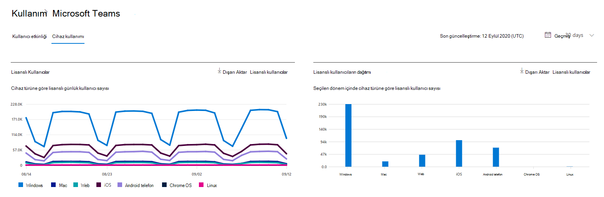
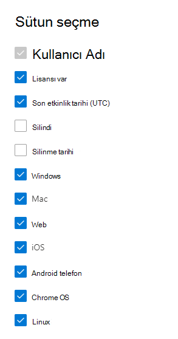

# Yönetim merkezinde Microsoft 365 Raporları - Microsoft Teams cihaz kullanımı

Microsoft 365 Raporları panosu, kuruluşunuzdaki ürünler genelindeki etkinliğe genel bakışı gösterir. Bu pano sayesinde her bir üründeki etkinliklerle ilgili daha ayrıntılı bilgi edinmek için ürün düzeyinde raporları ayrıntılı olarak inceleyebilirsiniz. [Raporlara genel bakış konusunu](activity-reports.md) gözden geçirin. Microsoft Teams uygulama kullanımı raporunda, kuruluşunuzda kullanılan Microsoft Teams uygulamalarıyla ilgili öngörüler edinebilirsiniz.
  
## Microsoft Teams uygulama kullanımı raporuna ulaşma

1. Yönetim merkezinde, **Raporlar** \> <a href="https://go.microsoft.com/fwlink/p/?linkid=2074756" target="_blank">Kullanımı</a> sayfasına gidin. 
2. Pano giriş sayfasında Microsoft Teams etkinlik kartındaki **Daha fazla görüntüle** düğmesine tıklayın.
  
## Microsoft Teams uygulama kullanımı raporunu yorumlama

Cihaz kullanımı sekmesini seçerek Teams raporunda **cihaz kullanımını** görüntüleyebilirsiniz. 

Rapora sütun eklemek veya rapordan sütun kaldırmak için Sütunları **seç'i** seçin.  

Dışarı **Aktar** bağlantısını seçerek rapor verilerini bir Excel .csv dosyasına da aktarabilirsiniz. Bu işlem tüm kullanıcıların verilerini dışarı aktarır ve daha fazla çözümleme yapmak için basit sıralama ve filtreleme işlemlerini kullanmanıza olanak tanır. 

**Microsoft Teams cihaz kullanımı** raporu, son 7 gün, 30 gün, 90 gün veya 180 günlük eğilimler için görüntülenebilir. Ancak raporda belirli bir gün seçerseniz, tablo geçerli tarihten itibaren (raporun oluşturulduğu tarihten değil) 28 güne kadar olan verileri gösterir.
  
|Öğe|Açıklama|
|:-----|:-----|
|**Metrik**|**Tanım**|
|Kullanıcı Adı    |Kullanıcının görünen adı.    |
|Windows    |Kullanıcı Windows tabanlı bir bilgisayarda Teams masaüstü istemcisinde etkinse seçilir.    |
|Mac    |Kullanıcı macOS bilgisayarda Teams masaüstü istemcisinde etkinse seçilir.    |
|iOS    |Kullanıcı iOS için Teams mobil istemcisinde etkinse seçilir.    |
|Android telefon    | Kullanıcı Android için Teams mobil istemcisinde etkinse seçilir.    |
|Chrome OS    |Kullanıcı Bir ChromeOS bilgisayarda Teams masaüstü istemcisinde etkinse seçilir.|
|Linux    | Kullanıcı Bir Linux bilgisayarda Teams masaüstü istemcisinde etkinse seçilir.    |
|Web    |Kullanıcı cihazlarda Teams web istemcisinde etkinse seçilir.|
|Son etkinlik tarihi (UTC)    |Kullanıcının bir Teams etkinliğine katıldığı son tarih (UTC).    |
|Lisanslıdır|Kullanıcı Teams'i kullanma lisansına sahipse seçilir.|

## Ayrıca bkz.
[Microsoft Teams kullanıcı etkinliği raporu](../activity-reports/microsoft-teams-user-activity-preview.md) 

[Microsoft Teams kullanım etkinliği raporu](../activity-reports/microsoft-teams-usage-activity.md) 
