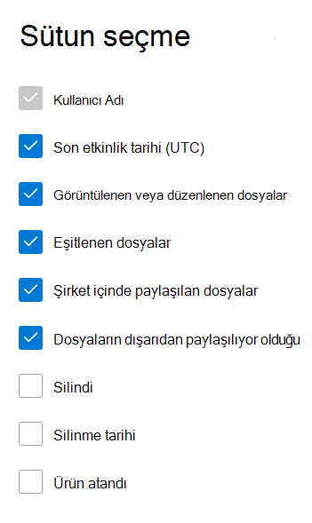

# Yönetim merkezinde Microsoft 365 Raporları - OneDrive İş etkinliği

Microsoft 365 Raporları panosu, kuruluşunuzdaki ürünler genelindeki etkinliğe genel bakışı gösterir. Bu pano sayesinde ürünlerin her birindeki etkinliklerle ilgili daha ayrıntılı bilgi edinmek için ürün düzeyinde raporları ayrıntılı olarak inceleyebilirsiniz. [Raporlara genel bakış konusuna](activity-reports.md) göz atın.
  
For example, you can understand the activity of every user licensed to use OneDrive by looking at their interaction with files on OneDrive. It also helps you to understand the level of collaboration going on by looking at the number of files shared.

## OneDrive Etkinlik raporuna nasıl ulaşabilirim?

1. Yönetim merkezinde, **Raporlar** \> <a href="https://go.microsoft.com/fwlink/p/?linkid=2074756" target="_blank">Kullanımı</a> sayfasına gidin. 
2. Pano giriş sayfasından OneDrive kartındaki **Daha fazla görüntüle** düğmesine tıklayın.
  
## OneDrive İş etkinlik raporunu yorumlama

**Etkinlik** sekmesini seçerek OneDrive raporundaki etkinlikleri görüntüleyebilirsiniz. 

Rapora sütun eklemek veya rapordan sütun kaldırmak için Sütunları **seç'i** seçin.    

Dışarı **Aktar** bağlantısını seçerek rapor verilerini bir Excel .csv dosyasına da aktarabilirsiniz. Bu işlem tüm kullanıcıların verilerini dışarı aktarır ve daha fazla çözümleme yapmak için basit sıralama ve filtreleme işlemlerini kullanmanıza olanak tanır. 

**OneDrive İş aktivite** raporu, son 7 gün, 30 gün, 90 gün veya 180 günlük eğilimler için görüntülenebilir. Ancak raporda belirli bir gün seçerseniz, tablo geçerli tarihten itibaren (raporun oluşturulduğu tarihten değil) 28 güne kadar olan verileri gösterir.
  
|Öğe|Açıklama|
|:-----|:-----|
|**Metrik**|**Tanım**|
|Kullanıcı Adı    |OneDrive hesabının sahibinin kullanıcı adı.    |
|Son etkinlik tarihi (UTC)    |Seçilen tarih aralığı için OneDrive hesabında en son gündeki dosya etkinliği gerçekleşti. Belirli bir tarihte gerçekleştirilen etkinliği görmek için, grafikte doğrudan tarihi seçin.    |
|Görüntülenen veya düzenlenen dosyalar    |Kullanıcının karşıya yüklediği, indirdiği, değiştirdiği veya görüntülendiği dosya sayısı.     |
|Eşitlenen dosyalar    |Kullanıcının yerel cihazından OneDrive hesabına eşitlenen dosyaların sayısı.   |
|Dahili olarak paylaşılan dosyalar    | Kuruluştaki kullanıcılarla veya gruplar içindeki kullanıcılarla (dış kullanıcıları içerebilecek) paylaşılan dosyaların sayısı.    |
|Harici olarak paylaşılan dosyalar    |Kuruluş dışındaki kullanıcılarla paylaşılan dosyaların sayısı.  |
|Silindi    | Bu, kullanıcının lisansının kaldırıldığını gösterir.    NOT: Silinen bir kullanıcının etkinliği, seçilen zaman aralığında bir süre lisanslandığı sürece raporda görüntülenmeye devam eder. **Silindi** sütunu, kullanıcının artık etkin olamayacağını ama rapordaki verilere katkıda bulunduğunu belirlemenize yardımcı olur.    |
|Silinme tarihi    |Kullanıcının lisansının kaldırıldığı tarih.  |
|Ürün atandı    |Kullanıcıya lisans verilen Microsoft 365 ürünleri.|
|||