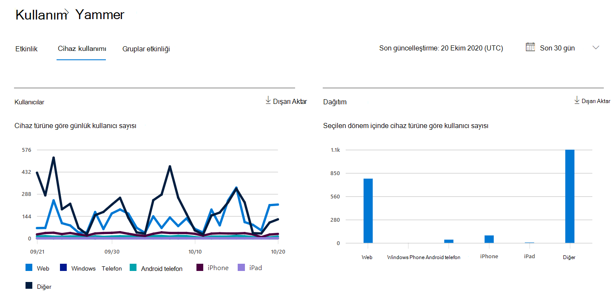

# Yönetim merkezinde Microsoft 365 Raporları - Yammer cihaz kullanım raporu

Microsoft 365 Raporları panosu, kuruluşunuzdaki ürünler genelindeki etkinliğe genel bakışı gösterir. Bu pano sayesinde her bir üründeki etkinliklerle ilgili daha ayrıntılı bilgi edinmek için ürün düzeyinde raporları ayrıntılı olarak inceleyebilirsiniz. [Raporlara genel bakış konusuna](activity-reports.md) göz atın.
  
Yammer cihaz kullanım raporları kullanıcılarınızın Yammer'ı hangi cihazlar üzerinde kullandığı hakkında bilgi verir. Cihaz türüne göre günlük kullanıcı sayısını ve cihaz türüne göre kullanıcı sayısını görüntüleyebilirsiniz. Bu bilgilerin ikisi de seçili bir zaman aralığında görüntülenebilir. Dilerseniz, kullanıcı başına ayrıntıları da görüntüleyebilirsiniz.
 
## Yammer cihaz kullanım raporuna nasıl ulaşabilirim?

1. Yönetim merkezinde **Raporlar'a** gidin ve **Kullanım'ı** seçin. 
2. Pano giriş sayfasında Yammer kartındaki **Daha fazla görüntüle** düğmesine tıklayın.
  
## Yammer cihaz kullanım raporunu yorumlama

**Cihaz kullanımı** sekmesini seçerek OneDrive raporunda kullanımı görüntüleyebilirsiniz.

Rapora sütun eklemek veya rapordan sütun kaldırmak için Sütunları **seç'i** seçin.  

Dışarı **Aktar** bağlantısını seçerek rapor verilerini bir Excel .csv dosyasına da aktarabilirsiniz. Bu işlem tüm kullanıcıların verilerini dışarı aktarır ve daha fazla çözümleme yapmak için basit sıralama ve filtreleme işlemlerini kullanmanıza olanak tanır. 

**Yammer cihaz kullanım** raporu son 7 gün, 30 gün, 90 gün veya 180 günlük eğilimler için görüntülenebilir. Ancak raporda belirli bir gün seçerseniz, tablo geçerli tarihten itibaren (raporun oluşturulduğu tarihten değil) 28 güne kadar olan verileri gösterir.
  
|Öğe|Açıklama|
|:-----|:-----|
|**Metrik**|**Tanım**|
|Kullanıcı Adı    |Kullanıcının e-posta adresi. Asıl e-posta adresini görüntüleyebilir veya bu alanın anonim olmasını sağlayabilirsiniz. Bu kılavuzda, Microsoft 365 hesabını kullanarak Yammer'da oturum açan veya çoklu oturum açma kullanarak ağda oturum açan kullanıcılar gösterilir.   |
|Görünen ad    |Kullanıcının tam adı. Asıl e-posta adresini görüntüleyebilir veya bu alanın anonim olmasını sağlayabilirsiniz.    |
|Kullanıcı durumu    |Üç değerden biri: Etkin, Silinmiş veya Askıya Alındı. Bu raporlarda etkin, askıya alınan ve silinen kullanıcıların verileri gösterilir. Bunlar bekleyen kullanıcıları yansıtmaz, çünkü bekleyen kullanıcılar iletileri gönderemez, okuyamaz veya beğenemez.     |
|Durum değiştirme tarihi (UTC)    |Yammer'da kullanıcının durumunun değiştirildiği tarih.    |
|Son etkinlik tarihi (UTC)    |Kullanıcının bir Yammer etkinliğine katıldığı son tarih (UTC).    |
|Web    |Kullanıcının Web üzerinde Yammer kullanıp kullanmadığını gösterir.    |
|Windows phone    | Kullanıcının Windows telefonunda Yammer kullanıp kullanmadığını gösterir.    |
|Android telefon    |Kullanıcının Android telefonda Yammer kullanıp kullanmadığını gösterir.  |
|Iphone   | Kullanıcının iPhone'da Yammer kullanıp kullanmadığını gösterir.    |
|Ipad    |Kullanıcının iPad'de Yammer kullanıp kullanmadığını gösterir.  |
|Diğer    |Kullanıcının yammer'ı daha önce listelenmeyen başka bir cihazda kullanıp kullanmadığını gösterir.  |
|||