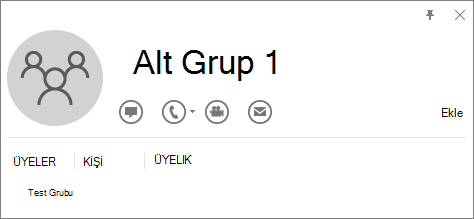

# <a name="determine-if-centralized-deployment-of-add-ins-works-for-your-organization"></a>Eklentilerin Merkezi Dağıtımının kuruluşunuz için çalışıp çalışmadığını belirleme

Merkezi Dağıtım, çoğu müşterinin kuruluşunuzdaki kullanıcılara ve gruplara Office Eklentileri dağıtması için önerilen ve en zengin özelliklere sahip yöntemdir. Yöneticiyseniz, kuruluşunuzun ve kullanıcılarınızın Merkezi Dağıtım'ı kullanabilmeniz için gereksinimleri karşılayıp karşılamadığını belirlemek için bu kılavuzu kullanın.

Merkezi Dağıtım şu avantajları sağlar:

- Yönetici bir eklentiyi doğrudan bir kullanıcıya, bir grup aracılığıyla birden çok kullanıcıya veya kuruluştaki herkese dağıtabilir ve atayabilir (bilgi için Yönetici gereksinim bölümüne bakın).
- İlgili Office uygulaması başlatıldığında eklenti otomatik olarak indirilir. Eklenti eklenti komutlarını destekliyorsa, eklenti otomatik olarak Office uygulamasının içindeki şeritte görünür.
- Yönetici eklentiyi kapatır veya silerse ya da kullanıcı Azure Active Directory'den veya eklentinin atandığı bir gruptan kaldırılırsa eklentiler artık kullanıcılar için görünmez.

Merkezi Dağıtım üç masaüstü platformlarını destekler Windows, Mac ve Çevrimiçi Office uygulamaları. Merkezi Dağıtım, iOS ve Android'i de destekler (Yalnızca Outlook Mobile Eklentileri).

Tüm kullanıcılar için eklentinin istemcide görünmesi 24 saati bulabilir.

## <a name="before-you-begin"></a>Başlamadan önce

Eklentilerin merkezi dağıtımı, kullanıcıların Microsoft 365 İş lisanslarını (business basic, business standard, business premium), Office 365 Kurumsal lisanslarını (E1/E3/E5/F3) veya Microsoft 365 Kurumsal lisanslarını (E3/E5/F3) (ve kuruluş kimliklerini kullanarak Office'te oturum açmalarını) kullanmasını gerektirir, Office 365 Eğitim  lisanslar (A1/A3/A5) veya Microsoft 365 Eğitim lisansları (A3/A5) ve Exchange Online ve etkin Exchange Online posta kutularına sahiptir. Abonelik dizininizin Azure Active Directory'de veya federasyonda olması gerekir.
Office ve Exchange için belirli gereksinimleri aşağıda görüntüleyebilir veya [Merkezi Dağıtım Uyumluluk Denetleyicisi'ni](#centralized-deployment-compatibility-checker) kullanabilirsiniz.

Merkezi Dağıtım şunları desteklemez:

- Office MSI sürümünü hedefleyen eklentiler (Outlook 2016 hariç)
- Şirket içi dizin hizmeti
- Şirket İçi Exchange Posta Kutusuna eklenti dağıtımı
- SharePoint'e eklenti dağıtımı
- Teams uygulamaları
- Bileşen Nesne Modeli (COM) veya Office için Visual Studio Araçları (VSTO) eklentilerinin dağıtımı.
- SKU'lar: İş için Microsoft 365 Uygulamaları ve Kurumsal için Microsoft 365 Uygulamaları gibi Exchange Online içermeyen Microsoft 365 dağıtımları.

### <a name="office-requirements"></a>Office Gereksinimleri

- Word, Excel ve PowerPoint eklentileri için kullanıcılarınızın aşağıdakilerden birini kullanıyor olması gerekir:
  - Bir Windows cihazında, Microsoft 365 İş lisanslarının Sürüm 1704 veya üzeri (business basic, business standard, business premium), Office 365 Kurumsal lisansları (E1/E3/E5/F3) veya Microsoft 365 Kurumsal lisansları (E3/E5/F3).
  - Mac'te Sürüm 15.34 veya üzeri.

- Outlook için, kullanıcılarınızın aşağıdakilerden birini kullanıyor olması gerekir:
  - Microsoft 365 İş lisanslarının (business basic, business standard, business premium), Office 365 Kurumsal lisanslarının (E1/E3/E5/F3) veya Microsoft 365 Kurumsal lisanslarının (E3/E5/F3) 1701 veya sonraki sürümleri.
  - Office Professional Plus 2019 veya Office Standard 2019 sürümü 1808 veya üzeri.
  - Office Professional Plus 2016 (MSI) veya Office Standard 2016 (MSI) sürüm 16.0.4494.1000 veya üzeri\*
  - Office Professional Plus 2013 (MSI) veya Office Standard 2013 (MSI) sürümü 15.0.4937.1000 veya üzeri\*
  - Office Mac 2016 Sürüm 16.0.9318.1000 veya üzeri
- iOS için Outlook Mobile'ın 2.75.0 veya üzeri sürümü
- Android için Outlook Mobile'ın 2.2.145 veya üzeri sürümü

    *Outlook'un MSI sürümleri, yönetici tarafından yüklenen eklentileri "Eklentilerim" bölümünde değil, uygun Outlook şeridinde gösterir.

### <a name="exchange-online-requirements"></a>Exchange Online gereksinimleri

Microsoft Exchange, eklenti bildirimlerini kuruluşunuzun kiracısında depolar. Eklentileri dağıtan yönetici ve bu eklentileri alan kullanıcılar OAuth kimlik doğrulamasını destekleyen bir Exchange Online sürümünde olmalıdır.

Check with your organization's Exchange admin to find out which configuration is in use. OAuth connectivity per user can be verified by using the [Test-OAuthConnectivity](/powershell/module/exchange/test-oauthconnectivity) PowerShell cmdlet.

### <a name="admin-requirements"></a>Yönetici gereksinimleri

Bir eklentiyi Merkezi Dağıtım aracılığıyla dağıtmak için, kuruluşta Genel yönetici veya Exchange yöneticisi olmanız gerekir.

> [!NOTE]
> **Uygulama Yöneticisi** rolü eklendiğinde veya Uygulama **Kayıtları** özelliği aşağıdaki görüntüde gösterildiği gibi Azure Active Directory yönetim merkezinde true olarak ayarlandıysa Exchange yöneticisi bir eklenti dağıtabilir:
>
> 

### <a name="centralized-deployment-compatibility-checker"></a>Merkezi Dağıtım Uyumluluk Denetleyicisi

Merkezi Dağıtım Uyumluluk Denetleyicisi'ni kullanarak, kiracınızdaki kullanıcıların Word, Excel ve PowerPoint için Merkezi Dağıtım kullanacak şekilde ayarlanıp ayarlanmadığını doğrulayabilirsiniz. Outlook desteği için Uyumluluk Denetleyicisi gerekmez. [Uyumluluk denetleyicisini](https://aka.ms/officeaddindeploymentorgcompatibilitychecker) indirip yükleyin.

#### <a name="run-the-compatibility-checker"></a>Uyumluluk denetleyicisini çalıştırma

1. Yükseltilmiş PowerShell.exe penceresini başlatın.

2. Aşağıdaki komutu çalıştırın:

   ```powershell
   Import-Module O365CompatibilityChecker
   ```

3. **Invoke-CompatibilityCheck** komutunu çalıştırın:

   ```powershell
   Invoke-CompatibilityCheck
   ```

   Bu komut sizden _TenantDomain_ (örneğin, _TailspinToysIncorporated.onmicrosoft.com_) ve _TenantAdmin_ kimlik bilgilerini (genel yönetici kimlik bilgilerinizi kullanın) ister ve ardından onay ister.

   > [!NOTE]
   > Kiracınızdaki kullanıcıların sayısına bağlı olarak, denetleyici dakikalar içinde veya saatler içinde tamamlanabilir.

Aracın çalışması bittiğinde, virgülle ayrılmış dosya (.csv) biçiminde bir çıkış dosyası üretir. Dosya varsayılan olarak **geçerli çalışma dizinine** kaydedilir. Çıkış dosyası aşağıdaki bilgileri içerir:

- Kullanıcı Adı
- Kullanıcı Kimliği (Kullanıcının e-posta adresi)
- Merkezi Dağıtım için hazır - Diğer öğeler doğruysa
- Office planı - Lisanslandıkları Office planı
- Office Etkinleştirildi - Office'i etkinleştirdiyse
- Desteklenen Posta Kutusu - OAuth özellikli bir posta kutusu kullanıyorsa

Microsoft 365 raporlarınızda gerçek kullanıcı adları yerine anonim kullanıcı adları gösteriliyorsa, Microsoft 365 yönetim merkezi raporlar ayarını değiştirerek bu sorunu düzeltin. Ayrıntılı adımlar için bkz. [Microsoft 365 raporları gerçek kullanıcı adları yerine anonim kullanıcı adlarını gösteriyor](/office365/troubleshoot/miscellaneous/reports-show-anonymous-user-name).

> [!NOTE]
> Merkezi Dağıtım PowerShell modülü kullanılırken çok faktörlü kimlik doğrulaması desteklenmez. Modül yalnızca Temel kimlik doğrulaması ile çalışır.

## <a name="user-and-group-assignments"></a>Kullanıcı ve grup atamaları

Merkezi Dağıtım özelliği şu anda Microsoft 365 grupları, dağıtım listeleri, dinamik gruplar ve güvenlik grupları dahil olmak üzere Azure Active Directory tarafından desteklenen grupların çoğunu destekler.

> [!NOTE]
> Posta hesabı etkin olmayan güvenlik grupları şu anda desteklenmemektedir.

Merkezi Dağıtım tek tek kullanıcılara, gruplara ve kiracıdaki herkese atamaları destekler. Merkezi Dağıtım, üst düzey gruplardaki veya üst grupları olmayan gruplardaki kullanıcıları destekler, ancak iç içe gruplardaki veya üst grupları olan gruplardaki kullanıcıları desteklemez.

Take a look at the following example where Sandra, Sheila, and the Sales Department group are assigned to an add-in. Because the West Coast Sales Department is a nested group, Bert and Fred aren't assigned to an add-in.


### <a name="find-out-if-a-group-contains-nested-groups"></a>Bir grubun iç içe gruplar içerip içermediğini öğrenme

Bir grubun iç içe gruplar içerip içermediğini saptamanın en kolay yolu, Outlook içindeki kişi kartlarını görüntülemektir. E-postanın **Kime** alanına grup adını girer ve çözümlendiğinde grup adını seçerseniz, bu ad size kullanıcı veya iç içe gruplar içerip içermediğini gösterir. Aşağıdaki örnekte, Test Grubu için Outlook kişi kartının **Üyeler** sekmesinde, hiçbir kullanıcıyı olmadığı ve yalnızca iki alt grubu olduğu gösteriliyor.


You can do the opposite query by resolving the group to see if it's a member of any group. In the example below, you can see under the **Membership** tab of the Outlook contact card that Sub Group 1 is a member of the Test Group.



Alternatif olarak, bir grup içindeki grupların listesini bulmak üzere sorgu çalıştırmak için Azure Active Directory Graph API kullanabilirsiniz. Daha fazla bilgi için bkz[. Gruplarda işlemler| başvuru Graph API](/previous-versions/azure/ad/graph/api/groups-operations).

### <a name="contacting-microsoft-for-support"></a>Destek için Microsoft'a başvurma

Siz veya kullanıcılarınız, merkezi olarak dağıtılan Web için Office uygulamalarını (Word, Excel vb.) kullanırken eklentiyi yüklerken sorunlarla karşılaşırsanız Microsoft desteğine başvurmanız gerekebilir ([nasıl yapılacağını öğrenin](../../business-video/get-help-support.md). Destek biletinde Microsoft 365 ortamınız hakkında aşağıdaki bilgileri sağlayın.

|Ortam|Hata ayıklama bilgisi|
|---|---|
|Office|Charles/Fiddler günlükleri <br/> Kiracı Kimliği ([nasıl yapılacağını öğrenin](/onedrive/find-your-office-365-tenant-id)) <br/> Correlationıd. Office sayfalarından birinin kaynağını görüntüleyin ve Bağıntı Kimliği değerini arayın ve destek için gönderin:  <br/>`<input name=" **wdCorrelationId**" type="hidden" value=" **{BC17079E-505F-3000-C177-26A8E27EB623}**">` <br/> `<input name="user_id" type="hidden" value="1003bffd96933623"></form>`|
|Zengin istemciler (Windows, Mac)|Charles/Fiddler günlükleri <br/> İstemci uygulamasının numaralarını oluşturma (tercihen **Dosya/Hesap'tan** ekran görüntüsü olarak)|

## <a name="related-content"></a>İlgili içerik

[Yönetim merkezinde eklentileri dağıtma](../manage/manage-deployment-of-add-ins.md) (makale)\
[Yönetim merkezinde eklentileri yönetme](manage-addins-in-the-admin-center.md) (makale)\
[Merkezi Dağıtım SSS](../manage/centralized-deployment-faq.yml) (makale)\
[İş için Microsoft 365 kullanıcılarınızı en son Office istemcisine yükseltin](../setup/upgrade-users-to-latest-office-client.md) (makale)
