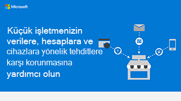

# Küçük işletmeler için güvenlik bilgileri grafiği

**Özet:** İşletmenizin karşılaştığı tehditlere ilişkin temel terimleri ve verilerinizi, hesaplarınızı ve cihazlarınızı korumak için neler yapabileceğinizi öğrenin. İşletmeler için Microsoft 365 yöneticisi olarak, işinizi daha güvenli hale getirmek için harekete geçin ve her çalışanın iş verilerinizi ve cihazlarınızı nasıl güvende tutacağınızı öğrenmesine yardımcı olun.

Aşağıdaki PowerPoint ve PDF bağlantıları tabloid biçiminde (kayıt defteri, 11 x 17 veya A3 olarak da bilinir) indirilebilir ve yazdırılabilir.

[PDF](downloads/smbthreatprotection-infographic.pdf) |  [PowerPoint](downloads/smbthreatprotection-infographic.pptx)
