# İşletmeler için Microsoft 365 kullanıcıları için mobil cihazları ayarlama

iPhone'a veya Android telefona Office'i yüklemek için sekmelerdeki yönergeleri izleyin. Bu adımları izledikten sonra, Office uygulamalarında oluşturulan iş dosyalarınız İş için Microsoft 365 tarafından korunur.

Bu örnek Outlook üzerinden hazırlanmıştır, ancak bahsedilen işlemler yüklemek istediğiniz diğer tüm Office uygulamaları için geçerlidir.
  
## Mobil cihazları ayarlama

## [iPhone](#tab/iPhone)
  
İş için Microsoft 365 ile iOS cihazlarda Office uygulamalarını ayarlama hakkında kısa bir video izleyin.  

> [!VIDEO https://www.microsoft.com/videoplayer/embed/RWee2n] 

Bu videoyu faydalı bulduysanız, [küçük işletmelere ve Microsoft 365’i ilk kez kullananlara yönelik eğitim serisinin tamamına göz atın](../../business-video/index.yml).

**App Store**'a gidin ve arama alanına Microsoft Outlook yazın.
  
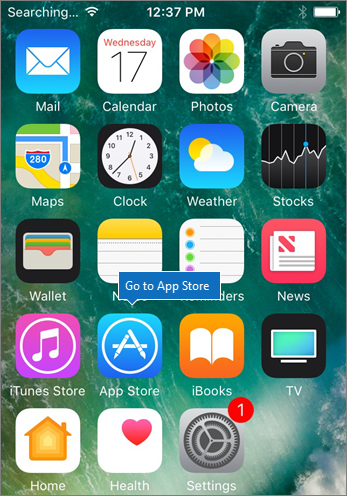
  
Bulut simgesine dokunarak Outlook'u yükleyin.
  
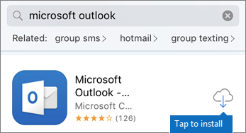
  
Yükleme tamamlandığında, **Aç** düğmesine dokunarak Outlook'u açın ve ardından **Başlarken**'e dokunun.
  
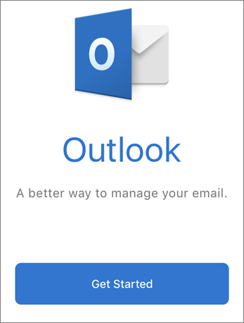
  
**Email Hesabı Ekle** ekranında \> iş e-posta adresinizi Girin **Hesap Ekle'ye** ve ardından İş için Microsoft 365 kimlik bilgilerinizi \> girin **Oturum açın**.
  
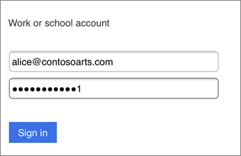
  
Kuruluşunuz uygulamalardaki dosyaları koruyorsa, kuruluşunuzun artık uygulamadaki verileri koruduğunu ve kullanmaya devam etmek için uygulamayı yeniden başlatmanız gerektiğini belirten bir iletişim kutusu görürsünüz. **Tamam**'a dokunun ve Outlook'u kapatın. 
  
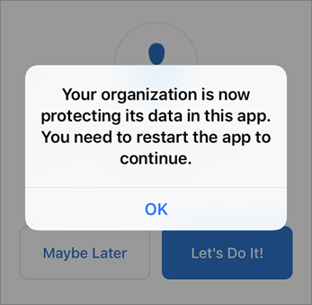
  
iPhone'da Outlook'u bulun ve yeniden başlatın. İstendiğinde bir PIN girin ve doğrulayın. iPhone'unuzdaki Outlook artık kullanıma hazırdır.
  
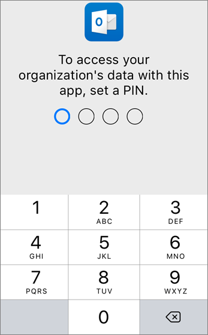
  
## [Android](#tab/Android)
  
Android cihazlara Outlook ve Office yükleme hakkında bir video izleyin.  

> [!VIDEO https://www.microsoft.com/videoplayer/embed/ecc2e9c0-bc7e-4f26-8b14-91d84dbcfef0] 

Bu videoyu faydalı bulduysanız, [küçük işletmelere ve Microsoft 365’i ilk kez kullananlara yönelik eğitim serisinin tamamına göz atın](../../business-video/index.yml).

Android telefonunuzda kuruluma başlamak için Play Store'a gidin.
  
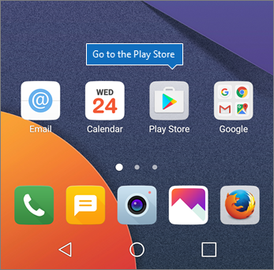
  
Google Play arama kutusuna Microsoft Outlook yazın ve **Yükle'ye** dokunun. Outlook'un yüklenmesi tamamlandıktan sonra **Aç'a** dokunun.
  
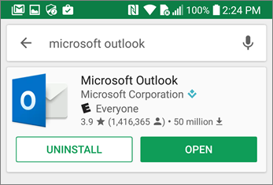
  
Outlook uygulamasında **Başlarken'e** dokunun, ardından İş için Microsoft 365 e-posta hesabınızı \> **Devam'a** ekleyin ve kuruluşunuzun kimlik bilgileriyle oturum açın.
  
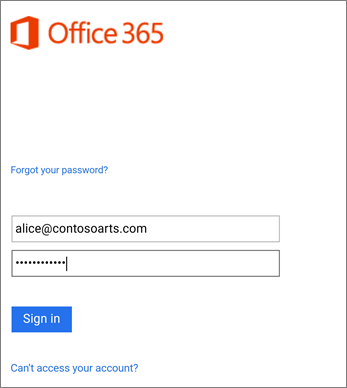
  
Intune Şirket Portalı uygulamasını yüklemeniz gerektiğini belirten iletişim kutusunda **Mağazaya git**'e dokunun.
  
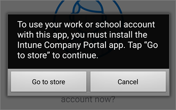
  
Play Store'da Intune Şirket Portalı yükleyin.
  
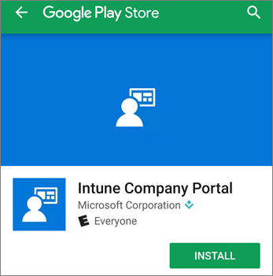
  
Outlook'u yeniden açın, PIN'i girin ve onaylayın. Outlook uygulamanız artık kullanıma hazırdır.
  
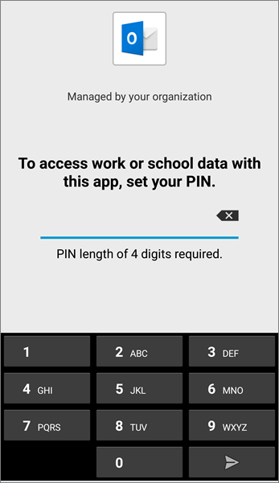

## İlgili içerik

[İş için Microsoft 365 eğitim videoları](../../business-video/index.yml)

---
