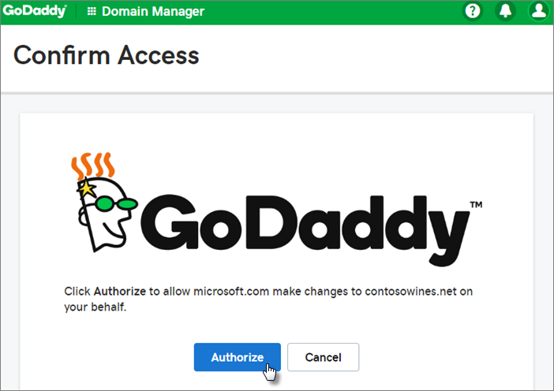

# Microsoft 365 İş Temel’i ayarlama

## İzleyin: Microsoft 365 İş Temel ayarlama

> [!VIDEO https://www.microsoft.com/videoplayer/embed/RE4vk3W]

Bu videoyu faydalı bulduysanız, [küçük işletmelere ve Microsoft 365’i ilk kez kullananlara yönelik eğitim serisinin tamamına göz atın](../../business-video/index.yml).

## Oturum açmayı kişiselleştirmek için etki alanınızı ekleme

Microsoft 365 İş Temel satın aldığınızda, sahip olduğunuz bir etki alanını kullanma veya kayıt sırasında bir etki alanı satın alma seçeneğiniz vardır.

- Kaydolduğunda yeni bir etki alanı satın aldıysanız, etki alanınız ayarlanmıştır ve [Kullanıcı ekle ve lisans ata'ya](#add-users-and-assign-licenses) geçebilirsiniz.

 ::: moniker range="o365-worldwide"

1. Şuradan yönetim merkezine gidin: <a href="https://go.microsoft.com/fwlink/p/?linkid=2024339" target="_blank">https://admin.microsoft.com</a>.

::: moniker-end

::: moniker range="o365-21vianet"

1. Şuradan yönetim merkezine gidin: <a href="https://go.microsoft.com/fwlink/p/?linkid=850627" target="_blank">https://portal.partner.microsoftonline.cn</a>.

::: moniker-end 

2. Sihirbazı başlatmak **için Kuruluma git'i** seçin.
    
3. **Etki alanı ekle** adımında, kullanmak istediğiniz etki alanı adını girin (contoso.com gibi).

    > [!IMPORTANT]
    > Kayıt sırasında bir etki alanı satın aldıysanız, burada **Etki alanı ekle** adımını görmezsiniz. Bunun yerine [Kullanıcı ekle'ye](#add-users-and-assign-licenses) gidin.

    
4. Etki alanının sahibi olduğunuzu doğrulayan [Office 365 için herhangi bir DNS barındırma sağlayıcısında DNS kayıtları oluşturma](/office365/admin/get-help-with-domains/create-dns-records-at-any-dns-hosting-provider) sihirbazındaki adımları izleyin. Etki alanı konağınızı biliyorsanız bkz. [Microsoft 365'e etki alanı ekleme](/microsoft-365/admin/setup/add-domain).

    Barındırma sağlayıcınız GoDaddy veya [etki alanı bağlantısı](/office365/admin/get-help-with-domains/domain-connect) etkinleştirilmiş başka bir konaksa işlem kolaydır ve otomatik olarak oturum açmanız ve Microsoft'un sizin adınıza kimlik doğrulaması yapmasına izin vermeniz istenir.

    

## Kullanıcı ekleme ve lisans atama

Sihirbaza kullanıcı ekleyebilirsiniz, ancak [daha sonra yönetim merkezinde de kullanıcı ekleyebilirsiniz](../add-users/add-users.md) . Ayrıca, yerel bir etki alanı denetleyiciniz varsa[, Azure AD Connect'e](/azure/active-directory/hybrid/how-to-connect-install-express) sahip kullanıcılar ekleyebilirsiniz.

## Sihirbaza kullanıcı ekleme

Sihirbaza eklediğiniz tüm kullanıcılara otomatik olarak bir Microsoft 365 İş Temel lisansı atanır.

1. Microsoft 365 İş Temel aboneliğinizde mevcut kullanıcılar varsa (örneğin, Azure AD Connect kullandıysanız), onlara şimdi lisans atama seçeneğine sahip olursunuz. Bu kullanıcılara da lisans ekleyerek işleme devam edin.

2. Kullanıcıları ekledikten sonra, eklediğiniz yeni kullanıcılarla kimlik bilgilerini paylaşma seçeneğine de sahip olursunuz. Bunları yazdırabilir, e-posta ile gönderebilir veya indirebilirsiniz.

## Etki alanınızı bağlama

> [!NOTE]
> .onmicrosoft etki alanını kullanmayı seçtiyseniz veya kullanıcıları ayarlamak için Connect Azure AD kullandıysanız, bu adımı görmezsiniz.
  
Hizmetleri ayarlamak için DNS ana bilgisayarınızda veya etki alanı kayıt şirketinizde bazı kayıtları güncelleştirmeniz gerekir.
  
1. Kurulum sihirbazı, genellikle kayıt şirketinizi algılar ve kayıt şirketinin web sitesinde NS kayıtlarınızı güncelleştirmek için adım adım yönergelere ulaşabileceğiniz bir bağlantı verir. Ayarlamıyorsa, [herhangi bir etki alanı kayıt şirketiyle Office 365 ayarlamak için ad sunucularını değiştirin](../get-help-with-domains/change-nameservers-at-any-domain-registrar.md). 

    - Dns kayıtlarınız varsa (örneğin, var olan bir web sitesi) ancak DNS ana bilgisayarınız [etki alanı bağlantısı](/office365/admin/get-help-with-domains/domain-connect) için etkinleştirildiyse **, Benim için kayıt ekle'yi** seçin. **çevrimiçi hizmetler seçin** sayfasında tüm varsayılanları kabul edin ve **İleri'yi** seçin ve DNS barındırma sağlayıcınızın sayfasında **Yetki ver'i** seçin.
    - Diğer DNS ana bilgisayarlarıyla (etki alanı bağlantısı için etkinleştirilmemiş) mevcut DNS kayıtlarınız varsa, mevcut hizmetlerin bağlı kalmasını sağlamak için kendi DNS kayıtlarınızı yönetmek istersiniz. Daha fazla bilgi için bkz. [etki alanı temelleri](/office365/admin/get-help-with-domains/dns-basics) .

2. Sihirbazdaki adımları izleyin; e-posta ve diğer hizmetler sizin için ayarlanır.

    Kaydolma işlemi tamamlandığında, yönetim merkezine yönlendirilirsiniz; burada kullanıcı ekleyebilir ve lisans atayabilirsiniz. İlk kurulumu tamamladıktan sonra, aboneliklerinizle birlikte gelen hizmetleri ayarlamaya ve yapılandırmaya devam etmek için yönetim merkezindeki **Kurulum** sayfasını kullanabilirsiniz.

    Kurulum sihirbazı ve yönetim merkezi **Kurulum** sayfası hakkında daha fazla bilgi için bkz. [Kurulum sihirbazı ile Kurulum sayfası arasındaki fark](o365-setup-wizard-and-setup-page.md).