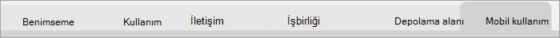

# Microsoft 365 kullanım analizinde raporlarda gezinin ve raporları kullanın

Panoda ana kullanım ve benimseme ölçümlerine ilişkin hızlı bir genel bakış sağlanır. En üst düzey ölçümleri seçerek daha fazla ayrıntı ve içgörü sağlayan raporlara erişebilirsiniz. Her rapor sekmesi, kuruluşunuz için kullanım ve benimsemeye ilişkin verilerin belirli bir açıdan görselleştirmesini içerir. Toplanan veriler her raporun başlığında açıklanır ve görüntülemekte olduğunuz rapor sekmesindeki görselleştirmeler hakkında daha fazla bilgi içeren bir kutucuk görüntülenir.

Raporlarınızla çalışmaya başlamak için birkaç ipucunu burada bulabilirsiniz:

- Her üst düzey rapora gitmek için soldaki veya **Yönetici Özeti** sayfasındaki ilgili ölçümdeki gezinti sekmelerini kullanın.

    

- Bu düzey içindeki farklı raporlara gitmek için her üst düzey raporun en üstündeki gezinti sekmelerini kullanın.

    

- Çoğu rapor, görüntülemek istediğiniz ürüne, AAD özniteliğine veya etkinliğe göre filtreleyebileceğiniz bir dilimleyici içerir. Bunlar tek seçim veya çoklu seçim olabilir.

    

    

- Ayrıntıları içeren bir açıklama balonunu görüntülemek için veri noktalarının üzerine gelin.

    

Şablon uygulamasının örneğini oluşturan kullanıcı, raporu ihtiyaçlarına göre özelleştirebilecektir. Şablon uygulamasını özelleştirmek için:

- **Raporun üst kısmındaki Raporu düzenle'yi** seçin.

    

- Temeldeki [veri kümelerini](usage-analytics-data-model.md) kullanarak kendi görsellerinizi oluşturun.

- Kendi veri kaynaklarınızı getirmek için Power BI Desktop kullanın.

Raporlarınızı paylaşmak için paylaş düğmesini seçmeniz yeterlidir  öğesini seçin.

Raporları nasıl özelleştireceğinizi öğrenmek için bkz: [Microsoft 365 kullanım analizinde raporları özelleştirme](customize-reports.md).

Power BI yardım belgelerinde çok daha fazla bilgi bulabilirsiniz:

- [Power BI temel kavramları](/power-bi/service-basic-concepts)

    Pano, veri kümeleri, raporlar ve diğer Power BI kavramları hakkında bilgi edinin.

- [Power BI ile çalışmaya başlama](/power-bi/service-get-started?wt.mc_id=O365_Reports_PBI_contentpack)

    Learn the basic functionality in Power BI. Find links to how to use Power BI Desktop.

- [Panoları ve raporları paylaşma](/power-bi/service-share-dashboards)

    Raporları iş arkadaşlarınızla veya kuruluşunuzun dışındaki kişilerle paylaşmayı öğrenin. Raporu veya raporun filtrelenmiş bir sürümünü de paylaşabilirsiniz.