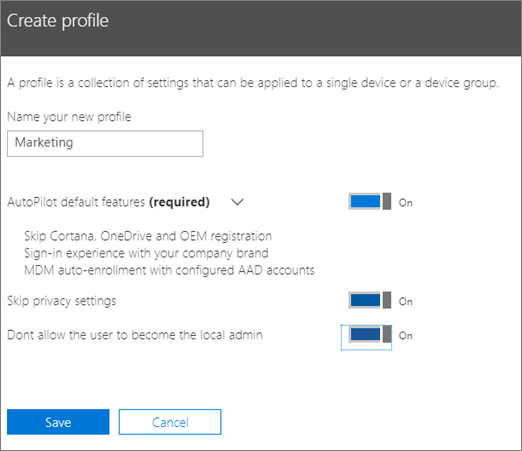
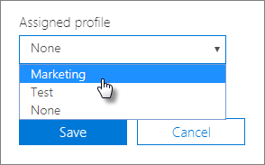

# Autopilot profili oluşturma ve düzenleme

Bir [cihaz grubundaki](m365bp-device-groups-mdb.md) cihazlara [Windows Autopilot dağıtım profili](/mem/autopilot/profiles) uygulayabilirsiniz. Dağıtım profilleri, kullanıcıların sahip olacağı Windows dağıtım ve kayıt deneyimini belirler. 

## Profil oluşturma

Profiller bir cihaza veya cihaz grubuna uygulanır,
  
1. Microsoft 365 yönetim merkezi **Cihazlar** \> **Otomatik Pilotu'nu** seçin.
  
2. **Autopilot** sayfasında **Profiller** sekmesini \> **Profil oluştur'u** seçin.

3. **Profil oluştur** sayfasında, profili tanımlamanıza yardımcı olacak bir ad girin, örneğin Pazarlama. İstediğiniz ayarı açın ve **kaydet'i** seçin. Autopilot profil ayarları hakkında daha fazla bilgi için bkz. [Autopilot Profili ayarları hakkında](m365bp-Autopilot-profile-settings.md).

    
  
### Cihaza profil uygulama

Profil oluşturduktan sonra bir cihaza veya bir cihaz grubuna uygulayabilirsiniz. [Adım adım kılavuzda](m365bp-add-Autopilot-devices-and-profile.md) var olan bir profili seçebilir ve yeni cihazlara uygulayabilir ya da bir cihaz veya cihaz grubu için mevcut profili değiştirebilirsiniz.
  
1. **Windows'u Hazırla** sayfasında **Cihazlar** sekmesini seçin.

2. Cihaz adının yanındaki onay kutusunu seçin ve **Cihaz** panelinde **Atanan profil** açılan listesinden \> **bir profil seçin Kaydet**.

    
  
## Profili düzenleme, silme veya kaldırma

Bir profili bir cihaza atadıktan sonra, cihazı daha önce bir kullanıcıya vermiş olsanız bile profili güncelleştirebilirsiniz. Cihaz İnternet'e bağlandığında, kurulum sırasında profilinizin en son sürümünü indirir. Kullanıcı cihazı varsayılan fabrika ayarlarına sıfırladığında da cihaz, profilinize yönelik en son güncelleştirmeleri indirir.
  
### Profili düzenleme

1. **Windows'u Hazırla** sayfasında **Profiller** sekmesini seçin.

2. Cihaz adının yanındaki onay kutusunu seçin ve **Profil** panelinde, kullanılabilir ayarlardan \> herhangi birini **Güncelleştir Kaydet'i seçin**.

    Bir kullanıcı cihazı İnternet'e bağlamadan önce bu görevi yaparsanız, profil kurulum işlemine uygulanır.

### Profili silme

1. **Windows'u Hazırla** sayfasında **Profiller** sekmesini seçin.

2. Cihaz adının yanındaki onay kutusunu seçin ve **Profil** panelinde **Profili** \> sil **Kaydet'i** seçin.

    Silinen profiller, atanmış oldukları cihazdan veya cihaz grubundan kaldırılır.

### Profili kaldırma

1. **Windows'u Hazırla** sayfasında **Cihazlar** sekmesini seçin.

2. Cihaz adının yanındaki onay kutusunu seçin ve **Cihaz** panelinde **Atanan profil** açılan **listesinden**\> Kaydet'i **seçin.**

## Ayrıca bkz.

[İş için Microsoft 365 planlarının güvenliğini sağlamaya yönelik en iyi yöntemler](../admin/security-and-compliance/secure-your-business-data.md)
