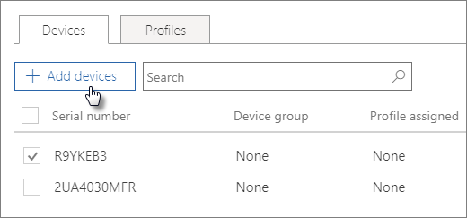

# Autopilot cihazları oluşturma ve düzenleme

## Cihaz listesini karşıya yükleme

Cihazları karşıya yüklemek için [Adım adım kılavuzu](m365bp-add-Autopilot-devices-and-profile.md) kullanabilirsiniz, ancak **cihazları Cihazlar** sekmesinden de karşıya yükleyebilirsiniz. 
  
Cihazların şu gereksinimleri karşılaması gerekir:
  
- Windows 10, sürüm 1703 veya üzeri
    
- Windows ilk çalıştırma deneyiminden geçmemiş yeni cihazlar

1. Microsoft 365 yönetim merkezi **Cihazlar** \> **Otomatik Pilotu'nu** seçin.
  
2. **Autopilot** sayfasında **Cihazlar** sekmesini \> **Cihaz ekle'yi** seçin.
    
    
  
3. **Cihaz ekle** panelinde, **Kapat'ı** **Kaydet'i** \> hazırladığınız \> [bir Cihaz listesi CSV dosyasına](../admin/misc/device-list.md) gidin.
    
    Bu bilgileri donanım satıcınızdan alabilir veya [Get-WindowsAutopilotInfo PowerShell betiğini](https://www.powershellgallery.com/packages/Get-WindowsAutopilotInfo) kullanarak CSV dosyası oluşturabilirsiniz. 
    
## Cihaza veya cihaz grubuna profil atama

1. **Windows'u Hazırla** sayfasında **Cihazlar** sekmesini seçin ve bir veya daha fazla cihazın yanındaki onay kutusunu seçin. 
    
2. **Cihaz** panelinde, **Atanan profil** açılan listesinden bir profil seçin. 
    
    Henüz hiç profiliniz yoksa yönergeler için [bkz. Autopilot profilleri oluşturma ve düzenleme](../admin/devices/create-and-edit-Autopilot-profiles.md) . 

## Ayrıca bkz.

[İş için Microsoft 365 planlarının güvenliğini sağlamaya yönelik en iyi yöntemler](../admin/security-and-compliance/secure-your-business-data.md)
