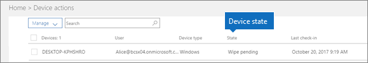

# İş için Microsoft 365'teki cihaz durumları

Bu makale Microsoft 365 İş Ekstra için geçerlidir.

> [!NOTE]
> İş için Microsoft Defender, 1 Mart 2022'de başlayarak Microsoft 365 İş Ekstra müşterilerine dağıtılıyor. Bu teklif, cihazlar için ek güvenlik özellikleri sağlar. [İş için Defender hakkında daha fazla bilgi edinin](../security/defender-business/mdb-overview.md).

**Cihaz eylemleri** listesindeki (Yönetim giriş sayfası \> **Cihaz eylemleri**) cihazlar aşağıdaki durumlarda olabilir.
  

  
|**Durum**|**Açıklama**|
|:-----|:-----|
|Intune tarafından yönetilen  |Microsoft 365 İş Ekstra tarafından yönetilir.  |
|Devre dışı bırakma bekliyor  |Microsoft 365 İş Ekstra, şirket verilerini cihazdan kaldırmaya hazırlanıyor.  |
|Devre dışı bırakma sürüyor  |Microsoft 365 İş Ekstra şu anda cihazdan şirket verilerini kaldırıyor.  |
|Devre dışı bırakma başarısız  | Şirket verilerini kaldırma işlemi başarısız oldu.  |
|Devre dışı bırakma iptal edildi  |Devre dışı bırakma eylemi iptal edildi.  |
|Temizleme işlemi beklemede  |Fabrika sıfırlamasının başlatılması bekleniyor.  |
|Temizleme işlemi sürüyor  |Fabrika sıfırlaması gönderildi.  |
|Temizleme başarısız oldu  |Fabrika sıfırlaması yapılamaz.  |
|Silme iptal edildi  |Fabrika silme işlemi iptal edildi.  |
|Uygun olmayan durumda  |Bir eylem beklemede (veya devam ediyor) ancak cihaz 30 günden fazla süreyle iade edilmemiştir.  |
|Silme bekliyor  |Silme eylemi bekliyor.  |
|Bulundu  |Microsoft 365 İş Ekstra cihazı algılamıştır.  |
   

## Ayrıca bkz.

[İş için Microsoft 365 planlarının güvenliğini sağlamaya yönelik en iyi yöntemler](../admin/security-and-compliance/secure-your-business-data.md)