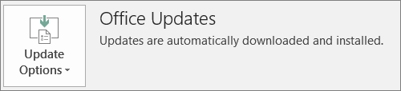

# İstemci bilgisayarlara Office uygulamalarını otomatik olarak yükleme hazırlığı

32 bit Office uygulamalarını Windows bilgisayarlara otomatik olarak yüklemek ve güncelleştirmelerle güncel tutmak için Microsoft 365 İş Ekstra kullanın.
  
Otomatik yükleme en iyi sonucu şu bilgisayar olduğunda sağlar: 

- , İş İçin Windows'tadır.
  
- mevcut Office masaüstü uygulamaları (Word, Excel, PowerPoint, Outlook, OneNote, Publisher, Access ve OneDrive) veya Tıkla-Çalıştır Office'in mevcut bir sürümü yüklü değildir.

Office'in Tıkla-Çalıştır sürümüne sahip olup olmadığınızı belirlemek için, herhangi bir Office uygulamasında **Dosya** \> **Hesap**'a (Outlook'ta **Office Hesabı**) gidin. Aşağıdaki şekilde gösterildiği gibi **Office Güncelleştirmeler** görüyorsanız, yükleme Tıkla-Çalıştır kullanılarak yapılmıştır.
  

  
## Bu özelliği kullanma gereksinimleri
  
Şu kişilerle çalışır:
  
- Windows business kullanıcı lisansına, etkin bir İş için Microsoft 365 lisansına sahip Windows 10 Creators Update ve Azure Active Directory'ye katılmış bir kullanıcı.

Şu işlemlerle çalışmaz: 

- 64 bit Office uygulamaları (örneğin: Word, Excel, PowerPoint). 64 bit Office uygulamaları gerekiyorsa, iş için Microsoft 365 yönetici konsolundan Office'in 64 bit 2016 Tıkla-Çalıştır sürümünü tetikleme desteği olmadığından bu özellik uygun değildir.

- Tüm 2016 Windows Installer (MSI) tek başına uygulamaları (örneğin, Visio veya Project). İş için Microsoft 365, Office'i Office 2016'nın Tıkla-Çalıştır sürümüne yükseltmektedir ve bu, Office 2016 MSI tek başına uygulamalarıyla çalışmaz.

Aşağıdaki tabloda, iş için Microsoft 365 yönetici konsolundan Office dağıtımının 32 bit Tıkla-Çalıştır sürümünün başarılı olması için, son kullanıcıların veya yöneticilerin başlangıç durumlarına bağlı olarak hangi eylemi gerçekleştirmesi gerekebileceği gösterilmektedir. 

|Başlangıçtaki Office yükleme durumu|İş için Microsoft 365 Office yüklemeden önce gerçekleştirmesi gereken eylem|Son durum|
|:-----|:-----|:-----|
|Hiçbir Office paketi yüklü değil  |Yok  |Tıkla-Çalıştır kullanılarak Office 2016 32 bit yüklenir  |
|Office'in Tıkla-Çalıştır 32 bit sürümü (2016 veya önceki) var ve tek başına uygulama yok  |Yok  |Gerektiği gibi Office 2016'nın en son 32 bit Tıkla-Çalıştır sürümüne yükseltilir **\*** |
|Office'in Tıkla-Çalıştır 32 bit sürümü ve Tıkla-Çalıştır 32 bit veya 64 bit tek başına Office uygulamaları (örneğin, Visio, Project)  |Yok  |Tek başına uygulamalar etkilenmez. Paket, Office 2016'nın Tıkla-Çalıştır 32 bit sürümüne yükseltilir  |
|Office'in Tıkla-Çalıştır 32 bit sürümü ve 32 bit veya 64 bit (2016 dışında) MSI tek başına Office uygulamaları var  |Yok  |Tek başına uygulamalar etkilenmez. Paket, Office 2016'nın Tıkla-Çalıştır 32 bit sürümüne yükseltilir  |
|Office'in Tıkla-Çalıştır 64 bit sürümü var  |Bunları 32 bit Office uygulamalarıyla değiştirmek uygunsa 64 bit Office uygulamalarını kaldırın  |Office 64 bit uygulamaları kaldırılmışsa, Office 2016'nın Tıkla-Çalıştır 32 bit sürümü yüklenir  |
|Tek başına uygulamalarla veya bu uygulamalar olmadan Office 2016'nın MSI yüklemesi var  |MSI Office 2016'yı kaldırın.  |Office 2016'nın Tıkla-Çalıştır 32 bit sürümü yüklenir. Tek başına uygulamalarda hiçbir değişiklik olmaz  |
|Office 2013'ün (veya önceki sürümlerin) ve/veya tek başına Office uygulamalarının MSI yüklemesi var  |Yok  |Office 2016'nın Tıkla-Çalıştır 32 bit sürümü, önceden var olan MSI Office yüklemesiyle (ve tek başına uygulamalarla) birlikte kullanılır  |

 **(\*) Not:** Bilinen bir hata nedeniyle Office 2016'nın Tıkla-Çalıştır 32 bit sürümüne yükseltilmez. Bir düzeltme devam ediyor. 

## Sonraki hedef

[Uygulama koruma ayarları oluşturma](m365bp-protection-settings-for-windows-10-devices.md)
  