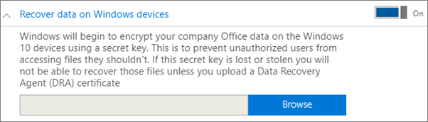
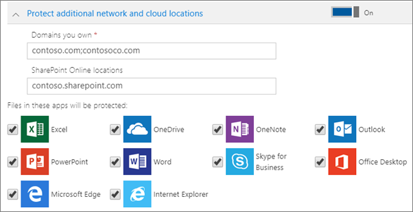

# Windows cihazları için uygulama koruma ayarlarını ayarlama veya düzenleme

Şimdi, tüm kullanıcılarınızın çalışmaları için uygulama kullandıklarında korunduğundan emin olmak için kuruluşunuzun Windows cihazları için uygulama koruma ilkeleri ayarlamanız gerekir.

## Windows cihazları için uygulama yönetimi ilkesini düzenleme

1. Şuradan yönetim merkezine gidin: <a href="https://go.microsoft.com/fwlink/p/?linkid=837890" target="_blank">https://admin.microsoft.com</a>.     

2. Sol gezinti bölmesinde **Cihazlar** \> **İlkeleri'ni** seçin.

3. Var olan bir Windows uygulama ilkesini ve ardından **Düzenle'yi** seçin.

4. Değiştirmek istediğiniz ayarın yanındaki **Düzenle'yi** ve ardından **Kaydet'i** seçin.

## Windows cihazları için uygulama yönetimi ilkesi oluşturma

Kullanıcılarınızın iş görevlerini gerçekleştirdikleri kişisel Windows cihazları varsa, bu cihazlardaki verilerinizi koruyabilirsiniz.
  
1. Şuradan yönetim merkezine gidin: <a href="https://go.microsoft.com/fwlink/p/?linkid=837890" target="_blank">https://admin.microsoft.com</a>. 

2. Sol gezinti bölmesinde **Cihaz** \> **İlkeleri** \> **Ekle'yi** seçin.

3. **İlke ekle** bölmesinde bu ilke için benzersiz bir ad girin. 

4. **İlke türü**'nün altında **Windows 10 için Uygulama Yönetimi**'ni seçin.

5. **Cihaz türü** altında **Kişisel** veya **Şirkete Ait'i** seçin.

6. **İş dosyalarını şifrele** seçeneği otomatik olarak açılır. 

7. Kullanıcıların çalışma dosyalarını kendi bilgisayarlarına kaydetmelerini istemiyorsanız, **Kullanıcıların şirket verilerini kişisel dosyalara kopyalamasını engelle ve çalışma dosyalarını OneDrive İş'e kaydetmelerini zorla** ilkesini **Açık** olarak ayarlayın. 

8. **Windows cihazlarında verileri kurtar'ı** genişletin. Açmanızı **öneririz.**
    Veri Kurtarma Aracısı sertifikasının konumuna göz atabilmeniz için önce bir tane oluşturmanız gerekir. Yönergeler için bkz [. Şifreleme Dosya Sistemi (EFS) Veri Kurtarma Aracısı (DRA) sertifikası oluşturma ve doğrulama](/windows/security/information-protection/windows-information-protection/create-and-verify-an-efs-dra-certificate).

    Varsayılan olarak iş dosyalarınız, cihazda depolanan ve kullanıcının profili ile ilişkilendirilmiş bir gizli anahtar kullanılarak şifrelenir. Yalnızca kullanıcı dosyanın şifresini çözebilir ve dosyayı açabilir. Bununla birlikte, cihaz kaybolursa veya kullanıcı kaldırılırsa, dosya şifrelenmiş halde kalabilir. Yönetici, dosyanın şifresini çözmek için Veri Kurtarma Aracısı (DRA) sertifikasını kullanabilir.

    
  
9. Listelenen tüm uygulamalardaki dosyaların korunduğundan emin olmak için ek etki alanları veya SharePoint Online konumları eklemek istiyorsanız Ek **ağ ve bulut konumlarını koru'yu** genişletin. Alanlara birden çok öğe girmeniz gerekiyorsa, öğeler arasında noktalı virgül (;) kullanın.

    
  
10. Next decide **Who will get these settings?** If you don't want to use the default **All Users** security group, choose **Change**, choose the security groups who will get these settings \> **Select**.
11. Son olarak, **Ekle**'yi seçerek ilkeyi kaydedin ve cihazlarınıza atayın.

## Ayrıca bkz.

[İş için Microsoft 365 planlarının güvenliğini sağlamaya yönelik en iyi yöntemler](../admin/security-and-compliance/secure-your-business-data.md)

## Sonraki hedef

[Windows ayarlarınızı doğrulayın](m365bp-validate-settings-on-windows-10-pcs.md).