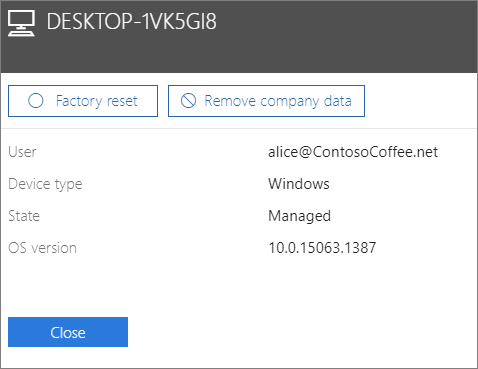

# Şirket verilerini cihazlardan kaldırma

## Şirket verilerini kaldırma

Kullanıcılarınızın [cihazlarında](m365bp-app-protection-settings-for-android-and-ios.md) veya Microsoft 365 tarafından korunan [Windows bilgisayarlarında](m365bp-protection-settings-for-windows-10-devices.md) bulunan şirket verilerini kaldırmak için İş için Microsoft 365'i kullanabilirsiniz. **Cihazdan kaldırdığınız şirket verilerini daha sonra geri yükleyemezsiniz**. 
  
1. Şuradan yönetim merkezine gidin: <a href="https://go.microsoft.com/fwlink/p/?linkid=837890" target="_blank">https://admin.microsoft.com</a>.
    
2. Sol gezinti bölmesinde **Cihazlar**  \> **Yönet'i** seçin.
  
3. **Yönet** sayfasında, kaldırmak istediğiniz verileri içeren bir kullanıcıyı seçin veya arayın ve adı seçin. 
    
4. Sonraki bölmede **Cihazlar** listesinden cihazı veya cihazları seçin. Açılan cihaz bölmesinde, cihaz türüne bağlı olarak cihazı fabrika ayarlarına sıfırlamayı veya şirket verilerini kaldırmayı seçebilirsiniz. 
    
    
  
5. Onay bölmesinde **Kapat'ı Onayla'yı** \> seçin.
    

## Ayrıca bkz.

[İş için Microsoft 365 planlarının güvenliğini sağlamaya yönelik en iyi yöntemler](../admin/security-and-compliance/secure-your-business-data.md)