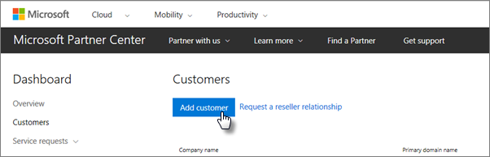
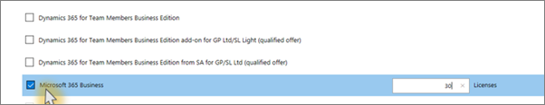

# Microsoft 365 İş Ekstra’yı edinin

## Microsoft'tan Microsoft 365 İş Ekstra alma

İş ortağınız yoksa ve Microsoft 365 İş Ekstra almak istiyorsanız buradan [satın](https://www.microsoft.com/microsoft-365/business) alabilirsiniz.

Ayrıntılı yönergeler için bkz. [Microsoft 365 İş Ekstra için kaydolma](sign-up.md).

Ayrıca Microsoft 365 İş Ekstra satın almak ve kurulum yardımı almak için [bir Microsoft Store'a](https://www.microsoft.com/store/locations/find-a-store?icid=en_US_Store_UH_FAS) gidebilirsiniz.
  
## Microsoft İş Ortağı Merkezi'nden Microsoft 365 İş Ekstra alma

1. Bulut Hizmeti Sağlayıcısı (CSP) programına kaydolurken oluşturduğunuz kimlik bilgilerini kullanarak [Microsoft İş Ortağı Merkezi](https://go.microsoft.com/fwlink/p/?linkid=849910)'nde oturum açın. 
    
2. İş Ortağı Panosu'nda **Müşteriler'i** seçin, ardından müşterinizi seçin veya Microsoft 365 İş Ekstra almadan önce yeni bir müşteri ekleyin.
    
    
  
3. Müşterinin **Abonelik** sayfasında **Abonelik ekle'yi** seçin, Katalog altında Küçük işletme seçeneğini belirleyin ve **ardından Microsoft 365 İş Ekstra'ı** seçin.
    
    İhtiyacınız olan lisans sayısını seçin (en fazla 300). 300'den fazla kullanıcınız varsa bunun yerine [Microsoft 365 Kurumsal](../enterprise/index.yml) bakın. 
    
    
  
    İş adı da dahil olmak üzere yeni müşteri ekleme adımlarının geri kalanını tamamlayın.
