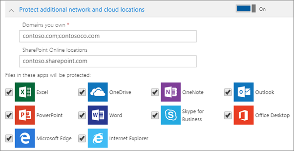

# Windows 10 cihazları için uygulama koruma ayarlarını ayarlama veya düzenleme

Bu makale Microsoft 365 İş Ekstra için geçerlidir.

## Windows 10 için uygulama yönetimi ilkesi düzenleme

1. Yönetim merkezine <a href="https://go.microsoft.com/fwlink/p/?linkid=837890" target="_blank">https://admin.microsoft.com</a> gidin:     
2. Sol gezintide Cihaz **İlkeleri'ne** \> **seçin.**
1. Var olan bir Windows uygulama ilkesi seçin ve ardından **Düzenle'yi seçin.**
1. Değiştirmek **istediğiniz** ayarın yanındaki Düzenle'yi ve ardından Kaydet'i **seçin.**

## Windows 10 için uygulama yönetimi ilkesi oluşturma

Kullanıcılarınızın işle ilgili görevleri gerçekleştirdikleri kişisel Windows 10 cihazları varsa, verilerinizi bu cihazlarda da koruma altına alabilirsiniz.
  
1. Yönetim merkezine <a href="https://go.microsoft.com/fwlink/p/?linkid=837890" target="_blank">https://admin.microsoft.com</a> gidin: 
2. Sol gezintide Cihaz **İlkeleri** \> **Ekle'yi** \> **seçin.**
3. **İlke ekle** bölmesinde bu ilke için benzersiz bir ad girin. 
4. **İlke türü**'nün altında **Windows 10 için Uygulama Yönetimi**'ni seçin.
5. Cihaz **türü altında,** Kişisel'i **veya Şirkete** **Ait'i seçin.**
6. **İş dosyalarını şifrele** seçeneği otomatik olarak açılır. 
7. Kullanıcıların çalışma dosyalarını kendi bilgisayarlarına kaydetmelerini istemiyorsanız, **Kullanıcıların şirket verilerini kişisel dosyalara kopyalamasını engelle ve çalışma dosyalarını OneDrive İş'e kaydetmelerini zorla** ilkesini **Açık** olarak ayarlayın. 
9. **Windows cihazlarda Verileri kurtar'ı genişletin.** Bu açmanizi **öneririz.**
    Veri Kurtarma Aracısı sertifikasının bulunduğu konuma göz atmadan önce bir sertifika oluşturmanız gerekir. Yönergeler için, Şifreleme [Dosyası Sistemi (EFS)](/windows/security/information-protection/windows-information-protection/create-and-verify-an-efs-dra-certificate)Veri Kurtarma Aracısı (DRA) sertifikası oluşturma ve doğrulama.
    
    Varsayılan olarak iş dosyalarınız, cihazda depolanan ve kullanıcının profili ile ilişkilendirilmiş bir gizli anahtar kullanılarak şifrelenir. Yalnızca kullanıcı dosyanın şifresini çözebilir ve dosyayı açabilir. Bununla birlikte, cihaz kaybolursa veya kullanıcı kaldırılırsa, dosya şifrelenmiş halde kalabilir. Yönetici, dosyanın şifresini çözmek için Veri Kurtarma Aracısı (DRA) sertifikasını kullanabilir.
    
    
  
10. Listelenen **tüm uygulamalardaki dosyaların** korun olduğundan emin olmak için ek etki alanları veya SharePoint Online konumları eklemek için Ek ağ ve bulut konumlarını koru'ya genişletin. Alanlara birden çok öğe girmeniz gerekiyorsa, öğeler arasında noktalı virgül (;) kullanın.
    
    
  
11. Next decide **Who will get these settings?** If you don't want to use the default **All Users** security group, choose **Change**, choose the security groups who will get these settings \> **Select**.
12. Son olarak, **Ekle**'yi seçerek ilkeyi kaydedin ve cihazlarınıza atayın.