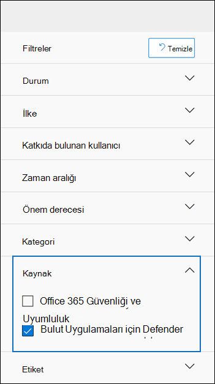

# <a name="alert-policies-in-microsoft-365"></a>Microsoft 365'te uyarı ilkeleri

Uyarı ilkelerini ve uyarı panosunu Microsoft Purview uyumluluk portalı veya Microsoft 365 Defender portalında kullanarak uyarı ilkeleri oluşturabilir ve kullanıcılar uyarı ilkesinin koşullarıyla eşleşen etkinlikler gerçekleştirdiğinde oluşturulan uyarıları görüntüleyebilirsiniz. Exchange Online yönetici ayrıcalıkları atama, kötü amaçlı yazılım saldırıları, kimlik avı kampanyaları ve olağan dışı dosya silme ve dış paylaşım düzeyleri gibi etkinlikleri izlemenize yardımcı olan çeşitli varsayılan uyarı ilkeleri vardır.

> [!TIP]
> Kullanılabilir [uyarı ilkelerinin](#default-alert-policies) listesi ve açıklaması için bu makaledeki Varsayılan uyarı ilkeleri bölümüne gidin.

Uyarı ilkeleri, bir ilke tarafından tetiklenen uyarıları kategorilere ayırmanıza, ilkeyi kuruluşunuzdaki tüm kullanıcılara uygulamanıza, bir uyarının tetiklenmesi için bir eşik düzeyi ayarlamanıza ve uyarılar tetiklendiğinde e-posta bildirimleri alıp almamaya karar vermenize olanak sağlar. Ayrıca uyarıları görüntüleyip filtreleyebileceğiniz, uyarıları yönetmenize yardımcı olacak bir uyarı durumu ayarlayabileceğiniz ve temel olayı ele aldıktan veya çözümledikten sonra uyarıları kapatabileceğiniz bir **Uyarılar** sayfası da vardır.

> [!NOTE]
> Uyarı ilkeleri ABD Kamu E1/F1/G1, E3/F3/G3 veya E5/G5 aboneliğine sahip Microsoft 365 Kurumsal, Office 365 Kurumsal veya Office 365 kuruluşlar için kullanılabilir. Gelişmiş işlevler yalnızca E5/G5 aboneliği olan kuruluşlarda ya da E1/F1/G1 veya E3/F3/G3 aboneliğine sahip kuruluşlarda ve Office 365 için Microsoft Defender P2 veya Microsoft 365 E5 Uyumluluk ya da E5 eBulma ve Denetim eklentisi aboneliğine sahip kuruluşlar için kullanılabilir. E5/G5 veya eklenti aboneliği gerektiren işlevler bu konuda vurgulanır. Uyarı ilkelerinin Office 365 GCC, GCC High ve DoD ABD kamu ortamlarında kullanılabildiğini de unutmayın.

[!INCLUDE [purview-preview](../includes/purview-preview.md)]

## <a name="how-alert-policies-work"></a>Uyarı ilkeleri nasıl çalışır?

Aşağıda, uyarı ilkelerinin nasıl çalıştığına ve kullanıcı veya yönetici etkinliği uyarı ilkesinin koşullarıyla eşleştiğinde tetikleyen uyarılara hızlı bir genel bakış verilmiştir.


1. Kuruluşunuzdaki bir yönetici, uyumluluk portalındaki veya Microsoft 365 Defender portalındaki Uyarı ilkeleri sayfasını kullanarak bir **uyarı ilkesi** oluşturur, yapılandırıp açar. Güvenlik & Uyumluluk PowerShell'indeki [New-ProtectionAlert](/powershell/module/exchange/new-protectionalert) cmdlet'ini kullanarak da uyarı ilkeleri oluşturabilirsiniz.

   Uyarı ilkeleri oluşturmak için uyumluluk portalında veya Defender portalında Uyarıları Yönet rolüne veya Kuruluş Yapılandırması rolüne atanmış olmanız gerekir.

   > [!NOTE]
   > Uyarıların ilke tarafından tetiklenebilmesi için bir uyarı ilkesi oluşturulduktan veya güncelleştirildikten sonra 24 saat kadar sürer. Bunun nedeni, ilkenin uyarı algılama altyapısıyla eşitlenmesi gerekir.

2. Kullanıcı, uyarı ilkesinin koşullarıyla eşleşen bir etkinlik gerçekleştirir. Kötü amaçlı yazılım saldırıları söz konusu olduğunda, kuruluşunuzdaki kullanıcılara gönderilen virüslü e-posta iletileri bir uyarı tetikler.

3. Microsoft 365, uyumluluk portalında veya Defender portalında **Uyarılar** sayfasında görüntülenen bir uyarı oluşturur. Ayrıca, uyarı ilkesi için e-posta bildirimleri etkinleştirildiyse, Microsoft alıcı listesine bir bildirim gönderir. Bir yöneticinin veya diğer kullanıcıların Uyarılar sayfasında görebileceği uyarılar, kullanıcıya atanan roller tarafından belirlenir. Daha fazla bilgi için bkz. [Uyarıları görüntülemek için gereken RBAC izinleri](#rbac-permissions-required-to-view-alerts).

4. Yönetici, Microsoft Purview uyumluluk portalı uyarıları yönetir. Uyarıları yönetmek, herhangi bir araştırmayı izlemeye ve yönetmeye yardımcı olmak için bir uyarı durumu atamaktan oluşur.

## <a name="alert-policy-settings"></a>Uyarı ilkesi ayarları

Uyarı ilkesi, uyarı oluşturan kullanıcı veya yönetici etkinliğini tanımlayan bir dizi kural ve koşuldan, etkinliği gerçekleştirdiklerinde uyarıyı tetikleyen kullanıcıların listesinden ve bir uyarı tetiklenmeden önce etkinliğin kaç kez gerçekleştirildiğini tanımlayan bir eşikten oluşur. Ayrıca ilkeyi kategorilere ayırıp bir önem düzeyi atarsınız. İlkeleri yönetirken ve Microsoft Purview uyumluluk portalı uyarıları görüntülerken bu ayarlara filtre uygulayabileceğinizden, bu iki ayar uyarı ilkelerini (ve ilke koşulları eşleştiğinde tetiklenen uyarıları) yönetmenize yardımcı olur. Örneğin, aynı kategorideki koşullarla eşleşen uyarıları görüntüleyebilir veya aynı önem düzeyine sahip uyarıları görüntüleyebilirsiniz.

Uyarı ilkelerini görüntülemek ve oluşturmak için:

- **Microsoft Purview uyumluluk portalı**:

  <a href="https://go.microsoft.com/fwlink/p/?linkid=2077149" target="_blank">Uyumluluk portalına</a> gidin ve **İlkeler** \> **Uyarı Uyarısı** \> **ilkeleri'ni** seçin.

  

- **Microsoft 365 Defender portalı**:

  <a href="https://go.microsoft.com/fwlink/p/?linkid=2077139" target="_blank">Microsoft 365 Defender portalına</a> gidin ve **işbirliği Email &** altında **İlkeler & kuralları** \> **Uyarı ilkesi'ni** seçin. Alternatif olarak doğrudan adresine <https://security.microsoft.com/alertpolicies>gidebilirsiniz.

  

> [!NOTE]
> Microsoft Purview uyumluluk portalı veya Microsoft 365 Defender portalında uyarı ilkelerini görüntülemek için Uyarıları Yönet View-Only rolüne atanmış olmanız gerekir. Uyarı ilkeleri oluşturmak ve düzenlemek için Uyarıları Yönet rolüne atanmış olmanız gerekir. Daha fazla bilgi için bkz. [Microsoft Purview uyumluluk portalı İzinler](microsoft-365-compliance-center-permissions.md).

Uyarı ilkesi aşağıdaki ayarlardan ve koşullardan oluşur.

- **Uyarının izlediği etkinlik**. Bir etkinliği izlemek için bir ilke oluşturursunuz veya bazı durumlarda bir dosyayı paylaşarak, erişim izinleri atayarak veya anonim bağlantı oluşturarak bir dosyayı dış kullanıcıyla paylaşma gibi birkaç ilgili etkinlik oluşturursunuz. Kullanıcı ilke tarafından tanımlanan etkinliği gerçekleştirdiğinde, uyarı eşiği ayarlarına göre bir uyarı tetikler.

    > [!NOTE]
    > İzleyebileceğiniz etkinlikler, kuruluşunuzun Office 365 Kurumsal veya OFFICE 365 ABD Kamu planına bağlıdır. Genel olarak kötü amaçlı yazılım kampanyaları ve kimlik avı saldırıları ile ilgili etkinlikler için E5/G5 aboneliği veya [Office 365 için Defender Plan 2](../security/office-365-security/defender-for-office-365.md) eklenti aboneliğine sahip bir E1/F1/G1 veya E3/F3/G3 aboneliği gerekir.

- **Etkinlik koşulları**. Çoğu etkinlik için, uyarı tetikleme amacıyla karşılanması gereken ek koşullar tanımlayabilirsiniz. Yaygın koşullar IP adreslerini (kullanıcı etkinliği belirli bir IP adresine sahip bir bilgisayarda veya IP adresi aralığı içinde gerçekleştirdiğinde bir uyarının tetiklenebilmesi için), belirli bir kullanıcı veya kullanıcı bu etkinliği gerçekleştirirse uyarının tetiklenip tetiklenmediğini ve etkinliğin belirli bir dosya adında veya URL'de gerçekleştirilip gerçekleştirilmediğini içerir. Etkinlik kuruluşunuzdaki herhangi bir kullanıcı tarafından gerçekleştirildiğinde uyarı tetikleyen bir koşul da yapılandırabilirsiniz. Kullanılabilir koşullar seçili etkinliğe bağlıdır.

Kullanıcı etiketlerini uyarı ilkesinin koşulu olarak da tanımlayabilirsiniz. Bu, etkilenen kullanıcının bağlamını dahil etmek için ilke tarafından tetiklenen uyarılarla sonuçlanır. Sistem kullanıcı etiketlerini veya özel kullanıcı etiketlerini kullanabilirsiniz. Daha fazla bilgi için bkz. [Office 365 için Microsoft Defender'de kullanıcı etiketleri](/microsoft-365/security/office-365-security/user-tags).

- **Uyarı tetiklendiğinde**. Bir uyarı tetiklenmeden önce etkinliğin ne sıklıkta gerçekleşebileceğini tanımlayan bir ayar yapılandırabilirsiniz. Bu, bir etkinliğin ilke koşullarıyla her eşleştiğinde, belirli bir eşiğin aşıldığında veya uyarının izlediği etkinliğin oluşması kuruluşunuz için olağan dışı hale geldiğinde uyarı oluşturmak için bir ilke ayarlamanıza olanak tanır.

    

    Olağan dışı etkinliğe göre ayarı seçerseniz, Microsoft seçilen etkinlik için normal sıklığı tanımlayan bir temel değer oluşturur. Bu temelin oluşturulması yedi güne kadar sürer ve bu süre boyunca uyarılar oluşturulmaz. Temel oluşturulduktan sonra, uyarı ilkesi tarafından izlenen etkinliğin sıklığı temel değeri büyük ölçüde aştığında bir uyarı tetiklenir. Denetimle ilgili etkinlikler (dosya ve klasör etkinlikleri gibi) için, tek bir kullanıcıyı veya kuruluşunuzdaki tüm kullanıcıları temel alan bir temel oluşturabilirsiniz; kötü amaçlı yazılımla ilgili etkinlikler için tek bir kötü amaçlı yazılım ailesini, tek bir alıcıyı veya kuruluşunuzdaki tüm iletileri temel alan bir temel oluşturabilirsiniz.

    > [!NOTE]
    > Uyarı ilkelerini bir eşiğe veya olağan dışı etkinliklere göre yapılandırabilmek için E5/G5 aboneliği ya da Office 365 için Microsoft Defender P2, Microsoft 365 E5 Uyumluluk veya Microsoft 365 eBulma ve Denetim eklentisi aboneliğine sahip bir E1/F1/G1 veya E3/F3/G3 aboneliği gerekir. E1/F1/G1 ve E3/F3/G3 aboneliğine sahip kuruluşlar, yalnızca bir etkinlik gerçekleştiğinde bir uyarının tetiklendiği uyarı ilkeleri oluşturabilir.

- **Uyarı kategorisi**. İlke tarafından oluşturulan uyarıları izleme ve yönetme konusunda yardımcı olmak için bir ilkeye aşağıdaki kategorilerden birini atayabilirsiniz.

  - Veri kaybı önleme
  - Bilgi Yönetişimi
  - Posta akışı
  - İzinler
  - Tehdit yönetimi
  - Diğer

  Uyarı ilkesinin koşullarıyla eşleşen bir etkinlik gerçekleştiğinde, oluşturulan uyarı bu ayarda tanımlanan kategoriyle etiketlenmiş olur. Bu, uyarıları kategoriye göre sıralayıp filtreleyebileceğinizden, Microsoft Purview portalındaki **Uyarılar** sayfasında aynı kategori ayarına sahip uyarıları izlemenize ve yönetmenize olanak tanır.

- **Uyarı önem derecesi**. Uyarı kategorisine benzer şekilde, uyarı ilkelerine bir önem derecesi özniteliği (**Düşük**, **Orta**, **Yüksek** veya **Bilgilendirici**) atarsınız. Uyarı kategorisi gibi, uyarı ilkesinin koşullarıyla eşleşen bir etkinlik gerçekleştiğinde, oluşturulan uyarı uyarı ilkesi için ayarlanan önem düzeyiyle etiketlenmiş olur. Bu da **Uyarılar sayfasında aynı** önem derecesine sahip uyarıları izlemenize ve yönetmenize olanak tanır. Örneğin, uyarı listesini filtreleyerek yalnızca **Yüksek** önem derecesine sahip uyarıların görüntülenmesini sağlayabilirsiniz.

    > [!TIP]
    > Uyarı ilkesi ayarlarken, kullanıcılara teslim sonrasında kötü amaçlı yazılım algılama, hassas veya sınıflandırılmış verileri görüntüleme, dış kullanıcılarla veri paylaşma veya veri kaybına veya güvenlik tehditlerine yol açabilecek diğer etkinlikler gibi ciddi olumsuz sonuçlara neden olabilecek etkinliklere daha yüksek önem derecesi atamayı göz önünde bulundurun. Bu, uyarıların ve temel nedenlerin araştırılması ve çözümlenmesi için gerçekleştirdiğiniz eylemlerin önceliklerini belirlemenize yardımcı olabilir.

- **Otomatik araştırma.** Bazı uyarılar, düzeltme veya azaltma gerektiren olası tehditleri ve riskleri belirlemek için otomatik araştırmalara neden olur. Çoğu durumda bu uyarılar kötü amaçlı e-postaların veya etkinliklerin algılanmasıyla tetiklenir, ancak bazı durumlarda uyarılar güvenlik portalındaki yönetici eylemleri tarafından tetiklenir. Otomatik araştırmalarla ilgili daha fazla bilgi için bkz. [Office 365 için Microsoft Defender'de otomatik araştırma ve yanıt (AIR).](../security/office-365-security/office-365-air.md)

- **bildirimleri Email**. İlkeyi, uyarı tetiklendiğinde e-posta bildirimlerinin bir kullanıcı listesine gönderilmesini (veya gönderilmemesi) için ayarlayabilirsiniz. Ayrıca, en fazla bildirim sayısına ulaşıldığında o gün boyunca uyarı için başka bildirim gönderilmemesi için günlük bildirim sınırı da ayarlayabilirsiniz. E-posta bildirimlerine ek olarak, siz veya diğer yöneticiler **Uyarılar sayfasında bir** ilke tarafından tetiklenen uyarıları görüntüleyebilirsiniz. Belirli bir kategorinin veya daha yüksek önem derecesine sahip uyarı ilkeleri için e-posta bildirimlerini etkinleştirmeyi göz önünde bulundurun.

## <a name="default-alert-policies"></a>Varsayılan uyarı ilkeleri

Microsoft, Exchange yönetici izinlerinin kötüye kullanımı, kötü amaçlı yazılım etkinliği, olası dış ve iç tehditler ve bilgi idaresi risklerinin belirlenmesine yardımcı olan yerleşik uyarı ilkeleri sağlar. **Uyarı ilkeleri** sayfasında, bu yerleşik ilkelerin adları kalın yazı tipindedir ve ilke türü **Sistem** olarak tanımlanır. Bu ilkeler varsayılan olarak açıktır. Bu ilkeleri kapatabilir (veya yeniden açabilir), e-posta bildirimleri gönderecek alıcıların listesini ayarlayabilir ve günlük bildirim sınırı ayarlayabilirsiniz. Bu ilkelerin diğer ayarları düzenlenemez.

Aşağıdaki tablolar, kullanılabilir varsayılan uyarı ilkelerini ve her ilkenin atandığı kategoriyi listeler ve açıklar. Kategori, kullanıcının Uyarılar sayfasında hangi uyarıları görüntüleyebileceğini belirlemek için kullanılır. Daha fazla bilgi için bkz. [Uyarıları görüntülemek için gereken RBAC izinleri](#rbac-permissions-required-to-view-alerts).

Tablolar ayrıca her biri için gereken Office 365 Kurumsal ve Office 365 ABD Kamu planını gösterir. Kuruluşunuzun E1/F1/G1 veya E3/F3/G3 aboneliğine ek olarak uygun eklenti aboneliği varsa bazı varsayılan uyarı ilkeleri kullanılabilir.

> [!NOTE]
> Bazı yerleşik ilkeler tarafından izlenen olağan dışı etkinlik, daha önce açıklanan uyarı eşiği ayarıyla aynı işlemi temel alır. Microsoft, "normal" etkinlik için normal sıklığı tanımlayan bir temel değer oluşturur. Yerleşik uyarı ilkesi tarafından izlenen etkinliklerin sıklığı temel değeri büyük ölçüde aştığında uyarılar tetiklenir.

### <a name="information-governance-alert-policies"></a>Bilgi idaresi uyarı ilkeleri

> [!NOTE]
> Bu bölümdeki uyarı ilkeleri, hatalı pozitifler olarak müşteri geri bildirimlerine göre kullanım dışı bırakılıyor. Bu uyarı ilkelerinin işlevselliğini korumak için aynı ayarlarla özel uyarı ilkeleri oluşturabilirsiniz.

|Name|Açıklama|Önem derecesi|Otomatik araştırma|Kurumsal abonelik|
|---|---|---|---|---|
|**Olağan dışı dış kullanıcı dosyası etkinliği**|Kuruluşunuz dışındaki kullanıcılar tarafından SharePoint veya OneDrive'daki dosyalarda olağan dışı derecede çok sayıda etkinlik gerçekleştirildiğinde bir uyarı oluşturur. Bu, dosyalara erişme, dosyaları indirme ve dosyaları silme gibi etkinlikleri içerir.|Yüksek|Hayır|E5/G5, Office 365 için Microsoft Defender P2 veya Microsoft 365 E5 eklenti aboneliği|
|**Olağan dışı dış dosya paylaşımı hacmi**|SharePoint veya OneDrive'da alışılmadık sayıda dosya kuruluşunuzun dışındaki kullanıcılarla paylaşıldığında bir uyarı oluşturur.|Orta|Hayır|E5/G5, Office 365 için Defender P2 veya Microsoft 365 E5 eklenti aboneliği|
|**Olağan dışı dosya silme hacmi**|SharePoint veya OneDrive'da kısa bir süre içinde olağan dışı derecede çok sayıda dosya silindiğinde bir uyarı oluşturur.|Orta|Hayır|E5/G5, Office 365 için Defender P2 veya Microsoft 365 E5 eklenti aboneliği|

### <a name="mail-flow-alert-policies"></a>Posta akışı uyarı ilkeleri

|Name|Açıklama|Önem derecesi|Otomatik araştırma|Kurumsal abonelik|
|---|---|---|---|---|
|**İletiler geciktirildi**|Microsoft, bağlayıcı kullanarak şirket içi kuruluşunuza veya iş ortağı sunucunuza e-posta iletileri gönderemiyorsa bir uyarı oluşturur. Bu durumda, ileti Office 365 kuyruğa alınır. Bu uyarı, bir saatten uzun süredir kuyruğa alınmış 2.000 veya daha fazla ileti olduğunda tetiklenir.|Yüksek|Hayır|E1/F1/G1, E3/F3/G3 veya E5/G5|

### <a name="permissions-alert-policies"></a>İzin uyarısı ilkeleri

|Name|Açıklama|Önem derecesi|Otomatik araştırma|Kurumsal abonelik|
|---|---|---|---|---|
|**Exchange yönetici ayrıcalığının yükseltilmesi**|Exchange Online kuruluşunuzda birine yönetici izinleri atandığında bir uyarı oluşturur. Örneğin, bir kullanıcı Exchange Online'daki Kuruluş Yönetimi rol grubuna eklendiğinde.|Düşük|Hayır|E1/F1/G1, E3/F3/G3 veya E5/G5|

### <a name="threat-management-alert-policies"></a>Tehdit yönetimi uyarı ilkeleri

|Name|Açıklama|Önem derecesi|Otomatik araştırma|Kurumsal abonelik|
|---|---|---|---|---|
|**Kötü amaçlı olabilecek bir URL tıklaması algılandı**|Kuruluşunuzdaki [Güvenli Bağlantılar](/microsoft-365/security/office-365-security/safe-links) tarafından korunan bir kullanıcı kötü amaçlı bir bağlantıya tıkladığında bir uyarı oluşturur. Bu uyarı, kullanıcı bir bağlantıya tıkladığında oluşturulur ve bu olay Office 365 için Microsoft Defender tarafından url kararı değişiklik tanımlaması tetikler. Bu uyarı[, Office 365 otomatik araştırma ve yanıtı](/microsoft-365/security/office-365-security/office-365-air) otomatik olarak tetikler. Bu uyarıyı tetikleyen olaylar hakkında daha fazla bilgi için bkz. [Güvenli Bağlantılar ilkelerini ayarlama](/microsoft-365/security/office-365-security/set-up-safe-links-policies).|Yüksek|Evet|E5/G5 veya Office 365 için Defender P2 eklenti aboneliği|
|**Kötü amaçlı olabilecek bir URL'ye tıklayan bir kullanıcı**|Kuruluşunuzdaki [Güvenli Bağlantılar](/microsoft-365/security/office-365-security/safe-links) tarafından korunan bir kullanıcı kötü amaçlı bir bağlantıya tıkladığında bir uyarı oluşturur. Bu olay, kullanıcı bir URL'ye tıkladığında (kötü amaçlı veya doğrulama bekleniyor olarak tanımlanır) ve barındırılan URL sayfasına/içeriğine devam etmek için Güvenli Bağlantılar uyarı sayfasını (kuruluşunuzun İş için Microsoft 365 Güvenli Bağlantılar ilkesine göre) geçersiz kıldığında tetiklenir. Office 365 için Defender P2, E5, G5 müşterileri için bu uyarı otomatik [araştırmayı ve yanıtı otomatik olarak Office 365](/microsoft-365/security/office-365-security/office-365-air) tetikler. Bu uyarıyı tetikleyen olaylar hakkında daha fazla bilgi için bkz. [Güvenli Bağlantılar ilkelerini ayarlama](/microsoft-365/security/office-365-security/set-up-safe-links-policies).|Yüksek|Evet|E5/G5 veya Office 365 için Defender P2 eklenti aboneliği|
|**Yönetici gönderim sonucu tamamlandı**|[bir Yönetici Gönderimi](../security/office-365-security/admin-submission.md) gönderilen varlığın yeniden taramasını tamamladığında bir uyarı oluşturur. bir Yönetici Gönderiminden her yeniden tarama sonucu işlendiğinde bir uyarı tetiklenir. <br/><br/> Bu uyarılar [, önceki gönderimlerin sonuçlarını gözden geçirmenizi](https://compliance.microsoft.com/reportsubmission), en son ilke denetimini almak ve kararları yeniden taramak için kullanıcı tarafından bildirilen iletileri göndermenizi ve kuruluşunuzdaki filtreleme ilkelerinin hedeflenen etkiyi sağlayıp sağlamadığını belirlemenize yardımcı olmayı anımsatmak için tasarlanmıştır.|Bilgi|Hayır|E1/F1, E3/F3 veya E5|
|**Yönetici el ile e-posta araştırmasını tetikledi**|Bir yönetici Tehdit Gezgini'nden bir e-postanın el ile araştırmasını tetiklediğinde bir uyarı oluşturur. Daha fazla bilgi için bkz [. Örnek: Güvenlik yöneticisi Tehdit Gezgini'nden bir araştırma tetikler](../security/office-365-security/automated-investigation-response-office.md#example-a-security-administrator-triggers-an-investigation-from-threat-explorer). <br/><br/> Bu uyarı, kuruluşunuza araştırmanın başlatıldığını bildirir. Uyarı, bu uyarıyı kimin tetiklediği hakkında bilgi sağlar ve araştırmanın bağlantısını içerir.|Bilgi|Evet|E5/G5 veya Office 365 için Microsoft Defender P2 eklenti aboneliği|
|**Yönetici kullanıcı güvenliğinin aşılmasına neden olan araştırma**|Yönetici, Tehdit Gezgini'nden bir e-posta göndereni veya alıcısını el ile ele geçirerek kullanıcı güvenliğini aşma araştırmasını tetiklediğinde bir uyarı oluşturur. Daha fazla bilgi için bkz [. Örnek: Güvenlik yöneticisi Tehdit Gezgini'nden bir araştırmayı tetikler](../security/office-365-security/automated-investigation-response-office.md#example-a-security-administrator-triggers-an-investigation-from-threat-explorer). Bu, e-postada bir araştırmanın ilgili el ile tetiklenmesi işlemini gösterir. Bu uyarı, kuruluşunuza kullanıcı güvenliğini aşma araştırmasının başlatıldığını bildirir. <br/><br/> Uyarı, bu uyarıyı kimin tetiklediği hakkında bilgi sağlar ve araştırmanın bağlantısını içerir.|Orta|Evet|E5/G5 veya Office 365 için Microsoft Defender P2 eklenti aboneliği|
|**Yönetici tarafından gönderilen yönetim eylemi**|Yöneticiler çeşitli yüzeyleri kullanarak e-posta varlıkları üzerinde el ile e-posta eylemleri gerçekleştirebilir. Örneğin, Tehdit Gezgini, gelişmiş avcılık veya özel algılama aracılığıyla. Düzeltme başladığında bir uyarı oluşturur. Bu uyarı, bir yöneticinin bir varlığı düzeltme eylemini gerçekleştirilen eylemi gösterdiğini belirtmek için **Yönetici tarafından gönderilen Yönetim eylemi** adıyla uyarılar kuyruğunda gösterilir. Uyarı, eylem türü, destekleyici araştırma bağlantısı, zaman vb. gibi ayrıntıları içerir. Varlıklarda düzeltme gibi hassas bir eylemin ne zaman gerçekleştirildiğini bilmek yararlı olur.|Bilgi|Evet|E5/G5 veya Office 365 için Defender P2 eklenti aboneliği|
|**İletme/yeniden yönlendirme kuralı oluşturma**|Kuruluşunuzdaki bir kişi, posta kutusu için iletileri başka bir e-posta hesabına yönlendiren veya yeniden yönlendiren bir gelen kutusu kuralı oluşturduğunda bir uyarı oluşturur. Bu ilke yalnızca Web üzerinde Outlook (eski adıyla Outlook Web App) veya PowerShell Exchange Online kullanılarak oluşturulan gelen kutusu kurallarını izler. Web üzerinde Outlook'da e-postayı iletmek ve yeniden yönlendirmek için gelen kutusu kurallarını kullanma hakkında daha fazla bilgi için bkz. [İletileri otomatik olarak başka bir hesaba iletmek için Web üzerinde Outlook kuralları kullanma](https://support.office.com/article/1433e3a0-7fb0-4999-b536-50e05cb67fed).|Bilgi|Hayır|E1/F1/G1, E3/F3/G3 veya E5/G5|
|**eBulma araması başlatıldı veya dışarı aktarıldı**|Birisi Microsoft Purview portalında İçerik arama aracını kullandığında bir uyarı oluşturur. Aşağıdaki içerik arama etkinlikleri gerçekleştirildiğinde bir uyarı tetiklenir: <br><br> <li> İçerik araması başlatıldı <li> İçerik aramasının sonuçları dışarı aktarılır <li> İçerik arama raporu dışarı aktarıldı <br><br> Uyarılar, önceki içerik arama etkinlikleri bir eBulma olayıyla ilişkili olarak gerçekleştirildiğinde de tetiklenir. İçerik arama etkinlikleri hakkında daha fazla bilgi için bkz. [Denetim günlüğünde eBulma etkinliklerini](search-for-ediscovery-activities-in-the-audit-log.md#ediscovery-activities) arama.|Bilgi|Hayır|E1/F1/G1, E3/F3/G3 veya E5/G5|
|**Email kötü amaçlı dosya içeren iletiler teslimden sonra kaldırıldı**|Kötü amaçlı bir dosya içeren iletiler kuruluşunuzdaki posta kutularına teslim edildiğinde bir uyarı oluşturur. Bu olay oluşursa, Microsoft [sıfır saatlik otomatik temizlemeyi](../security/office-365-security/zero-hour-auto-purge.md) kullanarak virüslü iletileri Exchange Online posta kutularından kaldırır. Bu ilke, [Office 365 otomatik araştırma ve yanıtı](../security/office-365-security/office-365-air.md) otomatik olarak tetikler. Bu yeni ilke hakkında daha fazla bilgi için bkz. [Office 365 için Microsoft Defender'de yeni uyarı ilkeleri](new-defender-alert-policies.md).|Bilgi|Evet|E5/G5 veya Office 365 için Microsoft Defender P2 eklenti aboneliği|
|**Teslimden sonra kötü amaçlı URL içeren iletilerin kaldırılmasını Email**|Kötü amaçlı URL içeren iletiler kuruluşunuzdaki posta kutularına teslim edildiğinde bir uyarı oluşturur. Bu olay oluşursa, Microsoft [sıfır saatlik otomatik temizlemeyi](../security/office-365-security/zero-hour-auto-purge.md) kullanarak virüslü iletileri Exchange Online posta kutularından kaldırır. Bu ilke, [Office 365 otomatik araştırma ve yanıtı](../security/office-365-security/office-365-air.md) otomatik olarak tetikler. Bu yeni ilke hakkında daha fazla bilgi için bkz. [Office 365 için Microsoft Defender'de yeni uyarı ilkeleri](new-defender-alert-policies.md).|Bilgi|Evet|E5/G5 veya Office 365 için Defender P2 eklenti aboneliği|
|**Teslimden sonra kaldırılan kötü amaçlı yazılım içeren iletileri Email**|**Not**: Bu uyarı ilkesi, **teslim sonrasında kaldırılan kötü amaçlı dosya içeren Email iletileriyle** değiştirilmiştir. Bu uyarı ilkesi sonunda ortadan kalkacaktır, bu nedenle bu uyarı ilkesini devre dışı bırakmanızı ve bunun yerine **kötü amaçlı dosya içeren Email iletilerin teslimden sonra kaldırılmasını** öneririz. Daha fazla bilgi için bkz. [Office 365 için Microsoft Defender'de yeni uyarı ilkeleri](new-defender-alert-policies.md).|Bilgi|Evet|E5/G5 veya Office 365 için Microsoft Defender P2 eklenti aboneliği|
|**Kimlik avı URL'lerini içeren Email iletileri teslim sonrasında kaldırıldı**|**Not**: Bu uyarı ilkesi, **teslim sonrasında kaldırılan kötü amaçlı URL içeren Email iletileriyle** değiştirilmiştir. Bu uyarı ilkesi sonunda ortadan kalkacaktır, bu nedenle bu uyarı ilkesini devre dışı bırakmanızı ve **bunun yerine teslimden sonra kaldırılan kötü amaçlı URL içeren Email iletileri** kullanmanızı öneririz. Daha fazla bilgi için bkz. [Office 365 için Microsoft Defender'de yeni uyarı ilkeleri](new-defender-alert-policies.md).|Bilgi|Evet|E5/G5 veya Office 365 için Defender P2 eklenti aboneliği|
|**Bir kampanyadan gelen iletilerin teslimden sonra kaldırılmasını Email**|[Kampanya](../security/office-365-security/campaigns.md) ile ilişkili iletiler kuruluşunuzdaki posta kutularına teslim edildiğinde bir uyarı oluşturur. Bu olay oluşursa, Microsoft [sıfır saatlik otomatik temizlemeyi](../security/office-365-security/zero-hour-auto-purge.md) kullanarak virüslü iletileri Exchange Online posta kutularından kaldırır. Bu ilke, [Office 365 otomatik araştırma ve yanıtı](../security/office-365-security/office-365-air.md) otomatik olarak tetikler. Bu yeni ilke hakkında daha fazla bilgi için bkz. [Office 365 için Microsoft Defender'de yeni uyarı ilkeleri](new-defender-alert-policies.md).|Bilgi|Evet|E5/G5 veya Office 365 için Defender P2 eklenti aboneliği|
|**teslimden sonra kaldırılan iletileri Email**|Kötü amaçlı bir varlık (URL veya Dosya) içermeyen veya Kampanya ile ilişkilendirilmiş kötü amaçlı iletiler kuruluşunuzdaki posta kutularına teslim edildiğinde bir uyarı oluşturur. Bu olay oluşursa, Microsoft [sıfır saatlik otomatik temizlemeyi](../security/office-365-security/zero-hour-auto-purge.md) kullanarak virüslü iletileri Exchange Online posta kutularından kaldırır. Bu ilke, [Office 365 otomatik araştırma ve yanıtı](../security/office-365-security/office-365-air.md) otomatik olarak tetikler. Bu yeni ilke hakkında daha fazla bilgi için bkz. [Office 365 için Microsoft Defender'de yeni uyarı ilkeleri](new-defender-alert-policies.md).|Bilgi|Evet|E5/G5 veya Office 365 için Defender P2 eklenti aboneliği|
|**kullanıcı tarafından kötü amaçlı yazılım veya kimlik avı olarak bildirilen Email**|Kuruluşunuzdaki kullanıcılar, Rapor İletisi eklentisini kullanarak iletileri kimlik avı e-postası olarak bildirdiğinde bir uyarı oluşturur. Bu eklenti hakkında daha fazla bilgi için bkz. [Rapor İletisi eklentisini kullanma](https://support.office.com/article/b5caa9f1-cdf3-4443-af8c-ff724ea719d2). Office 365 için Defender P2, E5, G5 müşterileri için bu uyarı otomatik [araştırmayı ve yanıtı otomatik olarak Office 365](../security/office-365-security/office-365-air.md) tetikler.|Düşük|Evet|E1/F1/G1, E3/F3/G3 veya E5/G5|
|**Email gönderme sınırı aşıldı**|Kuruluşunuzdaki biri giden istenmeyen posta ilkesi tarafından izin verilenden daha fazla posta gönderdiğinde bir uyarı oluşturur. Bu genellikle kullanıcının çok fazla e-posta gönderdiğinin veya hesabın gizliliğinin tehlikeye girmiş olabileceğinin göstergesidir. Bu uyarı ilkesi tarafından oluşturulan bir uyarı alırsanız [, kullanıcı hesabının gizliliğinin ihlal edilip edilmediğini denetlemek iyi bir fikirdir](../security/office-365-security/responding-to-a-compromised-email-account.md).|Orta|Hayır|E1/F1/G1, E3/F3/G3 veya E5/G5|
|**Olası kimlik avı girişimi nedeniyle form engellendi**|Kuruluşunuzdaki birinin formları paylaşması ve yinelenen kimlik avı girişimi davranışı algılanması nedeniyle Microsoft Forms kullanarak yanıt toplaması kısıtlandığında bir uyarı oluşturur.|Yüksek|Hayır|E1, E3/F3 veya E5|
|**Kimlik avı olarak işaretlenen ve onaylanan form**|Kuruluşunuzun içinden Microsoft Forms oluşturulan bir form, Kötüye Kullanım Raporu aracılığıyla olası kimlik avı olarak tanımlandığında ve Microsoft tarafından kimlik avı olarak onaylandığında bir uyarı oluşturur.|Yüksek|Hayır|E1, E3/F3 veya E5|
|**Teslimden sonra kötü amaçlı yazılım kampanyası algılandı**<sup>\*</sup>|Kötü amaçlı yazılım içeren çok sayıda ileti kuruluşunuzdaki posta kutularına teslim edildiğinde bir uyarı oluşturur. Bu olay oluşursa, Microsoft virüslü iletileri Exchange Online posta kutularından kaldırır.|Yüksek|Hayır|E5/G5 veya Office 365 için Microsoft Defender P2 eklenti aboneliği|
|**Kötü amaçlı yazılım kampanyası algılandı ve engellendi**<sup>\*</sup>|Birisi kuruluşunuzdaki kullanıcılara belirli bir tür kötü amaçlı yazılım içeren olağan dışı derecede çok sayıda e-posta iletisi göndermeye çalıştığında bir uyarı oluşturur. Bu olay oluşursa, virüslü iletiler Microsoft tarafından engellenir ve posta kutularına teslim edilmez.|Düşük|Hayır|E5/G5 veya Office 365 için Defender P2 eklenti aboneliği|
|**SharePoint ve OneDrive'da kötü amaçlı yazılım kampanyası algılandı**<sup>\*</sup>|SharePoint sitelerinde veya kuruluşunuzdaki OneDrive hesaplarında bulunan dosyalarda olağan dışı derecede yüksek miktarda kötü amaçlı yazılım veya virüs algılandığında bir uyarı oluşturur.|Yüksek|Hayır|E5/G5 veya Office 365 için Defender P2 eklenti aboneliği|
|**ZAP devre dışı bırakıldığından kötü amaçlı yazılım engellenmedi**| Kimlik Avı iletileri için Otomatik Temizleme devre dışı bırakıldığından, Microsoft bir kötü amaçlı yazılım iletisini Zero-Hour n posta kutusuna teslimini algıladığında bir uyarı oluşturur.|Bilgi|Hayır|E5/G5 veya Office 365 için Defender P2 eklenti aboneliği|
|**Teslimden sonra kaldırılmayan kötü amaçlı varlık içeren iletiler**|Kötü amaçlı içerik içeren herhangi bir ileti (dosya, URL, kampanya, varlık yok) kuruluşunuzdaki posta kutularına teslim edildiğinde bir uyarı oluşturur. Bu olay oluşursa, Microsoft [sıfır saat otomatik temizleme](../security/office-365-security/zero-hour-auto-purge.md) kullanarak Exchange Online posta kutularından virüslü iletileri kaldırmaya çalıştı, ancak bir hata nedeniyle ileti kaldırılmadı. Ek araştırma önerilir. Bu ilke, [Office 365 otomatik araştırma ve yanıtı](../security/office-365-security/office-365-air.md) otomatik olarak tetikler.|Orta|Evet|E5/G5 veya Office 365 için Defender P2 eklenti aboneliği|
|**Kullanıcının Gereksiz Posta klasörü devre dışı bırakıldığından kimlik avı teslim edildi**|**Not**: Bu uyarı ilkesi kullanım dışı bırakılıyor. Posta kutusu ayarları artık algılanan iletilerin Gereksiz Email klasörüne taşınıp taşınamayacağını belirlemez. Daha fazla bilgi için bkz[. Exchange Online posta kutularında gereksiz e-posta ayarlarını yapılandırma](/microsoft-365/security/office-365-security/configure-junk-email-settings-on-exo-mailboxes).|Bilgi|Hayır|E1/F1/G1, E3/F3/G3 veya E5/G5|
|**ETR geçersiz kılma nedeniyle kimlik avı teslim edildi**<sup>\*\*</sup>|Microsoft, yüksek güvenilirlikli kimlik avı iletisinin posta kutusuna teslim edilmesine izin veren bir Exchange aktarım kuralı (posta akışı kuralı olarak da bilinir) algıladığında bir uyarı oluşturur. Exchange Aktarım Kuralları (Posta akışı kuralları) hakkında daha fazla bilgi için bkz. [Exchange Online'de Posta akışı kuralları (aktarım kuralları).](/exchange/security-and-compliance/mail-flow-rules/mail-flow-rules)|Bilgi|Hayır|E1/F1/G1, E3/F3/G3 veya E5/G5|
|**IP izin verme ilkesi nedeniyle kimlik avı teslim edildi**<sup>\*\*</sup>|Microsoft, yüksek güvenilirlikli kimlik avı iletisinin bir posta kutusuna teslim edilmesine izin veren bir IP izin ilkesi algıladığında bir uyarı oluşturur. IP izin verme ilkesi (bağlantı filtreleme) hakkında daha fazla bilgi için bkz[. Varsayılan bağlantı filtresi ilkesini yapılandırma - Office 365](../security/office-365-security/configure-the-connection-filter-policy.md).|Bilgi|Hayır|E1/F1/G1, E3/F3/G3 veya E5/G5|
|**ZAP devre dışı bırakıldığından kimlik avı engellenmedi**<sup>\*\*</sup>|Zero-Hour Kimlik Avı iletileri için Otomatik Temizleme devre dışı bırakıldığından, Microsoft yüksek güvenilirlikli bir kimlik avı iletisinin posta kutusuna teslimini algıladığında bir uyarı oluşturur.|Bilgi|Hayır|E5/G5 veya Office 365 için Defender P2 eklenti aboneliği|
|**Olası ulus-devlet etkinliği**|Microsoft Tehdit Bilgileri Merkezi, kiracınızdaki hesapların güvenliğini aşma girişimi algılandı.|Yüksek|Hayır|E5/G5 veya Office 365 için Defender P2 eklenti aboneliği|
|**E-postalarda, URL'de veya gönderende yönetici tarafından gerçekleştirilen düzeltme eylemi**|**Not**: Bu uyarı ilkesi, **bir Yönetici uyarı ilkesi tarafından gönderilen Yönetim eylemiyle** değiştirilmiştir. Bu uyarı ilkesi sonunda ortadan kaldırılacağı için bu uyarı ilkesini devre dışı bırakmanızı ve bunun yerine **yönetici tarafından gönderilen Yönetim eylemini** kullanmanızı öneririz. <br/><br/> Bu uyarı, yönetici seçilen varlıkta düzeltme eyleminde bulunduğunda tetiklenir|Bilgi|Evet|E5/G5 veya Office 365 için Defender P2 eklenti aboneliği|
|**Şüpheli bağlayıcı etkinliği**|Kuruluşunuzdaki bir gelen bağlayıcıda şüpheli bir etkinlik algılandığında bir uyarı oluşturur. Postanın gelen bağlayıcıyı kullanması engellendi. Yönetici bir e-posta bildirimi ve bir uyarı alır. Bu uyarı kısıtlı bağlayıcıyı araştırma, değişiklikleri geri döndürme ve engelini kaldırma konusunda rehberlik sağlar. Bu uyarıya nasıl yanıt vereceğinizi öğrenmek için bkz. [Güvenliği aşılmış bağlayıcıya yanıt verme](/microsoft-365/security/office-365-security/respond-compromised-connector).|Yüksek|Hayır|E1/F1/G1, E3/F3/G3 veya E5/G5|
|**Şüpheli e-posta iletme etkinliği**|Kuruluşunuzdaki biri şüpheli bir dış hesaba otomatik olarak e-posta gönderdiğinde bir uyarı oluşturur. Bu, hesabın gizliliğinin aşıldığını ancak kullanıcıyı kısıtlayabilecek kadar ciddi olmadığını gösteren davranışlar için erken bir uyarıdır. Nadir olsa da, bu ilke tarafından oluşturulan bir uyarı bir anomali olabilir. [Kullanıcı hesabının gizliliğinin ihlal edilip edilmediğini denetlemek iyi bir fikirdir](../security/office-365-security/responding-to-a-compromised-email-account.md).|Yüksek|Hayır|E1/F1/G1, E3/F3/G3 veya E5/G5|
|**Şüpheli e-posta gönderme desenleri algılandı**|Kuruluşunuzdaki bir kişi şüpheli e-posta gönderdiğinde ve e-posta göndermesi kısıtlanma riskiyle karşılandığında bir uyarı oluşturur. Bu, hesabın gizliliğinin tehlikeye girdiğini ancak kullanıcıyı kısıtlayabilecek kadar ciddi olmadığını gösteren davranışlar için erken bir uyarıdır. Nadir olsa da, bu ilke tarafından oluşturulan bir uyarı bir anomali olabilir. Ancak [, kullanıcı hesabının gizliliğinin ihlal edilip edilmediğini denetlemek iyi bir fikirdir](../security/office-365-security/responding-to-a-compromised-email-account.md).|Orta|Evet|E1/F1/G1, E3/F3/G3 veya E5/G5|
|**Kiracı İzin Ver/Engelle Listesi girdisi süresi dolmak üzere**|Kiracı İzin Ver/Engelle Listesi girdisi kaldırılacakken bir uyarı oluşturur. Bu olay, son kullanma tarihinden üç gün önce tetiklenerek girişin oluşturulduğu veya en son güncelleştirildiği tarih temel alınmıştır. <br/><br/> Bloklar için, bloğu yerinde tutmak için sona erme tarihini uzatabilirsiniz. İzin vermek için, analistlerimizin bir daha bakabilmesi için öğeyi yeniden göndermeniz gerekir. Ancak, izin verilen değer hatalı pozitif olarak zaten derecelendirildiyse, girişin süresi yalnızca sistem filtreleri girişe doğal olarak izin verecek şekilde güncelleştirildiğinde sona erer. Bu uyarıyı tetikleyen olaylar hakkında daha fazla bilgi için bkz. [Kiracı İzin Ver/Engelle listesini yönetme](../security/office-365-security/tenant-allow-block-list.md).|Bilgi|Hayır|E5/G5 veya Office 365 için Defender P2 eklenti aboneliği|
|**Kiracının e-posta göndermesi kısıtlandı**|Kuruluşunuzdan gelen e-posta trafiğinin çoğu şüpheli olarak algılandığında ve Microsoft kuruluşunuzun e-posta göndermesini kısıtladığında bir uyarı oluşturur. Güvenliği aşılmış olabilecek kullanıcı ve yönetici hesaplarını, yeni bağlayıcıları veya açık geçişleri araştırın ve kuruluşunuzun engelini kaldırmak için Microsoft Desteği başvurun. Kuruluşların neden engellendiği hakkında daha fazla bilgi için bkz. [Exchange Online'de hata kodu 5.7.7xx için e-posta teslim sorunlarını düzeltme](/Exchange/mail-flow-best-practices/non-delivery-reports-in-exchange-online/fix-error-code-5-7-700-through-5-7-750).|Yüksek|Hayır|E1/F1/G1, E3/F3/G3 veya E5/G5|
|**Kiracının sağlanmamış e-posta göndermesi kısıtlandı**|Kayıtlı olmayan etki alanlarından (sağlanmamış etki _alanları olarak da_ bilinir) çok fazla e-posta gönderildiğinde bir uyarı oluşturur. Office 365, kayıtlı olmayan etki alanlarından makul miktarda e-posta gönderilmesine izin verir, ancak kullandığınız her etki alanını e-postayı kabul edilen bir etki alanı olarak gönderecek şekilde yapılandırmanız gerekir. Bu uyarı, kuruluştaki tüm kullanıcıların artık e-posta gönderemeyeceklerini gösterir. Kuruluşların neden engellendiği hakkında daha fazla bilgi için bkz. [Exchange Online'de hata kodu 5.7.7xx için e-posta teslim sorunlarını düzeltme](/Exchange/mail-flow-best-practices/non-delivery-reports-in-exchange-online/fix-error-code-5-7-700-through-5-7-750).|Yüksek|Hayır|E1/F1/G1, E3/F3/G3 veya E5/G5|
|**Kimlik avı olarak bildirilen e-postada olağan dışı artış**<sup>\*</sup>|İletileri kimlik avı postası olarak bildirmek için Outlook'taki Rapor İletisi eklentisini kullanarak kuruluşunuzdaki kişi sayısında önemli bir artış olduğunda bir uyarı oluşturur. Bu eklenti hakkında daha fazla bilgi için bkz. [Rapor İletisi eklentisini kullanma](https://support.office.com/article/b5caa9f1-cdf3-4443-af8c-ff724ea719d2).|Orta|Hayır|E5/G5 veya Office 365 için Defender P2 eklenti aboneliği|
|**Kullanıcı karantinaya alınmış bir iletiyi serbest bırakmak istedi**|Kullanıcı karantinaya alınmış bir iletinin yayınlanmasını istediğinde bir uyarı oluşturur. Karantinaya alınan iletilerin yayımlanmasını istemek için, karantina ilkesinde (örneğin, **Sınırlı erişim** önceden ayarlanmış izinler grubundan) **alıcıların karantinadan çıkarılacak bir ileti istemesine izin ver** (_PermissionToRequestRelease_) izni gerekir. Daha fazla bilgi için bkz. [Alıcıların karantina izninden serbest bırakılacak bir ileti istemesine izin verme](../security/office-365-security/quarantine-policies.md#allow-recipients-to-request-a-message-to-be-released-from-quarantine-permission).|Bilgi|Hayır|Microsoft Business Basic, Microsoft Business Standard, Microsoft Business Premium, E1/F1/G1, E3/F3/G3 veya E5/G5|
|**Kullanıcının e-posta göndermesi kısıtlandı**|Kuruluşunuzdaki birinin giden posta göndermesi kısıtlandığında bir uyarı oluşturur. Bu durum genellikle bir hesabın güvenliği aşıldığında ve kullanıcı uyumluluk portalındaki **Kısıtlı Kullanıcılar** sayfasında listelendiğinde sonuçlanır. (Bu sayfaya erişmek için **Tehdit yönetimi \> Kısıtlı Kullanıcıları Gözden Geçir'e \>** gidin). Kısıtlanmış kullanıcılar hakkında daha fazla bilgi için bkz. [İstenmeyen e-posta gönderdikten sonra engellenenler listesinden kullanıcı, etki alanı veya IP adresini kaldırma](/office365/securitycompliance/removing-user-from-restricted-users-portal-after-spam).|Yüksek|Evet|Microsoft Business Basic, Microsoft Business Standard, Microsoft Business Premium, E1/F1/G1, E3/F3/G3 veya E5/G5|
|**Kullanıcının formları paylaşması ve yanıt toplaması kısıtlandı**|Kuruluşunuzdaki birinin formları paylaşması ve yinelenen kimlik avı girişimi davranışı algılanması nedeniyle Microsoft Forms kullanarak yanıt toplaması kısıtlandığında bir uyarı oluşturur.|Yüksek|Hayır|E1, E3/F3 veya E5|

<sup>\*</sup> Bu uyarı ilkesi, hatalı pozitif olarak müşteri geri bildirimlerine göre kullanım dışı bırakılıyor. Bu uyarı ilkesinin işlevselliğini korumak için aynı ayarlara sahip bir özel uyarı ilkesi oluşturabilirsiniz.

<sup>\*\*</sup> Bu uyarı ilkesi, **kiracı veya kullanıcı geçersiz kılma** ve Kullanıcı geri bildirimine göre kaldırılan **gelen kutusu/klasör uyarı ilkelerine teslim edilen Kullanıcı kimliğine bürünme kimlik avı nedeniyle teslim edilen Kimlik Avı** için değiştirme işlevselliğinin bir parçasıdır. Office 365'da kimlik avı önleme hakkında daha fazla bilgi için bkz. [Kimlik avı önleme ve kimlik avı önleme ilkelerini ayarlama](../security/office-365-security/set-up-anti-phishing-policies.md).

## <a name="view-alerts"></a>Uyarıları görüntüleme

Kuruluşunuzdaki kullanıcılar tarafından gerçekleştirilen bir etkinlik bir uyarı ilkesinin ayarlarıyla eşleştiğinde, bir uyarı oluşturulur ve Microsoft Purview portalındaki veya Defender portalındaki **Uyarılar** sayfasında görüntülenir. Uyarı ilkesinin ayarlarına bağlı olarak, bir uyarı tetiklendiğinde belirtilen kullanıcıların listesine bir e-posta bildirimi de gönderilir. Her uyarı için **, Uyarılar** sayfasındaki panoda ilgili uyarı ilkesinin adı, uyarının önem derecesi ve kategorisi (uyarı ilkesinde tanımlanır) ve uyarının oluşturulmasıyla sonuçlanan etkinlik sayısı görüntülenir. Bu değer, uyarı ilkesinin eşik ayarını temel alır. Pano ayrıca her uyarının durumunu da gösterir. Uyarıları yönetmek için durum özelliğini kullanma hakkında daha fazla bilgi için bkz. [Uyarıları yönetme](#manage-alerts).

Uyarıları görüntülemek için:

### <a name="microsoft-purview-compliance-portal"></a>Microsoft Purview uyumluluk portalı

 <https://compliance.microsoft.com> Öğesine gidin ve **Uyarılar'ı** seçin. Alternatif olarak doğrudan adresine <https://compliance.microsoft.com/compliancealerts>gidebilirsiniz.


### <a name="microsoft-365-defender-portal"></a>Microsoft 365 Defender portalı

<a href="https://go.microsoft.com/fwlink/p/?linkid=2077139" target="_blank">Microsoft 365 Defender portalına</a> gidin ve **ardından Olaylar & uyarılar'ı** >  seçin. Alternatif olarak doğrudan adresine <https://security.microsoft.com/alerts>gidebilirsiniz.


**Uyarılar** sayfasında tüm uyarıların bir alt kümesini görüntülemek için aşağıdaki filtreleri kullanabilirsiniz:

- **Durum**: Belirli bir duruma atanan uyarıları gösterir. Varsayılan durum **Etkin'dir**. Siz veya diğer yöneticiler durum değerini değiştirebilirsiniz.
- **İlke**: Bir veya daha fazla uyarı ilkesinin ayarıyla eşleşen uyarıları gösterin. Ya da tüm uyarı ilkeleri için tüm uyarıları görüntüleyebilirsiniz.
- **Zaman aralığı**: Belirli bir tarih ve saat aralığında oluşturulan uyarıları gösterir.
- **Önem Derecesi**: Belirli bir önem derecesine atanan uyarıları gösterir.
- **Kategori**: Bir veya daha fazla uyarı kategorisindeki uyarıları gösterin.
- **Etiketler**:Bir veya daha fazla kullanıcı etiketinden gelen uyarıları gösterin. Etiketler, uyarılarda görünen etiketli posta kutularına veya kullanıcılara göre yansıtılır. Daha fazla bilgi için bkz. [Office 365 için Defender'de kullanıcı etiketleri](../security/office-365-security/user-tags.md).
- **Kaynak**: Microsoft Purview portalında uyarı ilkeleri tarafından tetiklenen uyarıları veya Microsoft Defender for Cloud Apps ilkeleri tarafından tetiklenen uyarıları veya her ikisini birden göstermek için bu filtreyi kullanın. Cloud Apps için Defender uyarıları hakkında daha fazla bilgi için bu makalenin [Cloud Apps için Defender uyarılarını görüntüleme](#view-defender-for-cloud-apps-alerts) bölümüne bakın.

> [!IMPORTANT]
> Kullanıcı etiketlerine göre filtreleme ve sıralama şu anda Genel Önizleme aşamasındadır ve genel kullanıma sunulmadan önce önemli ölçüde değiştirilebilir. Microsoft, bu konuda sağlanan bilgilerle ilgili olarak açık veya zımni hiçbir garanti vermez.

## <a name="alert-aggregation"></a>Uyarı toplama

Bir uyarı ilkesinin koşullarıyla eşleşen birden çok olay kısa bir süre içinde gerçekleştiğinde, _bunlar uyarı toplama_ adlı bir işlem tarafından var olan bir uyarıya eklenir. Bir olay bir uyarıyı tetiklediğinde, uyarı oluşturulur ve **Uyarılar** sayfasında görüntülenir ve bir bildirim gönderilir. Aynı olay toplama aralığı içinde gerçekleşirse, Microsoft 365 yeni bir uyarı tetikleme yerine mevcut uyarıya yeni olayla ilgili ayrıntıları ekler. Uyarı toplamanın amacı, uyarı "yorgunluğunu" azaltmaya yardımcı olmak ve aynı olay için daha az uyarıya odaklanmanızı ve eylem gerçekleştirmenizi sağlamaktır.

Toplama aralığının uzunluğu Office 365 veya Microsoft 365 aboneliğinize bağlıdır.

|Abonelik|Toplama<br>Aralığı|
|---|:---:|
|Office 365 veya Microsoft 365 E5/G5|1 dakika|
|Office 365 için Defender Plan 2 |1 dakika|
|E5 Uyumluluk eklentisi veya E5 Bulma ve Denetim eklentisi|1 dakika|
|Office 365 veya Microsoft 365 E1/F1/G1 veya E3/F3/G3|15 dakika|
|Plan 1 veya Exchange Online Protection Office 365 için Defender|15 dakika|

Toplama aralığında aynı uyarı ilkesiyle eşleşen olaylar gerçekleştiğinde, sonraki olayla ilgili ayrıntılar özgün uyarıya eklenir. Tüm olaylar için, toplanan olaylar hakkındaki bilgiler ayrıntılar alanında görüntülenir ve toplama aralığıyla bir olayın kaç kez gerçekleştiği etkinlik/isabet sayısı alanında görüntülenir. Etkinlik listesini görüntüleyerek tüm toplanan olay örnekleri hakkında daha fazla bilgi görüntüleyebilirsiniz.

Aşağıdaki ekran görüntüsünde dört toplu olay içeren bir uyarı gösterilmektedir. Etkinlik listesi uyarıyla ilgili dört e-posta iletisi hakkında bilgi içerir.


Uyarı toplama hakkında aşağıdaki şeyleri göz önünde bulundurun:

- **Kötü amaçlı olabilecek BIR URL tıklaması** tarafından tetiklenen uyarılar algılandı [varsayılan uyarı ilkesi](#default-alert-policies) toplanmaz. Bunun nedeni, bu ilke tarafından tetiklenen uyarıların her kullanıcı ve e-posta iletisi için benzersiz olmasıdır.

- Şu anda **İsabet sayısı** uyarı özelliği, tüm uyarı ilkeleri için toplanan olayların sayısını göstermez. Bu uyarı ilkeleri tarafından tetiklenen uyarılar için, **ileti listesini görüntüle'ye** veya uyarıdaki **Etkinliği görüntüle'ye** tıklayarak toplanan olayları görüntüleyebilirsiniz. **İsabet sayısı** uyarı özelliğinde listelenen toplu olayların sayısını tüm uyarı ilkeleri için kullanılabilir hale getirmek için çalışıyoruz.

## <a name="rbac-permissions-required-to-view-alerts"></a>Uyarıları görüntülemek için gereken RBAC izinleri

Kuruluşunuzdaki kullanıcılara atanan Rol Tabanlı Access Control (RBAC) izinleri, kullanıcının **Uyarılar** sayfasında hangi uyarıları görebileceğini belirler. Bu nasıl başarıldı? Kullanıcılara atanan yönetim rolleri (uyumluluk portalındaki veya Microsoft 365 Defender portalındaki rol gruplarındaki üyeliklerine bağlı olarak), kullanıcının Uyarılar sayfasında hangi uyarı **kategorilerini** görebileceğini belirler. İşte birkaç örnek:

- Kayıt Yönetimi rol grubunun üyeleri yalnızca **Bilgi idaresi** kategorisine atanan uyarı ilkeleri tarafından oluşturulan uyarıları görüntüleyebilir.
- Uyumluluk Yöneticisi rol grubunun üyeleri **, Tehdit yönetimi** kategorisine atanan uyarı ilkeleri tarafından oluşturulan uyarıları görüntüleyemez.
- Atanan rollerin hiçbiri herhangi bir uyarı kategorisindeki uyarıları görüntüleme izni vermediğinden, eBulma Yöneticisi rol grubunun üyeleri hiçbir uyarıyı görüntüleyemiyor.

Bu tasarım (RBAC izinlerine göre) kuruluşunuzdaki belirli iş rollerindeki kullanıcılar tarafından hangi uyarıların görüntüleneceğini (ve yönetilebileceğini) belirlemenize olanak tanır.

Aşağıdaki tabloda, altı farklı uyarı kategorisindeki uyarıları görüntülemek için gereken roller listelenmiştir. Onay işareti, bu role atanan kullanıcının başlık satırında listelenen ilgili uyarı kategorisindeki uyarıları görüntüleyebileceğini gösterir.

Varsayılan uyarı ilkesinin atandığı kategoriyi görmek için [Varsayılan uyarı ilkeleri'ndeki](#default-alert-policies) tablolara bakın.

|Rol|Bilgi<br>Yönetim|Veri kaybı<br>Önleme|Posta<br>Akışı|İzinler|Tehdit<br>Yönetimi|Diğer|
|---|:---:|:---:|:---:|:---:|:---:|:---:|
|Uyumluluk Yöneticisi|✔|✔||✔||✔|
|DLP Uyumluluk Yönetimi||✔|||||
|Information Protection Yönetici||✔|||||
|Information Protection Analisti||✔|||||
|Information Protection Araştırmacısı||✔|||||
|Uyarıları Yönet||||||✔|
|Kuruluş Yapılandırması||||||✔|
|Gizlilik Yönetimi|||||||
|Karantina|||||||
|Kayıt Yönetimi|✔||||||
|Bekletme Yönetimi|✔||||||
|Rol Yönetimi||||✔|||
|Güvenlik Yöneticisi||✔||✔|✔|✔|
|Güvenlik Okuyucusu||✔||✔|✔|✔|
|Taşıma Hijyeni|||||||
|View-Only DLP Uyumluluk Yönetimi||✔|||||
|View-Only Yapılandırması|||||||
|Uyarıları View-Only Yönetme||||||✔|
|alıcıları View-Only|||✔||||
|View-Only Kayıt Yönetimi|✔||||||
|View-Only Bekletme Yönetimi|✔||||||

> [!TIP]
> Varsayılan rol gruplarının her birine atanan rolleri görüntülemek için Güvenlik & Uyumluluk PowerShell'de aşağıdaki komutları çalıştırın:
>
> ```powershell
> $RoleGroups = Get-RoleGroup
>
> $RoleGroups | foreach {Write-Output -InputObject `r`n,$_.Name,("-"*25); Get-RoleGroup $_.Identity | Select-Object -ExpandProperty Roles}
> ```
>
> Uyumluluk portalında veya Microsoft 365 Defender portalında bir rol grubuna atanan rolleri de görüntüleyebilirsiniz. **İzinler** sayfasına gidin ve bir rol grubu seçin. Atanan roller açılır sayfada listelenir.

## <a name="manage-alerts"></a>Uyarıları yönetin

Uyarılar oluşturulduktan ve Microsoft Purview portalındaki **Uyarılar** sayfasında görüntülendikten sonra bunları önceliklendikten, araştırabilir ve çözümleyebilirsiniz. Kullanıcılara [uyarılara erişim sağlayan RBAC izinleri](#rbac-permissions-required-to-view-alerts) , onlara uyarıları yönetme olanağı da verir.

Uyarıları yönetmek için gerçekleştirebileceğiniz bazı görevler aşağıdadır.

- **Uyarılara durum atama: Uyarılara** şu durumlardan birini atayabilirsiniz: **Etkin** (varsayılan değer), **Araştırma**, **Çözümlendi** veya **Kapatıldı**. Ardından, aynı durum ayarına sahip uyarıları görüntülemek için bu ayarı filtreleyebilirsiniz. Bu durum ayarı, uyarıları yönetme işlemini izlemeye yardımcı olabilir.

- **Uyarı ayrıntılarını görüntüleme**: Uyarıyla ilgili ayrıntıları içeren bir açılır sayfa görüntülemek için bir uyarı seçebilirsiniz. Ayrıntılı bilgiler ilgili uyarı ilkesine bağlıdır, ancak genellikle aşağıdaki bilgileri içerir:

  - Cmdlet veya denetim günlüğü işlemi gibi uyarıyı tetikleyen gerçek işlemin adı.
  - Uyarıyı tetikleyen etkinliğin açıklaması.
  - Uyarıyı tetikleyen kullanıcı (veya kullanıcı listesi). Bu yalnızca tek bir kullanıcıyı veya tek bir etkinliği izlemek için ayarlanan uyarı ilkelerine dahildir.
  - Uyarı tarafından izlenen etkinliğin kaç kez gerçekleştirildiği. Daha fazla uyarı tetiklenmiş olabileceğinden, bu sayı Uyarılar sayfasında listelenen ilgili uyarı sayısıyla eşleşmeyebilir.
  - Uyarıyı tetikleyen gerçekleştirilen her etkinlik için bir öğe içeren bir etkinlik listesinin bağlantısı. Bu listedeki her girdi, etkinliğin ne zaman gerçekleştiğini, gerçek işlemin adını ("FileDeleted" gibi), etkinliği gerçekleştiren kullanıcıyı, etkinliğin gerçekleştirildiği nesneyi (dosya, eBulma olayı veya posta kutusu gibi) ve kullanıcının bilgisayarının IP adresini tanımlar. Kötü amaçlı yazılımla ilgili uyarılar için bu, bir ileti listesine bağlanır.
  - İlgili uyarı ilkesinin adı (ve bağlantısı).

- **E-posta bildirimlerini gizleme**: Bir uyarı için açılır sayfadan e-posta bildirimlerini kapatabilir (veya gizleyebilirsiniz). E-posta bildirimlerini gizlediğinizde, uyarı ilkesinin koşullarıyla eşleşen etkinlikler veya olaylar gerçekleştiğinde Microsoft bildirim göndermez. Ancak kullanıcılar tarafından gerçekleştirilen etkinlikler uyarı ilkesinin koşullarıyla eşleştiğinde uyarılar tetiklenir. Uyarı ilkesini düzenleyerek e-posta bildirimlerini de kapatabilirsiniz.

- **Uyarıları çözümleme**: Uyarının açılır sayfasında (uyarının durumunu Çözüldü olarak ayarlayan) bir uyarıyı **çözümlendi** olarak işaretleyebilirsiniz. Filtreyi değiştirmediğiniz sürece, çözümlenen uyarılar **Uyarılar** sayfasında görüntülenmez.

## <a name="view-defender-for-cloud-apps-alerts"></a>Cloud Apps için Defender uyarılarını görüntüleme

Cloud Apps için Defender ilkeleri tarafından tetiklenen uyarılar artık Microsoft Purview portalının **Uyarılar** sayfasında görüntülenir. Bu, Etkinlik ilkeleri tarafından tetiklenen uyarıları ve Cloud Apps için Defender'daki anomali algılama ilkeleri tarafından tetiklenen uyarıları içerir. Bu, tüm uyarıları Microsoft Purview portalında görüntüleyebileceğiniz anlamına gelir. Bulut Uygulamaları için Defender yalnızca Office 365 Kurumsal E5 veya Office 365 US Government G5 aboneliğine sahip kuruluşlar için kullanılabilir. Daha fazla bilgi için bkz. [Cloud Apps için Defender'a genel bakış](/cloud-app-security/what-is-cloud-app-security).

Enterprise Mobility + Security E5 aboneliği veya tek başına hizmet olarak Microsoft Defender for Cloud Apps sahip kuruluşlar, uyumluluk portalında veya microsoft 365 uygulamaları ve hizmetleriyle ilgili Bulut Uygulamaları için Defender uyarılarını da görüntüleyebilir Microsoft 365 Defender portalı.

Microsoft Purview portalında veya Defender portalında yalnızca Cloud Apps için Defender uyarılarını görüntülemek için **Kaynak** filtresini kullanın ve **Bulut Uygulamaları için Defender'ı** seçin.



Microsoft Purview portalındaki bir uyarı ilkesi tarafından tetiklenen uyarıya benzer şekilde, uyarıyla ilgili ayrıntıları içeren bir açılır sayfa görüntülemek için Cloud Apps için Defender uyarısı seçebilirsiniz. Uyarı, ayrıntıları görüntülemek ve Bulut Uygulamaları için Defender portalında uyarıyı yönetmek için bir bağlantı ve uyarıyı tetikleyen ilgili Cloud Apps için Defender ilkesinin bağlantısını içerir. Bkz. [Cloud Apps için Defender'da uyarıları izleme](/cloud-app-security/monitor-alerts).


> [!IMPORTANT]
> Microsoft Purview portalında Bulut Uygulamaları için Defender uyarısının durumunu değiştirmek, Cloud Apps için Defender portalında aynı uyarının çözüm durumunu güncelleştirmez. Örneğin, uyarının durumunu Microsoft Purview portalında **Çözüldü** olarak işaretlerseniz, Cloud Apps için Defender portalındaki uyarının durumu değişmez. Cloud Apps için Defender uyarısını çözmek veya kapatmak için, Cloud Apps için Defender portalında uyarıyı yönetin.
