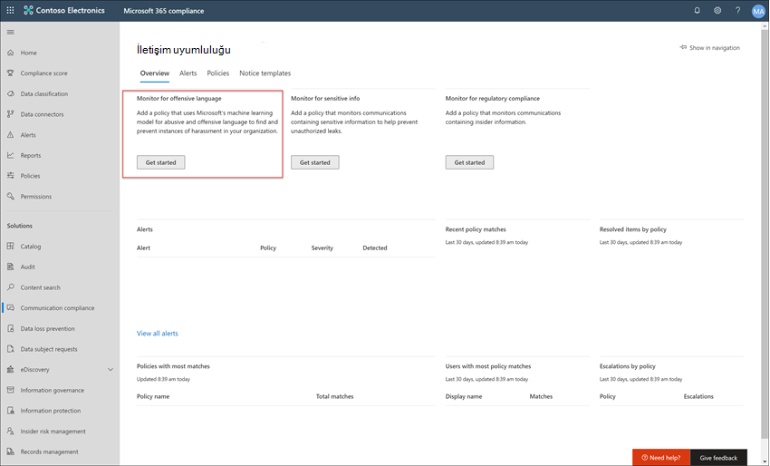

# Örnek olay incelemesi - Contoso, Microsoft Teams, Exchange ve Yammer iletişimleri için uygun olmayabilecek metinleri belirlemek üzere bir iletişim uyumluluk ilkesi yapılandırır

> [!IMPORTANT]
> Microsoft Purview İletişim Uyumluluğu, kuruluşların hassas veya gizli bilgiler, taciz veya tehdit dili ve yetişkin içeriğinin paylaşılması gibi mevzuat uyumluluğu ihlallerini (örneğin SEC veya FINRA) algılamasına yardımcı olacak araçlar sağlar. Tasarım gereği gizlilikle oluşturulan kullanıcı adları varsayılan olarak takma ad kullanılır, rol tabanlı erişim denetimleri yerleşiktir, araştırmacılar bir yönetici tarafından kabul edilir ve denetim günlükleri kullanıcı düzeyinde gizlilik sağlamaya yardımcı olur.

[Microsoft Purview İletişim Uyumluluğu](/microsoft-365/compliance/communication-compliance), kuruluşunuzda uygunsuz olabilecek metinler içeren iletileri algılamanıza, yakalamanıza ve üzerinde işlem yapmanıza yardımcı olarak iletişim risklerini en aza indirmenize yardımcı olur. Uygunsuz olabilecek metinler küfür, tehdit, taciz ve yetişkin içeriği içerebilir. Önceden tanımlanmış ve özel [ilkeler](/microsoft-365/compliance/communication-compliance-policies) , ilke eşleşmeleri için iç ve dış iletişimleri gözden geçirmenize olanak tanıyarak belirlenen gözden geçirenler tarafından incelenebilir. Gözden geçirenler kuruluşunuz genelinde e-posta, Microsoft Teams, Yammer veya üçüncü taraf iletişim [uyarılarını araştırabilir](/microsoft-365/compliance/communication-compliance-investigate-remediate#investigate-alerts) ve kuruluşunuzun ileti standartlarıyla uyumlu olduklarından emin olmak için uygun [düzeltme eylemlerini](/microsoft-365/compliance/communication-compliance-investigate-remediate#remediate-alerts) gerçekleştirebilir.

Contoso Corporation, uygunsuz olabilecek metinleri algılamak için hızla ilke yapılandırması gereken kurgusal bir kuruluştur. Microsoft 365'i öncelikli olarak kullanıcıları için e-posta, Microsoft Teams ve Yammer desteği için kullanıyorlar, ancak iş yerindeki taciz konusunda şirket ilkesini zorunlu kılmak için yeni gereksinimleri var. Contoso BT yöneticileri ve uyumluluk uzmanları, Microsoft 365 ile çalışmanın temelleri hakkında temel bilgilere sahiptir ve iletişim uyumluluğunu hızlı bir şekilde kullanmaya başlama konusunda uçtan uca yönergeler arıyor.

Bu örnek olay incelemesi, uygunsuz olabilecek metinleri algılamak için bir iletişim uyumluluk ilkesini hızla yapılandırmaya yönelik temel bilgileri kapsar. Bu kılavuz şunları içerir:

- [1. Adım: İletişim uyumluluğunu planlama](#step-1-planning-for-communication-compliance)
- [2. Adım: İletişim uyumluluğuna erişme](#step-2-accessing-communication-compliance)
- [3. Adım: Önkoşulları yapılandırma ve iletişim uyumluluk ilkesi oluşturma](#step-3-configuring-prerequisites-and-creating-a-communication-compliance-policy)
- [4. Adım: Uyarıları araştırma ve düzeltme](#step-4-investigate-and-remediate-alerts)

[!INCLUDE [purview-preview](../includes/purview-preview.md)]

## 1. Adım: İletişim uyumluluğunu planlama

Contoso BT yöneticileri ve uyumluluk uzmanları Microsoft Purview'daki uyumluluk çözümleri hakkında çevrimiçi web seminerlerine katıldı ve iletişim uyumluluk ilkelerinin iş yeri tacizini azaltmak için güncelleştirilmiş kurumsal ilke gereksinimlerini karşılamalarına yardımcı olduğuna karar verdi. Birlikte çalışarak, uygunsuz olabilecek iletileri algılayacak bir iletişim uyumluluk ilkesi oluşturmak ve etkinleştirmek için bir plan geliştirdiler. Bu yapılandırma Microsoft Teams'de gönderilen sohbetler, Yammer'daki özel iletiler ve topluluk konuşmaları ile Exchange Online gönderilen e-posta iletileri için metin algılamayı içerir.

Planları şunları belirlemeyi içerir:

- İletişim uyumluluk özelliklerine erişmesi gereken BT yöneticileri.
- İletişim uyumluluk ilkeleri oluşturması ve yönetmesi gereken uyumluluk uzmanları.
- İletişim uyumluluğu uyarılarını araştırması ve düzeltmesi gereken diğer departmanlarda (İnsan Kaynakları, Hukuk vb.) uyumluluk uzmanları ve diğer iş arkadaşı.
- İletişim uyumluluğunun kapsamına giren kullanıcılar, uygun olmayabilecek metin ilkesine sahip olabilir.

### Lisanslama

İlk adım, Contoso'nun Microsoft 365 lisanslama işleminin iletişim uyumluluk çözümü için destek içerip içermediğini onaylamaktır. İletişim uyumluluğuna erişmek ve bu uyumluluğu kullanmak için Contoso BT yöneticilerinin Contoso'nun aşağıdakilerden birine sahip olduğunu doğrulamaları gerekir:

- Microsoft 365 E5/A5/F5/G5 aboneliği (ücretli veya deneme sürümü)
- Microsoft 365 E3/A3/F3/G5 aboneliği + Microsoft 365 E5/A5/F5/G5 Uyumluluk eklentisi
- Microsoft 365 E3/A3/F3/G5 aboneliği + Microsoft 365 E5/A5/F5/G5 Insider Risk Management eklentisi
- Office 365 Kurumsal E5 aboneliği (ücretli veya deneme sürümü)
- Office 365 A5 aboneliği (ücretli veya deneme sürümü)
- Office 365 Kurumsal E3 aboneliği + Office 365 Gelişmiş Uyumluluk eklentisi (artık yeni aboneliklerde kullanılamaz, nota bakın)

İletişim uyumluluk ilkelerine dahil olan kullanıcılara yukarıdaki lisanslardan biri atanmalıdır. Abonelikler ve lisanslama hakkında daha fazla bilgi için bkz. [Güvenlik & uyumluluğu için Microsoft 365 kılavuzu](/office365/servicedescriptions/microsoft-365-service-descriptions/microsoft-365-tenantlevel-services-licensing-guidance/microsoft-365-security-compliance-licensing-guidance#communication-compliance).

> [!IMPORTANT]
> Office 365 Gelişmiş Uyumluluk artık tek başına abonelik olarak satılmaz. Geçerli aboneliklerin süresi dolduğunda, müşterilerin aynı veya ek uyumluluk özelliklerini içeren yukarıdaki aboneliklerden birine geçiş yapması gerekir.

Contoso BT yöneticileri, Contoso için lisans desteğini doğrulamak için aşağıdaki adımları uygular:

1. BT yöneticileri [Microsoft 365 yönetim merkezi](https://admin.microsoft.com) oturum açar ve Microsoft 365 yönetim merkezi > **Faturalama** > <a href="https://go.microsoft.com/fwlink/p/?linkid=842264" target="_blank">**Lisansları'na**</a> gider.

2. Burada iletişim uyumluluğu desteği içeren [lisans seçeneklerinden](/microsoft-365/compliance/communication-compliance-configure#subscriptions-and-licensing) birine sahip olduklarını onaylarlar.

### İletişim uyumluluğu izinleri

İletişim uyumluluk özelliklerini yönetmek için izinleri yapılandırmak için kullanılan beş rol grubu vardır. **İletişim uyumluluğunu** Microsoft Purview uyumluluk portalı menü seçeneği olarak kullanılabilir hale getirmek ve bu yapılandırma adımlarına devam etmek için Contoso yöneticilerine *İletişim Uyumluluğu Yöneticileri* rolü atanır.

Contoso *, İletişim Uyumluluğu* rol grubunu kullanmaya karar verir ve tüm iletişim uyumluluğu yöneticilerini, analistlerini, araştırmacılarını ve görüntüleyicilerini gruba atar. Bu rol grubu yapılandırması, Contoso'nun hızlı bir şekilde başlamasını ve uyumluluk yönetimi gereksinimlerine en uygun şekilde başlamasını kolaylaştırır.

|**Rol**|**Rol izinleri**|
|:-----|:-----|
| **İletişim Uyumluluğu** | Kuruluşunuz için iletişim uyumluluğunu tek bir grupta yönetmek için bu rol grubunu kullanın. Belirlenen yöneticiler, analistler, araştırmacılar ve görüntüleyiciler için tüm kullanıcı hesaplarını ekleyerek, iletişim uyumluluk izinlerini tek bir grupta yapılandırabilirsiniz. Bu rol grubu tüm iletişim uyumluluk izni rollerini içerir. Bu rol grubu yapılandırması, iletişim uyumluluğunu hızlı bir şekilde kullanmaya başlamanın en kolay yoludur ve ayrı kullanıcı grupları için ayrı izinlere ihtiyaç duymayan kuruluşlar için uygundur. |
| **İletişim Uyumluluğu Yöneticileri** | İletişim uyumluluğunu başlangıçta yapılandırmak ve daha sonra iletişim uyumluluk yöneticilerini tanımlı bir gruba ayırmak için bu rol grubunu kullanın. Bu rol grubuna atanan kullanıcılar iletişim uyumluluk ilkelerini, genel ayarları ve rol grubu atamalarını oluşturabilir, okuyabilir, güncelleştirebilir ve silebilir. Bu rol grubuna atanan kullanıcılar ileti uyarılarını görüntüleyemez. |
| **İletişim Uyumluluğu Analistleri** | İletişim uyumluluğu analistleri olarak görev yapacak kullanıcılara izin atamak için bu grubu kullanın. Bu rol grubuna atanan kullanıcılar, Gözden Geçiren olarak atandıkları ilkeleri görüntüleyebilir, ileti meta verilerini görüntüleyebilir (ileti içeriği değil), ek gözden geçirenlere iletebilir veya kullanıcılara bildirim gönderebilir. Analistler bekleyen uyarıları çözümleyemez. |
| **İletişim Uyumluluğu Araştırmacıları** | İletişim uyumluluk araştırmacısı olarak görev yapacak kullanıcılara izin atamak için bu grubu kullanın. Bu rol grubuna atanan kullanıcılar ileti meta verilerini ve içeriğini görüntüleyebilir, ek gözden geçirenlere iletebilir, eBulma (Premium) olayına iletebilir, kullanıcılara bildirim gönderebilir ve uyarıyı çözebilir. |
| **İletişim Uyumluluğu Görüntüleyicileri** | İletişim raporlarını yönetecek kullanıcılara izin atamak için bu grubu kullanın. Bu rol grubuna atanan kullanıcılar, iletişim uyumluluğu giriş sayfasındaki tüm raporlama pencere öğelerine erişebilir ve tüm iletişim uyumluluk raporlarını görüntüleyebilir. |

1. Contoso BT yöneticileri[, genel](https://compliance.microsoft.com/permissions) yönetici hesabının kimlik bilgilerini kullanarak Microsoft Purview uyumluluk portalı izinleri sayfasında oturum açar ve Microsoft 365'te rolleri görüntülemek ve yönetmek için bağlantıyı seçer.
2. Microsoft Purview uyumluluk portalı <a href="https://go.microsoft.com/fwlink/p/?linkid=2173597" target="_blank">**, İzinler'e**</a> gider ve Office 365 rolleri görüntülemek ve yönetmek için bağlantıyı seçer.
3. Yöneticiler *İletişim Uyumluluğu* rol grubunu ve ardından **Rol grubunu düzenle'yi** seçer.
4. Yöneticiler sol gezinti **bölmesinden Üyeleri seç'i** ve ardından **Düzenle'yi** seçin.
5. **Ekle'yi** ve ardından iletişim uyumluluğunu yönetecek, uyarıları araştıracak ve gözden geçirecek tüm Contoso kullanıcılarının onay kutusunu seçer.
6. Yöneticiler **Ekle'yi** ve ardından **Bitti'yi** seçin.
7. Contoso kullanıcılarını rol grubuna eklemek için **Kaydet'i** seçer. Adımları tamamlamak için **Kapat'ı** seçer.

## 2. Adım: İletişim uyumluluğuna erişme

İletişim uyumluluğu izinlerini yapılandırdıktan sonra, İletişim Uyumluluğu rol grubuna atanan Contoso BT yöneticileri ve uyumluluk uzmanları Microsoft Purview'daki iletişim uyumluluk çözümüne erişebilir. Contoso BT yöneticilerinin ve uyumluluk uzmanlarının iletişim uyumluluğuna erişmenin ve yeni bir ilke oluşturmaya başlamanın çeşitli yolları vardır:

- Doğrudan iletişim uyumluluk çözümünden başlama
- Microsoft Purview uyumluluk portalı başlayarak
- Microsoft Purview çözüm kataloğundan başlayarak
- Microsoft 365 yönetim merkezi başlayarak

### Doğrudan iletişim uyumluluk çözümünden başlama

Çözüme erişmenin en hızlı yolu, doğrudan [İletişim uyumluluğu çözümünde](https://compliance.microsoft.com/supervisoryreview) oturum açmaktır. Bu bağlantıyı kullanarak Contoso BT yöneticileri ve uyumluluk uzmanları, uyarıların durumunu hızla gözden geçirebileceğiniz ve önceden tanımlanmış şablonlardan yeni ilkeler oluşturabileceğiniz iletişim uyumluluğu giriş sayfasına yönlendirilir.

### Microsoft Purview uyumluluk portalı başlayarak

Contoso BT yöneticilerinin ve uyumluluk uzmanlarının iletişim uyumluluk çözümüne erişmesinin bir diğer kolay yolu da doğrudan [Microsoft Purview uyumluluk portalı](https://compliance.microsoft.com) oturum açmaktır. Oturum açtıktan sonra kullanıcıların tüm uyumluluk çözümlerini görüntülemek için **Tümünü göster** denetimini ve ardından başlamak için **İletişim uyumluluğu** çözümünü seçmeleri yeterlidir.

### Microsoft Purview çözüm kataloğundan başlayarak

Contoso BT yöneticileri ve uyumluluk uzmanları, Microsoft Purview çözüm kataloğunu seçerek iletişim uyumluluk çözümüne erişmeyi de seçebilir. **Microsoft Purview uyumluluk portalı** sol gezintinin **Çözümler** bölümünde **Katalog'u** seçerek, tüm Microsoft Purview çözümlerini listeleyen çözüm kataloğunu açabilirler. **Insider risk yönetimi** bölümüne doğru aşağı kaydırarak Contoso BT yöneticileri, başlamak için İletişim uyumluluğu'na tıklayabilir. Contoso BT yöneticileri, daha sonra oturum açtıklarında daha hızlı erişim için iletişim uyumluluk çözümünü sol gezinti bölmesine sabitlemek için Gezintide göster denetimini kullanmaya da karar verir.

### Microsoft 365 yönetim merkezi başlayarak

Microsoft 365 yönetim merkezi başlarken iletişim uyumluluğuna erişmek için Contoso BT yöneticileri ve uyumluluk uzmanları [Microsoft 365 yönetim merkezi](https://admin.microsoft.com) [oturum açıp Microsoft Purview uyumluluk portalı](https://compliance.microsoft.com)

Bu eylem **Office 365 Güvenlik ve Uyumluluk merkezini** açar ve sayfanın üst kısmındaki başlıkta sağlanan **Microsoft Purview uyumluluk portalı** bağlantısını seçmeleri gerekir.

contoso BT yöneticileri **, Microsoft Purview uyumluluk portalı** bir kez uyumluluk çözümlerinin tam listesini görüntülemek için **Tümünü göster'i** seçer.

**Tümünü göster'i** seçtikten sonra Contoso BT yöneticileri iletişim uyumluluk çözümüne erişebilir.

## 3. Adım: Önkoşulları yapılandırma ve iletişim uyumluluk ilkesi oluşturma

İletişim uyumluluk ilkesini kullanmaya başlamak için Contoso BT yöneticilerinin uygunsuz olabilecek metinleri algılamak için yeni ilkeyi ayarlamadan önce yapılandırması gereken çeşitli önkoşullar vardır. Bu önkoşullar tamamlandıktan sonra Contoso BT yöneticileri ve uyumluluk uzmanları yeni ilkeyi yapılandırabilir ve uyumluluk uzmanları oluşturulan uyarıları araştırmaya ve düzeltmeye başlayabilir.

### Microsoft 365'te denetimi etkinleştirme

İletişim uyumluluğu için denetim günlüklerinin uyarıları göstermesi ve gözden geçirenler tarafından gerçekleştirilen düzeltme eylemlerini izlemesi gerekir. Denetim günlükleri, tanımlı bir kuruluş ilkesiyle ilişkili tüm etkinliklerin özetidir veya iletişim uyumluluk ilkesinde herhangi bir değişiklik olduğunda.

Contoso BT yöneticileri denetimi açmak için [adım adım yönergeleri](/microsoft-365/compliance/turn-audit-log-search-on-or-off) gözden geçirir ve tamamlar. Denetimi açtıktan sonra, denetim günlüğünün hazırlandığını ve hazırlık tamamlandıktan birkaç saat sonra bir arama çalıştırabileceklerini belirten bir ileti görüntülenir. Contoso BT yöneticilerinin bu eylemi yalnızca bir kez yapması gerekir.

### Yammer kiracısını Yerel Mod için yapılandırma

İletişim uyumluluğu, özel iletilerde ve genel topluluk konuşmalarında uygunsuz olabilecek metinleri algılamak için bir kuruluşun Yammer kiracısının Yerel Modda olmasını gerektirir.

Contoso BT yöneticileri [, Microsoft 365'te Yammer Yerel Moduna Genel Bakış makalesindeki](/yammer/configure-your-yammer-network/overview-native-mode) bilgileri gözden geçirdiklerinden emin olur ve [Microsoft 365 için Yammer ağınızı Yerel Mod için yapılandırma](/yammer/configure-your-yammer-network/native-mode) makalesindeki geçiş aracını çalıştırma adımlarını izler.

### Kapsam içi kullanıcılar için grup ayarlama

Contoso uyumluluk uzmanları, uygunsuz olabilecek metinleri algılayacak iletişim ilkesine tüm kullanıcıları eklemek istiyor. Her kullanıcı hesabını ilkeye ayrı olarak eklemeye karar verebilirler, ancak bunun çok daha kolay olduğunu ve bu ilke için kullanıcılar için **Tüm Kullanıcılar** dağıtım grubunu kullanmanın zaman kazandırabileceğine karar vermişlerdir.

Tüm Contoso kullanıcılarını dahil etmek için yeni bir grup oluşturmaları gerekir, bu nedenle aşağıdaki adımları uygularlar:

1. Contoso BT yöneticileri BT [Microsoft 365 yönetim merkezi](https://admin.microsoft.com) oturum açar ve Microsoft 365 yönetim merkezi > **Grupları Grupları'na** >  gider.
2. Grup **ekle'yi** seçip sihirbazı tamamlayarak yeni bir *Microsoft 365 grubu* veya *Dağıtım grubu* oluşturur.

    

3. Yeni grup oluşturulduktan sonra tüm Contoso kullanıcılarını yeni gruba eklemeleri gerekir. [Exchange yönetim merkezini](https://outlook.office365.com/ecp) açar ve **Exchange yönetim merkezi** > **alıcı gruplarına** > <a href="https://go.microsoft.com/fwlink/?linkid=2183233" target="_blank">**gider.**</a> Contoso BT yöneticileri Üyelik alanını ve oluşturdukları yeni *Tüm Çalışanlar* grubunu seçip **Düzenle** denetimini seçerek tüm Contoso kullanıcılarını sihirbazdaki yeni gruba ekler.

    

### Uygunsuz olabilecek metni algılamak için ilke oluşturma

Tüm önkoşullar tamamlandıysa, BT yöneticileri ve Contoso için uyumluluk uzmanları, uygunsuz olabilecek metinleri algılamak için iletişim uyumluluk ilkesini yapılandırmaya hazırdır. Metin ilkesi şablonunu kullanarak bu yeni ilkeyi yapılandırmak basit ve hızlı bir işlemdir.

1. Contoso BT yöneticileri ve uyumluluk uzmanları **Microsoft Purview uyumluluk portalı** oturum açıp sol gezinti bölmesinden **İletişim uyumluluğu'na** tıklayın. Bu eylem, iletişim uyumluluk ilkesi şablonları için hızlı bağlantıları olan panoyu açar. **İlkeler'i** seçer, **Uygunsuz metinleri algıla** şablonuna kaydırıp **İlke oluştur** şablonunu seçer.

    

2. İlke şablonu sihirbazında Contoso BT yöneticileri ve uyumluluk uzmanları, gerekli üç alanı tamamlamak için birlikte çalışır: **İlke adı**, **Denetlenecek kullanıcılar veya gruplar** ve **Gözden Geçirenler**.
3. İlke sihirbazı ilke için zaten bir ad önerdiğinden, BT yöneticileri ve uyumluluk uzmanları önerilen adı tutmaya ve kalan alanlara odaklanmaya karar verir. Alanı **denetleyecek Kullanıcılar veya gruplar** için *Tüm kullanıcılar* grubunu ve **Gözden Geçirenler** alanı için ilke uyarılarını araştırması ve düzeltmesi gereken uyumluluk uzmanlarını seçer. İlkeyi yapılandırmanın ve uyarı bilgilerini toplamaya başlamanın son adımı **İlke oluştur'u** seçmektir.

    

## 4. Adım: Uyarıları araştırma ve düzeltme

Uygunsuz olabilecek metinleri algılamak için iletişim uyumluluk ilkesi yapılandırıldığına göre, Contoso uyumluluk uzmanları için bir sonraki adım ilke tarafından oluşturulan uyarıları araştırmak ve düzeltmek olacaktır. İlkenin tüm iletişim kaynağı kanallarındaki iletişimleri tam olarak işlemesi ve uyarıların **Uyarı panosunda** görünmesi bir saat kadar sürer.

Uyarılar oluşturulduktan sonra Contoso uyumluluk uzmanları, uygunsuz olabilecek metin sorunlarını araştırmak ve düzeltmek için [iş akışı yönergelerini](/microsoft-365/compliance/communication-compliance-investigate-remediate) izlemeye devam edecektir.
