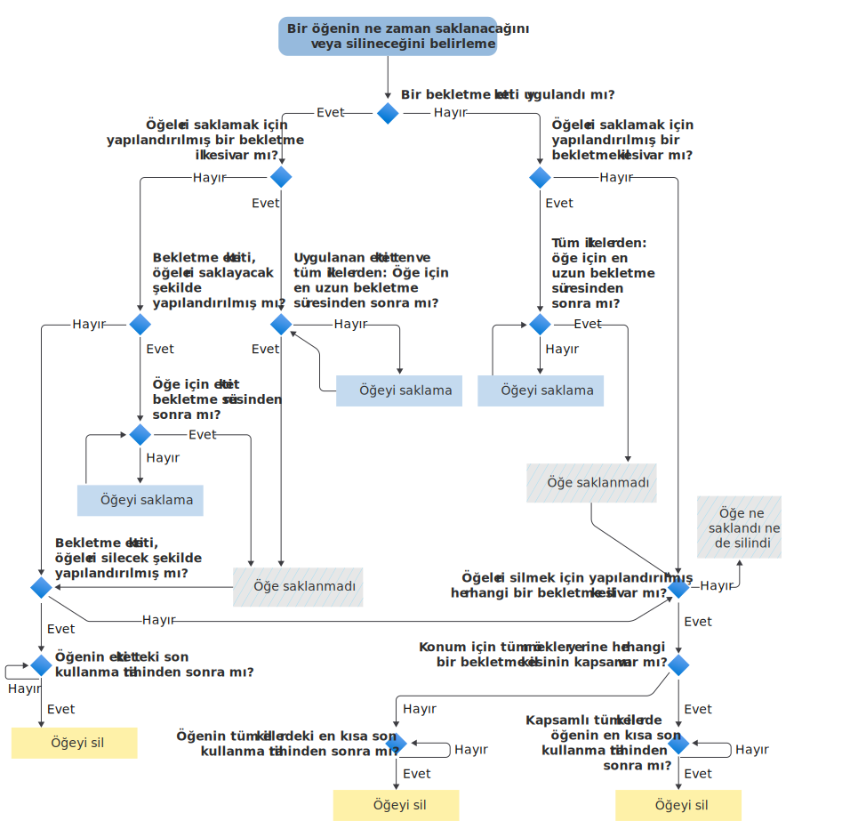

# Bir öğenin ne zaman tutulacağını veya kalıcı olarak silineceğini saptamak için akış çizelgesi

>*[Güvenlik & uyumluluğu için Microsoft 365 lisanslama kılavuzu](/office365/servicedescriptions/microsoft-365-service-descriptions/microsoft-365-tenantlevel-services-licensing-guidance/microsoft-365-security-compliance-licensing-guidance).*

Bir öğeye [bekletme ilkelerini](retention.md#the-principles-of-retention-or-what-takes-precedence) uygulamak için aşağıdaki akış çizelgesini kullanarak sistemin saklama etiketinin veya bekletme ilkesinin bir sonucu olarak saklamayı mı yoksa kalıcı olarak mı sileceğini belirleyin.

Bu mantıksal akış, aşağıdaki koşullardan biri uygulandığında bir öğe için kullanılır:

- Birden fazla bekletme ilkesi uygulandı
- Bekletme etiketi ve bir veya daha fazla bekletme ilkesi vardır

Bir öğe bir eBulma ayrı tutmasına (veya Dava tutma veya In-Place tutma eski teknolojilerine) tabi olduğunda, saklama ilkeleri ve bekletme etiketi için karar akışlarından önce her zaman korunur.

Bu akış çizelgesinde kullanılan terimlerden herhangi biri size yabancıysa bkz. [Bekletme ilkeleri ve bekletme etiketleri hakkında bilgi edinin](retention.md).

   

> [!NOTE]
> Öğe için en uzun saklama süresi ile bir bekletme ilkesi veya etiketinde belirtilen en uzun süre arasında ayrım yapmak önemlidir. Benzer şekilde, öğe için en kısa süre sonu tarihi ile bekletme ilkesinde belirtilen en kısa süre arasında.
> 
> Daha fazla bilgi için [bekletme ilkeleri](retention.md#the-principles-of-retention-or-what-takes-precedence) bölümündeki grafik sonrasındaki açıklamaya bakın.
