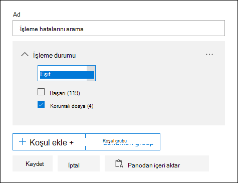

# Düzeltmede tek öğe Advanced eDiscovery

Hata düzeltmesi, Advanced eDiscovery kullanıcıların içeriği düzgün işlemesini önleyen veri Advanced eDiscovery düzeltme olanağı sağlar. Örneğin, parola korumalı dosyalar kilitli ya da şifrelenmiş olduğundan işlenemez. Daha önce, bu iş akışını kullanarak yalnızca toplu hataları [düzeltebilirsiniz](error-remediation-when-processing-data-in-advanced-ediscovery.md). Ancak bazen, araştırılıyor olan durumla ilgili olarak bu dosyalardan herhangi biri hassas olduğunda emin değilseniz birden çok dosyada oluşan hataları düzeltmek mantıklı değildir. Ayrıca, yanıt süresiyle ilgili önceden karar ver verebilirsiniz ve buna yardımcı olmak için dosya meta verilerini (dosya konumu veya erişimi olanlar gibi) gözden geçirme fırsatına sahip olmadan önce hataları düzeltmek de mantıklı olmaz. Tek öğe hata *düzeltmesi* adı verilen yeni bir özellik, eBulma yöneticilerine işleme hatası olan dosyaların meta verilerini görüntüleme olanağı verir ve gerekirse doğrudan gözden geçirme kümesinde hatayı düzeltebilirsiniz. Bu makalede, bir gözden geçirme kümesinde işleme hataları ile dosyaların nasıl tanım, yoksayma ve düzeltme işlemleri olduğu açıklanmıştır.

## Hatalı belgeleri tanımlama

Gözden geçirme kümesinde işleme hataları olan belgeler artık (başlıkla) tanımlanır. Hatayı düzeltmek veya yoksayabilirsiniz. Aşağıdaki ekran görüntüsü, parola korumalı bir gözden geçirme kümesinde bir Word belgesinin işleme hatasını gösterir. Ayrıca, işleme hatalarının olduğu belgelerin dosya meta verilerini görüntü ola bildirimini de edin.

Gözden geçirme kümesinde belgeleri sorgularken, İşleme **durumu** koşulsunu kullanarak da [işleme hataları olan belgeleri arayabilirsiniz](review-set-search.md).

### Hataları yoksayma

İşleme hatası başlığında Yoksay'a **tıklayarak işleme** hatasını yoksayabilirsiniz. Bir hatayı yoksaymasanız, belge toplu hata [düzeltme iş akışından kaldırılır](error-remediation-when-processing-data-in-advanced-ediscovery.md). Hata yoksayıldıktan sonra, belge başlığı renk değiştirir ve işleme hatasının yoksayıldı olduğunu gösterir. Geri Al'a tıklayarak, istediğiniz zaman hatayı yoksayma kararını geri **alabilirsiniz**.

Gözden geçirme kümesinde belgeleri sorgularken Yoksayılan işleme hataları koşulsunu kullanarak, işleme hatası  olan tüm belgeleri de arayabilirsiniz.

## Hatalı bir belgeyi düzeltme

Bazen belgelerde bir işlem hatasını düzeltmek (parolayı kaldırarak, şifreli bir dosyanın şifresini çözerek veya bozuk bir belgeyi kurtararak) ve sonra düzeltilen belgeyi gözden geçirme kümesine eklemeniz gerekebilir. Bu, hata belgesini gözden geçirme kümesinde diğer belgelerle birlikte gözden geçirmenizi ve dışarı aktarmayı sağlar. 

Tek bir belgeyi düzeltmek için şu adımları izleyin:

1. **Dosyanın** >  **bir kopyasını yerel** bilgisayara indirmek için Özgün dosyayı indir'e tıklayın.

   

2. Dosyada çevrimdışı hatayı düzeltmek. Şifre çözme yazılımı gerektiren şifrelenmiş dosyalar için parola korumasını kaldırmak için, parolayı girin ve dosyayı kaydedin veya parola kırıcı kullanın. Dosyayı düzeltmek için bir sonraki adıma geçin.

3. Gözden geçirme kümesinde, düzelttikleri işlem hatasını olan dosyayı seçin ve sonra **Düzeltme'ye tıklayın**.

   

4. **Gözat'a** tıklayın, yerel bilgisayarınızda düzeltilen dosyanın bulunduğu konuma gidin ve dosyayı seçin.

   

    Düzeltilen dosya seçidikten sonra, gözden geçirme kümesine otomatik olarak yüklenir. Dosyanın işleme durumunu izleyebilirsiniz.

    

   İşlem tamamlandıktan sonra düzeltili belgeyi görüntüebilirsiniz.

    

Bir belge düzeltilene kadar neler olduğu hakkında daha fazla bilgi için bkz [. Dosyalar düzeltilince ne olur](error-remediation-when-processing-data-in-advanced-ediscovery.md#what-happens-when-files-are-remediated)?

## Düzeltilenmiş belgeleri arama

Anahtar sözcükler koşulu kullanarak düzeltmiş ve şu özelliği:değer çifti: **IsFromErrorRemediation:true** değerini belirterek gözden geçirme kümesinde tüm belgeleri arayabilirsiniz. Bu özellik, gözden geçirme kümesinden belge dışarı aktarsanız da dışarı aktarma yükleme dosyasında kullanılabilir.
