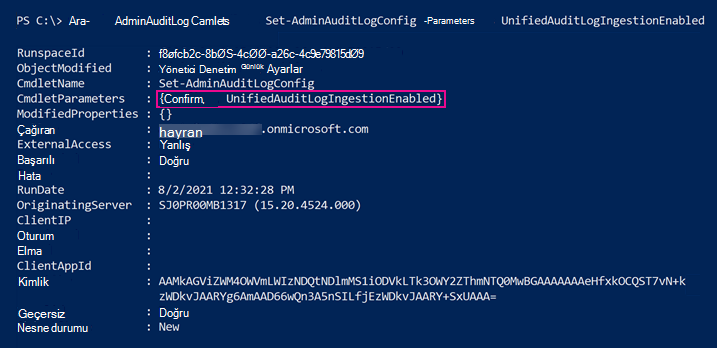

# <a name="turn-auditing-on-or-off"></a>Denetimi açma veya kapatma

Denetim günlüğü, kurumsal kuruluşlar tarafından denetlenen Microsoft 365 Office 365 olarak açıktır. Ancak, bir kuruluşta yeni Microsoft 365 veya Office 365 ayarlarken, kuruluş için denetim durumunu doğrulamanız gerekir. Yönergeler için, bu [makalenin Kuruluş için denetim durumunu](#verify-the-auditing-status-for-your-organization) doğrulama bölümüne bakın. 

Microsoft 365 uyumluluk merkezi'de denetim açıkken, kuruluştan gelen kullanıcı ve yönetici etkinlikleri denetim günlüğüne kaydedilir ve kullanıcılara atanan lisansa bağlı olarak 90 gün ve bir yıla kadar korunur. Bununla birlikte, kuruluşta denetim günlüğü verilerini kaydetmek ve tutmak istememek için bazı nedenleri olabilir. Bu gibi durumlarda, genel yönetici kendi yönetim merkezinde denetimi kapatmaya Microsoft 365.

> [!IMPORTANT]
> Microsoft 365'de denetimi kapatsanız bile, Office 365 Yönetim Etkinliği API'sini veya Microsoft Sentinel'i kullanarak kuruluşlarınız için denetim verilerine erişebilirsiniz. Bu makaledeki adımların ardından denetimin kapatılması, Microsoft 365 uyumluluk merkezi'i kullanarak denetim günlüğünde arama gerçekleştirerek veya Exchange Online PowerShell'de **Search-UnifiedAuditLog** cmdlet'ini çalıştırarak sonuç döndürülmayacak anlamına gelir. Bu ayrıca denetim günlüklerinin Yönetim Etkinliği API'si veya Microsoft Sentinel Office 365 de kullanılamaz.
  
## <a name="before-you-turn-auditing-on-or-off"></a>Denetimi açmadan veya kapatmadan önce

- Exchange Online'te denetimi açmak veya kapatmak için, Exchange Online Günlükleri rolüne atanmış Microsoft 365 gerekir. Varsayılan olarak bu rol, Yönetim Merkezi'nin İzinler sayfasındaki **Uyumluluk Yönetimi ve** Kuruluş Exchange atanır. E-posta Microsoft 365 genel yöneticiler Kuruluş Yönetimi rol grubunun bir üyesi Exchange Online.

    > [!NOTE]
    > Denetimi açmak veya kapatmak için Exchange Online izinlerin kullanıcılara atanmış olması gerekir. Kullanıcılara Denetim Günlükleri rolünü Microsoft 365 uyumluluk merkezi sayfasında atarsanız,  denetimi açılamaz veya kapatılamaz. Bunun nedeni, temel cmdlet'in bir PowerShell cmdlet'i Exchange Online cmdlet'idir.

- Denetim günlüğünde aramayla ilgili adım adım yönergeler için bkz. [Denetim günlüğünde arama.](search-the-audit-log-in-security-and-compliance.md) Yeni Yönetim Etkinliği API'si Microsoft 365 daha fazla bilgi için bkz. Yönetim [API'leriyle Microsoft 365 başlama](/office/office-365-management-api/get-started-with-office-365-management-apis).

## <a name="verify-the-auditing-status-for-your-organization"></a>Kuruluş için denetim durumunu doğrulama

Denetimin, organizasyonunız için açık olduğunu doğrulamak için, [Exchange Online PowerShell'de şu komutu çalıştırabilirsiniz](/powershell/exchange/connect-to-exchange-online-powershell):

```powershell
Get-AdminAuditLogConfig | FL UnifiedAuditLogIngestionEnabled
```

`True` _UnifiedAuditLogIngestionEnabled özelliği için bir_ değer denetimin açık olduğunu gösterir. Değeri, `False` denetimin açık olmadığını gösterir.

## <a name="turn-on-auditing"></a>Denetimi açma

Denetimin organizasyonu için açık olup olmadığını, Microsoft 365 uyumluluk merkezi'ta veya Exchange Online PowerShell kullanarak açabilirsiniz. Denetim günlüğünde arama sonuçları döndüremeden önce, denetimi açmanız birkaç saat sürebilir.
  
### <a name="use-the-compliance-center-to-turn-on-auditing"></a>Denetimi açmak için uyumluluk merkezini kullanma

1. Gidin ve <https://compliance.microsoft.com> oturum açma.

2. Denetim bölmesinin sol gezinti Microsoft 365 uyumluluk merkezi Denetim'e **tıklayın**.

   Organizasyonunız için denetleme açık değilse, kullanıcı ve yönetici etkinliğini kaydetmeye başlamanızı istemiyle bir başlık görüntülenir.

   

3. Kullanıcı ve **yönetici etkinliği kaydını başlat başlığına** tıklayın.

   Değişikliğin etkili bir şekilde yürürlüğe girdisi 60 dakika kadar sürebilir.

### <a name="use-powershell-to-turn-on-auditing"></a>Denetimi açmak için PowerShell kullanma

1. [Bağlan PowerShell Exchange Online e geri tarak.](/powershell/exchange/connect-to-exchange-online-powershell)

2. Denetimi açmak için aşağıdaki PowerShell komutunu çalıştırın.

    ```powershell
    Set-AdminAuditLogConfig -UnifiedAuditLogIngestionEnabled $true
    ```

    Değişikliğin etkili bir şekilde 60 dakika kadar sürebilir olduğunu söyleyen bir ileti görüntülenir.
  
## <a name="turn-off-auditing"></a>Denetimi kapatma

Exchange Online PowerShell kullanarak denetimi kapatabilirsiniz.
  
1. [Bağlan PowerShell Exchange Online e geri tarak.](/powershell/exchange/connect-to-exchange-online-powershell)

2. Denetimi kapatmak için aşağıdaki PowerShell komutunu çalıştırın.

    ```powershell
    Set-AdminAuditLogConfig -UnifiedAuditLogIngestionEnabled $false
    ```

3. Bir süre sonra, denetimin kapalı (devre dışı) olduğunu doğrulayın. Bunu yapmanın iki yolu vardır:

    - PowerShell Exchange Online de aşağıdaki komutu çalıştırın:

      ```powershell
      Get-AdminAuditLogConfig | FL UnifiedAuditLogIngestionEnabled
      ```

      `False` _UnifiedAuditLogIngestionEnabled_ özelliğinin değeri denetimin kapalı olduğunu gösterir.

    - Denetim **sayfasındaKimlik** sayfasına Microsoft 365 uyumluluk merkezi.

      Organizasyonunız için denetleme açık değilse, kullanıcı ve yönetici etkinliğini kaydetmeye başlamanızı istemiyle bir başlık görüntülenir.

## <a name="audit-records-when-auditing-status-is-changed"></a>Denetim durumu değiştiriken kayıtları denetleme

Organizasyon durumdaki denetim durumunda yapılan değişiklikler, denetlemenin kendileridir. Bu, denetimin açık veya kapalı olduğu durumda denetim kayıtlarının günlüğe kaydedileceğini anlamına gelir. Bu denetim kayıtlarını Exchange denetim günlüğünde arayabilirsiniz.

Yönetici denetim Exchange günlüğünde, denetimi açma veya kapatmada oluşturulan denetim kayıtlarını aramak için, [Exchange Online PowerShell'de aşağıdaki komutu çalıştırın](/powershell/exchange/connect-to-exchange-online-powershell):

```powershell
Search-AdminAuditLog -Cmdlets Set-AdminAuditLogConfig -Parameters UnifiedAuditLogIngestionEnabled
```

Bu olayların denetim kayıtları, denetim durumunun ne zaman değiştirdiğini, durumu değiştiren yönetici hakkında bilgi ve değişikliği yapmak için kullanılan bilgisayarın IP adresi bilgilerini içerir. Aşağıdaki ekran görüntüleri, kurumda denetim durumunu değiştirmeye karşılık gelen denetim kayıtlarını gösterir.

### <a name="audit-record-for-turning-on-auditing"></a>Denetimin açması için denetim kaydı



`Confirm` *CmdletParameters* özelliğinin değeri, birleşik denetim günlüğünün uyumluluk merkezinde veya **Set-AdminAuditLogConfig -UnifiedAuditLogIngestionEnabled cmdlet'i çalıştırarak açık olduğunu $true** gösterir.

### <a name="audit-record-for-turning-off-auditing"></a>Denetimi kapatarak denetim kaydı


Değeri `Confirm` *CmdletParameters özelliğine dahil* değildir. Bu, birleşik denetim günlüğünün **Set-AdminAuditLogConfig -UnifiedAuditLogIngestionEnabled $false** olduğunu gösterir.

Yönetici denetim günlüğünde arama Exchange daha fazla bilgi için bkz. [Search-AdminAuditLog](/powershell/module/exchange/search-adminauditlog).
