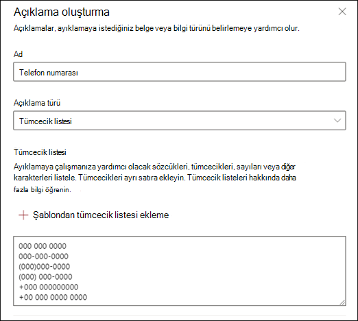

# Microsoft SharePoint Syntex'da açıklama şablonlarını kullanma

Açıklamanız için çeşitli tümcecik listesi değerlerini el ile ekleyebilmenize karşın, açıklama kitaplığında size sağlanan şablonları kullanmak daha kolay olabilir.

Örneğin, *tarih* için tüm varyasyonları el ile eklemek yerine, *tarih için* tümcecik listesi şablonunu kullanabilirsiniz çünkü zaten birçok tümcecik listesi değeri içerir:

Açıklama kitaplığı, aşağıdakiler de dahil olmak üzere yaygın olarak kullanılan *tümcecik listesi* açıklamalarını içerir:

- Tarih: Takvim tarihleri, tüm biçimler. Metin ve sayıları içerir (örneğin, "9 Aralık 2020").
- Tarih (sayısal): Takvim tarihleri, tüm biçimler. Sayılar içerir (örneğin, 1-11-2020).
- Zaman: 12 saat ve 24 saatlik biçimler.
- Sayı: İki ondalık basameğe kadar pozitif ve negatif sayılar.
- Yüzde: Yüzdeyi temsil eden desenlerin listesi. Örneğin, %1, %11, %100 veya %11,11.
- Telefon numarası: Ortak ABD ve Uluslararası biçimler. Örneğin, 000 000 000 0000, 000-000-0000, (000)000-0000 veya (000) 000-0000.
- Posta kodu: ABD Posta kodu biçimleri. Örneğin, 11111, 11111-1111.
- Cümlenin ilk sözcüğü: Dokuz karaktere kadar olan sözcükler için ortak desenler.
- Cümle sonu: Cümlenin sonu için yaygın noktalama işaretleri.
- Kredi kartı: Ortak kredi kartı numarası biçimleri. Örneğin, 1111-1111-1111-1111.
- Sosyal güvenlik numarası: ABD Sosyal Güvenlik Numarası biçimi. Örneğin, 111-11-1111.
- Onay kutusu: Dolu bir onay kutusundaki varyasyonları temsil eden bir tümcecik listesi. Örneğin, _X_, _ _X_.
- Para Birimi: Büyük uluslararası semboller. Örneğin, $.
- bilgi Email: genellikle iletinin gönderildiği diğer kişilerin veya grupların adlarının veya e-posta adreslerinin yanında bulunan 'CC:' terimine sahip bir tümcecik listesi.
- Email tarih: Genellikle e-postanın gönderildiği tarihin yakınında bulunan 'Gönderme tarihi:' terimine sahip bir tümcecik listesi.
- Email karşılama: E-postalar için genel açılış satırları.
- Email alıcı: genellikle iletinin gönderildiği kişilerin veya grupların adlarının veya e-posta adreslerinin yanında bulunan ve 'Kime:' terimine sahip bir tümcecik listesi.
- Email gönderen: Genellikle gönderenin adının veya e-posta adresinin yanında bulunan ve 'Kimden:' terimine sahip bir tümcecik listesi.
- Email konu: Genellikle e-postanın konusunun yakınında bulunan 'Subject:' terimine sahip bir tümcecik listesi.

Açıklama kitaplığı, aşağıdakiler de dahil olmak üzere yaygın olarak kullanılan *normal ifade* açıklamalarını da içerir:

- 6 basamaklı ile 17 basamaklı sayılar arası: 6 ile 17 basamak arası herhangi bir sayıyla eşleşir. ABD banka hesap numaraları bu desene uyar.
- Email adresi: meganb@contoso.com gibi yaygın bir e-posta adresi türüyle eşleşir.
- ABD vergi mükellefi kimlik numarası: 9 ile başlayan üç basamaklı bir sayıyla ve ardından 7 veya 8 ile başlayan 6 basamaklı bir sayıyla eşleşir.
- Web adresi (URL): http:// veya https:// ile başlayarak bir web adresinin biçimiyle eşleşir.

Ayrıca açıklama kitaplığı, örnek dosyalarınızda etiketlediğiniz verilerle çalışan üç otomatik şablon türü içerir:

- Etiket sonrası: Örnek dosyalardaki etiketlerden sonra oluşan sözcükler veya karakterler.
- Etiketin önüne: Örnek dosyalardaki etiketlerden önce oluşan sözcükler veya karakterler.
- Etiketler: Örnek dosyalardan en fazla ilk 10 etiket.

Size otomatik şablonların nasıl çalıştığına ilişkin bir örnek vermek için, aşağıdaki örnek dosyada, modele daha doğru bir eşleşme elde etmek için daha fazla bilgi vermenize yardımcı olması için Etiket açıklamasından önce şablonunu kullanacağız.

Etiket açıklamasından önce şablonunu seçtiğinizde, örnek dosyalarınızda etiketin önünde görünen ilk sözcük kümesini arar. Örnekte, ilk örnek dosyada tanımlanan sözcük kümesi "Itibarıyla" şeklindedir.

Şablondan bir açıklama oluşturmak için **Ekle'yi** seçebilirsiniz. Daha fazla örnek dosya eklediğinizde, ek sözcükler tanımlanır ve tümcecik listesine eklenir.

## Açıklama kitaplığından şablon kullanma

1. Modelinizin **Eğit** sayfasında **Açıklamalar** bölümünde **Yeni'yi** ve ardından **Şablondan'ı** seçin.

   

2.  **Açıklama şablonları** sayfasında, kullanmak istediğiniz açıklamayı seçin ve ardından **Ekle'yi** seçin.

    

3. Seçtiğiniz şablonun bilgileri **, Açıklama oluştur** sayfasında görüntülenir. Gerekirse açıklama adını düzenleyin ve tümcecik listesinden öğe ekleyin veya kaldırın.

    

4. İşiniz bittiğinde **Kaydet'i** seçin.

## Şablonu açıklama kitaplığına kaydetme

Diğer modellerle birlikte kullanılacak bir içerik merkezinin açıklama kitaplığında kullanılabilir hale getirmek için bir açıklamayı şablon olarak kaydedebilirsiniz. Şablon, tümceciklerin belgede nerede göründüğünü belirtme seçeneği dışında, açıklamanın temel ve gelişmiş ayarlarını içerir.

> [!NOTE]
> Yalnızca tümcecik listesi ve normal ifade açıklamaları şablon olarak kaydedilebilir.

1. Modelinizin **Eğitim** sayfasının **Açıklamalar** bölümünde:

   a. Açıklama listesinden şablon olarak kaydetmek istediğiniz açıklamayı seçin.

   b. **Şablon olarak kaydet'i** seçin.

    

2. **Açıklama şablonunu kaydet** sayfasında:

   a. **Ad** bölümünde gerekirse açıklamayı yeniden adlandırın.

   b. **Açıklama** bölümünde, başkalarına açıklamanın nasıl kullanılacağını bildirmek için bir açıklama ekleyin.

   c. **Kaydet**'i seçin.

    

### Ayrıca bkz.

[SharePoint Syntex'de açıklama türleri](explanation-types-overview.md)