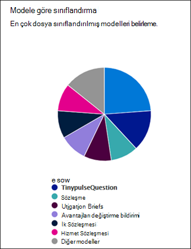

# Modellerinizin Microsoft Syntex'te nasıl kullanıldığını analiz etme

**Şunlar için geçerlidir:**  &ensp; &#10003; Tüm özel modeller &ensp; | &ensp; &#10003; Tüm önceden oluşturulmuş modeller

<!---
 

> [!VIDEO https://www.microsoft.com/videoplayer/embed/RE4GnhX]  

 
--->

Microsoft Syntex'teki içerik merkeziniz, içerik merkezinden yayımlanan modellerinizin nasıl kullanıldığı hakkında daha fazla bilgi sağlamak için model kullanım analizi sağlar. İçerik merkezinin **son 30 gün içinde modellerinizin performansı** bölümünde aşağıdaki grafiklerde ve listelerde sağlanan 30 günlük kullanım analizi verilerinin birleştirilmesi yer alır:

- Modele göre sınıflandırma
- Kitaplığa göre sınıflandırma
- Model kullanımı 

  

### Model kullanım verilerini varsayılan içerik merkezinden alma

Syntex'te, kurulum sırasında varsayılan içerik merkezi oluşturulur. Gerektiğinde daha fazla içerik merkezi de oluşturulabilir. Örneğin, departmanlar modellerini oluşturmak ve yönetmek için kendi içerik merkezlerini oluşturabilir. 

Model kullanım analiziyle ilgili olarak şunları unutmayın:

- Varsayılan içerik merkeziniz, diğer içerik merkezlerinde oluşturulanlar da dahil olmak üzere kuruluşunuzdaki tüm içerik merkezleri ve modeller için model kullanım analizini gösterir. Bu, içerik yöneticilerine ve diğer paydaşlara şirket genelindeki içerik merkezlerini ve modellerini yönetmeleri ve denetlemeleri için merkezi bir portal sağlar.
 
- Diğer içerik merkezleri yalnızca kendilerinde oluşturulmuş modeller için model kullanım analizini gösterir. Bu, içerik yöneticilerine yalnızca ilgilendikleri modeller için kullanım verileriyle ilgili içgörüler sağlar.

## Modele göre sınıflandırma

    

**Modele göre sınıflandırma** pasta grafiği, hangi modellerin en çok dosyayı sınıflandırmış olduğunu gösterir. Yayımlanan her modeli, içerik merkezindeki tüm yayımlanan modeller tarafından işlenen toplam dosyaların yüzdesi olarak gösterir.

Her model, model tarafından başarıyla analiz edilen karşıya yüklenen dosyaların yüzdesi olan **Tamlık Oranı'nı** da gösterir. Düşük bir tamlık oranı, model veya analiz edilen dosyalarla ilgili sorunlar olduğu anlamına gelebilir.

## Kitaplığa göre sınıflandırma

    

Kitaplık çubuğuna **göre sınıflandırma** grafiği, kuruluşunuzdaki içerik anlamanın etkinliğini belirlemenize yardımcı olur. Her model için zaman içinde işlenen dosya sayısını göstermekle kalmaz, grafikte bir sütun seçerek modelin uygulandığı belge kitaplıklarını da gösterir.

## Model kullanımı

Model kullanım listesi, içerik merkezi aracılığıyla oluşturulan modeller için kullanım analizini gösterir.  

> [!NOTE]
> Varsayılan içerik merkezindeyseniz ve kuruluşunuzda ek içerik merkezleri varsa, model kullanım listesi içerik merkezine göre gruplandırılır.

Model kullanım listesindeki her model kullanım verilerini gösterir:

- Sınıflandırılmış öğe sayısı: Model tarafından işlenen dosyaların sayısı.
- Ortalama güvenilirlik puanı: Dosyalara karşı çalıştırıldığında modelin ortalama doğruluk puanı.
- Hedef liste URL'si: Modelin uygulandığı SharePoint belge kitaplığı.

