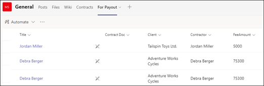

# <a name="step-3-use-power-automate-to-create-the-flow-to-process-your-contracts"></a>Adım 3. Anlaşmalarınızı işlemek üzere akış oluşturmak için Power Automate'i kullanma

Sözleşme Yönetimi kanalınızı oluşturdunuz ve SharePoint belge kitaplığınızı iliştirdiniz. Bir sonraki adım, Syntex modelinizin tanımladığını ve sınıflaştırdığını sözleşmelerinizi işlemek için bir Power Automate akışı oluşturmaktır. [SharePoint belge kitaplığınızda bir Power Automate akışı oluşturarak](https://support.microsoft.com/office/create-a-flow-for-a-list-or-library-in-sharepoint-or-onedrive-a9c3e03b-0654-46af-a254-20252e580d01) bu adımı gerçekleştirebilirsiniz.

Sözleşme yönetimi çözümünüz için aşağıdaki eylemleri gerçekleştirmek üzere bir Power Automate akışı oluşturmak istiyorsunuz:

-  Syntex modeliniz tarafından bir sözleşme sınıflandırıldıktan sonra sözleşme durumunu **Gözden geçirildi** olarak değiştirin.
- Ardından sözleşme gözden geçirilir ve onaylanır veya reddedilir.
- Onaylanan sözleşmeler için, sözleşme bilgileri ödeme işleme için bir sekmeye nakledilir.
- Reddedilen sözleşmeler için takıma daha fazla analiz için bildirim gönderilir. 

Aşağıdaki diyagramda, sözleşme yönetimi çözümü için Power Automate akışı gösterilmektedir.


## <a name="prepare-your-contract-for-review"></a>Sözleşmenizi gözden geçirme için hazırlama

Syntex belge anlama modelinize göre bir sözleşme tanımlanıp sınıflandırıldığında, Power Automate akışı önce durumu **Gözden geçirildi** olarak değiştirir.


Dosyayı kullanıma aldıktan sonra durum değerini **Gözden geçirildi** olarak değiştirin.


Sonraki adım, sözleşmenin gözden geçirmeyi beklediğini ve Sözleşme Yönetimi kanalına göndermeyi beklediğini belirten uyarlamalı bir kart oluşturmaktır.


Aşağıdaki kod, Power Automate akışında bu adım için kullanılan JSON kodudur.

```JSON
{
"$schema": "http://adaptivecards.io/schemas/adaptive-card.json",
"type": "AdaptiveCard",
"version": "1.0",
"body": [
    {
    "type": "TextBlock",
    "text": "Contract approval request",
    "size": "large",
    "weight": "bolder",
     "wrap": true
    },
        {
            "type": "Container",
            "items": [
                {
                    "type": "FactSet",
                    "spacing": "Large",
                    "facts": [
                        {
                            "title": "Client",
                            "value": "@{triggerOutputs()?['body/Client']}"
                        },
                        {
                            "title": "Contractor",
                            "value": "@{triggerOutputs()?['body/Contractor']}"
                        },
                        {
                            "title": "Fee amount",
                            "value": "@{triggerOutputs()?['body/FeeAmount']}"
                        },
                        {
                            "title": "Date created",
                            "value": "@{triggerOutputs()?['body/Modified']} "
                        },
                        {
                            "title": "Link",
                            "value": "[@{triggerOutputs()?['body/{FilenameWithExtension}']}](@{triggerOutputs()?['body/{Link}']})"
                        }
                    ]
                }
            ]
         },
    {
    "type": "TextBlock",
    "text": "Comment:"
    },
        {
            "type": "Input.Text",
            "placeholder": "Enter comments",
            "id": "acComments"
        }
],
"actions": [
    {
    "type": "Action.Submit",
    "title": "Approve",
    "data": {
        "x": "Approve"
    }
    },
    {
    "type": "Action.Submit",
    "title": "Reject",
    "data": {
        "x": "Reject"
    }
    }
]
}
```


## <a name="conditional-context"></a>Koşullu bağlam

Akışınızda, daha sonra sözleşmenizin  [onaylanacağı](#if-the-contract-is-approved) veya [reddedileceği](#if-the-contract-is-rejected) bir koşul oluşturmanız gerekir.


## <a name="if-the-contract-is-approved"></a>Sözleşme onaylanırsa

Bir sözleşme onaylandığında aşağıdaki işlemler gerçekleşir:

- **Sözleşmeler** sekmesinde, sözleşme kartındaki durum **Onaylandı** olarak değişir.

   

- Akışınızda durum **Onaylandı** olarak değiştirilir.

   

- Bu çözümde, ödemelerin yönetilebilmesi için sözleşme verileri **Ödeme İçin** sekmesine eklenecektir. Bu işlem, akışın üçüncü taraf bir finansal uygulama (örneğin, Dynamics CRM) tarafından ödeme için sözleşmeleri göndermesine izin verecek şekilde uzatılabilir.

   

- Akışta, onaylanan sözleşmeleri **Ödeme İçin** sekmesine taşımak için aşağıdaki öğeyi oluşturursunuz.

   

    Teams kartından gereken bilgilerin ifadelerini almak için aşağıdaki tabloda gösterilen değerleri kullanın.
 
    |Name     |Expression |
    |---------|-----------|
    | Onay durumu  | body('Post_an_Adaptive_Card_to_a_Teams_channel_and_wait_for_a_response')? ['submitActionId']         |
    | Onaylanan     | body('Post_an_Adaptive_Card_to_a_Teams_channel_and_wait_for_a_response')? ['yanıtlayıcı'] ['displayName']        |
    | Onay tarihi     | body('Post_an_Adaptive_Card_to_a_Teams_channel_and_wait_for_a_response')? ['responseTime']         |
    | Açıklama ekleme     | body('Post_an_Adaptive_Card_to_a_Teams_channel_and_wait_for_a_response')? ['data']? ['acComments']         |
    
    Aşağıdaki örnekte, Power Automate'te ifade yazmak için formül kutusunun nasıl kullanılacağı gösterilmektedir.

       

- Sözleşmenin onaylandığını belirten uyarlamalı bir kart oluşturulur ve Sözleşme Yönetimi kanalına gönderilir.

   

   


   Aşağıdaki kod, Power Automate akışında bu adım için kullanılan JSON kodudur.

```JSON
{ 
    "type": "AdaptiveCard",
    "body": [
        {
            "type": "Container",
            "style": "emphasis",
            "items": [
                {
                    "type": "ColumnSet",
                    "columns": [
                        {
                            "type": "Column",
                            "items": [
                                {
                                    "type": "TextBlock",
                                    "size": "Large",
                                    "weight": "Bolder",
                                    "text": "CONTRACT APPROVED"
                                }
                            ],
                            "width": "stretch"
                        }
                    ]
                }
            ],
            "bleed": true
        },
        {
            "type": "Container",
            "items": [
                {
                    "type": "FactSet",
                    "spacing": "Large",
                    "facts": [
                        {
                            "title": "Client",
                            "value": "@{triggerOutputs()?['body/Client']}"
                        },
                        {
                            "title": "Contractor",
                            "value": "@{triggerOutputs()?['body/Contractor']}"
                        },
                        {
                            "title": "Fee amount",
                            "value": "@{triggerOutputs()?['body/FeeAmount']}"
                        },
                        {
                            "title": "Approval by",
                            "value": "@{body('Post_an_Adaptive_Card_to_a_Teams_channel_and_wait_for_a_response')?['responder']['displayName']}"
                        },
                        {
                            "title": "Approved date",
                            "value": "@{body('Post_an_Adaptive_Card_to_a_Teams_channel_and_wait_for_a_response')?['responseTime']}"
                        },
                        {
                            "title": "Approval comment",
                            "value": "@{body('Post_an_Adaptive_Card_to_a_Teams_channel_and_wait_for_a_response')?['data']?['acComments']}"
                        },
                        {
                            "title": " ",
                            "value": " "
                        },
                        {
                            "title": "Status",
                            "value": "Ready for payout"
                        }
                    ]
                }
            ]
        }
    ],
    "$schema": "http://adaptivecards.io/schemas/adaptive-card.json",
    "version": "1.2",
    "fallbackText": "This card requires Adaptive Cards v1.2 support to be rendered properly."
}
```

## <a name="if-the-contract-is-rejected"></a>Sözleşme reddedilirse

Bir sözleşme reddedildiğinde aşağıdaki işlemler gerçekleşir:

- **Sözleşmeler** sekmesinde, sözleşme kartındaki durum **Reddedildi** olarak değişir.

   

- Akışınızda sözleşme dosyasını kullanıma alır, durumu **Reddedildi** olarak değiştirir ve sonra dosyayı yeniden iade edebilirsiniz.

   

- Akışınızda, sözleşmenin reddedildiğini belirten uyarlamalı bir kart oluşturursunuz.

   

Aşağıdaki kod, Power Automate akışında bu adım için kullanılan JSON kodudur.

```JSON
{ 
    "type": "AdaptiveCard",
    "body": [
        {
            "type": "Container",
            "style": "attention",
            "items": [
                {
                    "type": "ColumnSet",
                    "columns": [
                        {
                            "type": "Column",
                            "items": [
                                {
                                    "type": "TextBlock",
                                    "size": "Large",
                                    "weight": "Bolder",
                                    "text": "CONTRACT REJECTED"
                                }
                            ],
                            "width": "stretch"
                        }
                    ]
                }
            ],
            "bleed": true
        },
        {
            "type": "Container",
            "items": [
                {
                    "type": "FactSet",
                    "spacing": "Large",
                    "facts": [
                        {
                            "title": "Client",
                            "value": "@{triggerOutputs()?['body/Client']}"
                        },
                        {
                            "title": "Contractor",
                            "value": "@{triggerOutputs()?['body/Contractor']}"
                        },
                        {
                            "title": "Fee amount",
                            "value": "@{triggerOutputs()?['body/FeeAmount']}"
                        },
                        {
                            "title": "Rejected by",
                            "value": "@{body('Post_an_Adaptive_Card_to_a_Teams_channel_and_wait_for_a_response')?['responder']['displayName']}"
                        },
                        {
                            "title": "Rejected date",
                            "value": "@{body('Post_an_Adaptive_Card_to_a_Teams_channel_and_wait_for_a_response')?['responseTime']}"
                        },
                        {
                            "title": "Comment",
                            "value": "@{body('Post_an_Adaptive_Card_to_a_Teams_channel_and_wait_for_a_response')?['data']?['acComments']}"
                        },
                        {
                            "title": " ",
                            "value": " "
                        },
                        {
                            "title": "Status",
                            "value": "Needs review"
                        }
                    ]
                }
            ]
        }
    ],
    "$schema": "http://adaptivecards.io/schemas/adaptive-card.json",
    "version": "1.2",
    "fallbackText": "This card requires Adaptive Cards v1.2 support to be rendered properly."
}
```

- Kart Sözleşme Yönetimi kanalına gönderilir.

   
