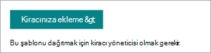

# Microsoft SharePoint Syntex için Sözleşme Yönetimi site şablonunu kullanma

Sözleşme Yönetimi sitesi, kuruluşunuzun SharePoint Syntex değerini en üst düzeye çıkarmanıza yardımcı olan, dağıtılmaya hazır ve özelleştirilebilir bir SharePoint site şablonudur. Site, kuruluşunuzdaki sözleşmeleri yönetmek, işlemek ve durumunu izlemek için profesyonel bir site oluşturmanıza olanak sağlamak için tasarlanmıştır.

## Sitenin özellikleri

Sözleşme Yönetimi sitesi önceden doldurulmuş sayfalar, web bölümleri ve site gezintisi içerir. Site, kuruluşunuzun kendi markasını, çalışan bilgilerini, ilke ve planlama bilgilerini, iş akışını, kişileri ve kaynakları birleştirecek şekilde özelleştirilebilir.

Site, belgeleri sınıflandırmak ve meta verileri ayıklamak için SharePoint belge kitaplığında çalışan bir SharePoint Syntex modelinin gücünü kullanır. Site, hızlı bir şekilde başlamanız için önceden oluşturulmuş belge kitaplıkları sağlar, ancak gerektiğinde kendi belgenizi de oluşturabilirsiniz. Site aşağıdaki öne çıkan kitaplıkları içerir:

- **Bölgeler** – Sözleşme belgelerini coğrafi alana, ülkeye veya bölgeye göre sınıflandırma.

- **Şablonlar** – İfşa etmeme sözleşmeleri, hizmet sözleşmeleri ve iş bildirimleri gibi sözleşme türü için uygun sözleşme şablonunu seçin.

- **Sözleşme istekleri** – Doğrudan sözleşme ekibinize bir sözleşme isteği başlatın.

- **İstemciler** – İstemci bilgilerini tek bir yerde bulun.

- **Modeller** – Belgeleri sınıflandırmak ve meta verileri ayıklamak için bu kitaplıktaki modeli kullanın. Kullanıcılar ihtiyaçlarına uyacak şekilde kendi modellerini oluşturabilir ve bunları bu kitaplığa ekleyebilir.

- **Örnek anlaşmalar kitaplığı** – Sınıflandırılmış ve meta verileri SharePoint Syntex modeli kullanılarak ayıklanmış dosyaları bulun. 

Kitaplıkta durum gibi diğer meta verileri izleyebileceğiniz ve belge kitaplığı biçimlendirmesini kullanarak daha görsel bir şekilde gösterebileceğiniz ayrı bir görünüm vardır.

## Siteyi sağlama

Sözleşme Yönetimi sitesi [SharePoint look book hizmetinden](https://lookbook.microsoft.com/) sağlanabilir.

> [!NOTE]
> Siteyi sağlamak için Microsoft 365'te genel yönetici veya SharePoint yöneticisi olmanız gerekir. Ayrıca bu site şablonunu kuruluşunuza eklemek için SharePoint Syntex lisansınız olmalıdır.

1. [SharePoint görünüm kitabının](https://lookbook.microsoft.com/) ana sayfasında, **Tasarımları görüntüle** menüsünde **sözleşme yönetimi SharePoint Syntex** >  **SharePoint Syntex** seçin.

2. **Sözleşme Yönetimi** sayfasında **Kiracınıza ekle'yi** seçin.

    

3. E-posta adresinizi (sitenizin kullanıma hazır olduğu zaman bildirimi için), kullanmak istediğiniz site URL'sini ve siteniz için kullanmak istediğiniz başlığı girin. 

    

4. **Sağla'yı** seçtiğinizde, kısa bir süre içinde siteniz kullanıma hazır olur. Sözleşme Yönetimi site şablonunu sağlama isteğinizin tamamlandığını belirten bir e-posta alırsınız (sağladığınız e-posta adresine gönderilir).

5. **Siteyi aç'ı** seçtiğinizde Sözleşme Yönetimi sitenizi görürsünüz. Buradan siteyi keşfedebilir, sayfaları ve içeriği özelleştirebilirsiniz. 

SharePoint look book hizmetinden sağlama hakkında daha fazla bilgi için bkz. [Yeni öğrenme yolları çözümü sağlama](/office365/customlearning/custom_provision).

## Siteyi özelleştirme

Sözleşme Yönetimi sitesini diğer kullanıcılarla paylaşmadan önce, siteyi gereksinimlerinizi karşılayacak şekilde özelleştirmek istersiniz. 

### Sitenizin görünümünü özelleştirme

Sitenizin aşağıdaki öğelerini kuruluşunuzun ihtiyacına uyacak şekilde özelleştirin:

- Sözleşme Yönetimi sitesindeki [markayı](https://support.microsoft.com/office/customize-your-sharepoint-site-320b43e5-b047-4fda-8381-f61e8ac7f59b) kuruluşunuzla uyumlu olacak şekilde güncelleştirin.
- Mümkün olduğunca kuruluşunuzdaki gerçek sitelerin görüntülerini içerecek şekilde [Hero web bölümünü](https://support.microsoft.com/office/use-the-hero-web-part-d57f449b-19a0-4b0d-8ce3-be5866430645) özelleştirin.
- [Kişiler web bölümünü](https://support.microsoft.com/office/show-people-profiles-on-your-page-with-the-people-web-part-7e52c5f6-2d72-48fa-a9d3-d2750765fa05) sözleşme yöneticilerinin veya diğer kişilerin iletişim bilgilerini içerecek şekilde özelleştirin.
- Stiller, madde işaretleri, girintiler, vurgulama ve bağlantılar gibi biçimlendirme seçeneklerine paragraf eklemek için [Metin web bölümünü](https://support.microsoft.com/office/add-text-and-tables-to-your-page-with-the-text-web-part-729c0aa1-bc0d-41e3-9cde-c60533f2c801) özelleştirin.
- Sayfaya resim eklemek için [Resim web bölümünü](https://support.microsoft.com/office/use-the-image-web-part-a63b335b-ad0a-4954-a65d-33c6af68beb2) özelleştirin.
- Diğer kaynakların bağlantılarını düzenlemek ve görüntülemek için [Hızlı Bağlantılar web bölümünü özelleştirin](https://support.microsoft.com/office/use-the-quick-links-web-part-e1df7561-209d-4362-96d4-469f85ab2a82) .
- Gerekirse sitenize [başka web bölümleri](https://support.microsoft.com/office/using-web-parts-on-sharepoint-pages-336e8e92-3e2d-4298-ae01-d404bbe751e0) ekleyin.
- [Sayfa düzenlerini](https://support.microsoft.com/office/add-sections-and-columns-on-a-sharepoint-modern-page-fc491eb4-f733-4825-8fe2-e1ed80bd0899) gerektiği gibi özelleştirin.
- Ek destek veya bilgilendirici kaynaklar eklemek için [yeni sayfalar](https://support.microsoft.com/office/create-and-use-modern-pages-on-a-sharepoint-site-b3d46deb-27a6-4b1e-87b8-df851e503dec) ekleyin.

### Site gezintisini özelleştirme

Sözleşme Yönetimi sitesi için site gezintisi denetimine sahipsiniz. Kuruluşunuzla uyumlu değişiklikler yapmanıza yardımcı olması için aşağıdaki kaynakları kullanın:

- [Site gezintisini](https://support.microsoft.com/office/customize-the-navigation-on-your-sharepoint-site-3cd61ae7-a9ed-4e1e-bf6d-4655f0bf25ca) özelleştirin.
- [Bu siteyi bir hub ile ilişkilendirin](https://support.microsoft.com/office/associate-a-sharepoint-site-with-a-hub-site-ae0009fd-af04-4d3d-917d-88edb43efc05).
- Belirli kullanıcılara yönelik belirli gezinti bağlantılarını hedeflemek için [hedef kitle](https://support.microsoft.com/office/target-navigation-news-and-files-to-specific-audiences-33d84cb6-14ed-4e53-a426-74c38ea32293) hedeflemeyi kullanın. 
- Gerekirse [istenmeyen sayfaları silin](https://support.microsoft.com/office/delete-a-page-from-a-sharepoint-site-1d4197b8-31b6-460d-906b-3fb492a51db1).

### Diğer iş akışlarını ekleme

Sözleşme Yönetimi sitesi, başlamak için ihtiyacınız olan bileşenleri içerir, ancak aşağıdakiler gibi ek bileşenler de ekleyebilirsiniz:

- **Sözleşme istekleri** kitaplığına yeni bir sözleşme eklendiğinde iş akışını tetikleme amacıyla [Power Automate akışı](/power-automate/getting-started) kullanın.
- Ek [SharePoint Syntex modelleri oluşturun](/microsoft-365/contentunderstanding/#models).
- **Şablonlar** kitaplığındaki [içerik derleme](content-assembly.md) özelliğini kullanın.
- microsoft 365'in diğer bileşenleriyle birlikte SharePoint Syntex kullanarak [bir sözleşme yönetimi çözümü](solution-manage-contracts-in-microsoft-365.md) oluşturun.

## Siteyi başkalarıyla paylaşma

[Sitenizi başkalarıyla paylaşın](https://support.microsoft.com/office/share-a-site-958771a8-d041-4eb8-b51c-afea2eae3658). Sözleşme Yönetimi sitesinin yaygın olarak bilindiğinden ve benimsendiğinden emin olmak için kuruluşunuzdaki diğer kişilerle iş ortağı olun.

Sözleşme Yönetimi sitesini yönetmeye yönelik önemli başarı faktörleri:

- Sözleşme Yönetimi sitenizin başlatılmasını kutlayın.
- Yeni kaynağı duyurarak haber oluşturun ve gönderin.
- Kullanıcıların sorular ve geri bildirimler için bir çıkış noktası olduğundan emin olun.
- Giriş sayfasındaki içeriği yükseltmek, gezintiyi güncelleştirmek veya netlik için içeriği yeniden yazmak için [site analizinden](https://support.microsoft.com/office/view-usage-data-for-your-sharepoint-site-2fa8ddc2-c4b3-4268-8d26-a772dc55779e) elde edilen içgörüleri kullanın.
- İçeriğin güncel ve hala ilgili olduğundan emin olmak için Sözleşme Yönetimi sitesini gerektiği gibi gözden geçirin.

