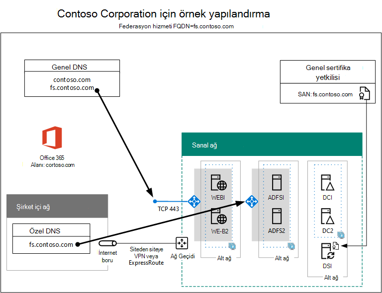

# Yüksek kullanılabilirlik federasyon kimlik doğrulaması 5. Aşama: Microsoft 365 için federasyon kimlik doğrulamasını yapılandırma

Azure altyapı hizmetlerinde Microsoft 365 için yüksek kullanılabilirlik federasyon kimlik doğrulaması dağıtmanın bu son aşamasında, bir genel sertifika yetkilisi tarafından verilen bir sertifikayı alır ve yükler, yapılandırmanızı doğrular ve ardından dizin eşitleme sunucusunda Azure AD Connect'i yükleyip çalıştırırsınız. Azure AD Connect, Federasyon kimlik doğrulaması için Microsoft 365 aboneliğinizi ve Active Directory Federasyon Hizmetleri (AD FS) (AD FS) ve web uygulaması ara sunucularınızı yapılandırıyor.
  
Tüm aşamalar için bkz. [Azure'da Microsoft 365 için yüksek kullanılabilirlik federasyon kimlik doğrulamasını dağıtma](deploy-high-availability-federated-authentication-for-microsoft-365-in-azure.md) .
  
## Ortak bir sertifika alın ve bunu dizin eşitleme sunucusuna kopyalayın

Aşağıdaki özelliklere sahip bir genel sertifika yetkilisinden dijital sertifika alın:
  
- SSL bağlantıları oluşturmaya uygun bir X.509 sertifikası.
    
- Konu Alternatif Adı (SAN) genişletilmiş özelliği federasyon hizmeti FQDN'nize ayarlanır (örnek: fs.contoso.com).
    
- Sertifika özel anahtara sahip olmalı ve PFX biçiminde depolanmalıdır.
    
Ayrıca, kuruluşunuzun bilgisayarlarının ve cihazlarının dijital sertifikayı veren genel sertifika yetkilisine güvenmesi gerekir. Bu güven, bilgisayarlarınızda ve cihazlarınızda güvenilen kök sertifika yetkilileri deposuna genel sertifika yetkilisinden bir kök sertifika yüklenerek kurulur. Microsoft Windows çalıştıran bilgisayarlarda genellikle yaygın olarak kullanılan sertifika yetkililerinden bu tür sertifikalar yüklenir. Genel sertifika yetkilinizden alınan kök sertifika henüz yüklü değilse, bunu kuruluşunuzun bilgisayarlarına ve cihazlarına dağıtmanız gerekir.
  
Federasyon kimlik doğrulaması için sertifika gereksinimleri hakkında daha fazla bilgi için bkz. [Federasyon yükleme ve yapılandırma önkoşulları](/azure/active-directory/connect/active-directory-aadconnect-prerequisites#prerequisites-for-federation-installation-and-configuration).
  
Sertifikayı aldığınızda, sertifikayı dizin eşitleme sunucusunun C: sürücüsündeki bir klasöre kopyalayın. Örneğin, dosyayı SSL.pfx olarak adlandırın ve dizin eşitleme sunucusundaki C:\\Certs klasöründe depolayın.
  
## Yapılandırmanızı doğrulama

Artık Microsoft 365 için Azure AD Connect ve federasyon kimlik doğrulamasını yapılandırmaya hazır olmanız gerekir. Olduğunuzdan emin olmak için bir denetim listesi aşağıdadır:
  
- Kuruluşunuzun genel etki alanı Microsoft 365 aboneliğinize eklenir.
    
- Kuruluşunuzun Microsoft 365 kullanıcı hesapları, kuruluşunuzun genel etki alanı adına göre yapılandırılır ve başarıyla oturum açabilir.
    
- Genel etki alanı adınızı temel alan bir federasyon hizmeti FQDN'si belirlediniz.
    
- Federasyon hizmeti FQDN'niz için genel DNS A kaydı, web uygulaması ara sunucuları için İnternet'e yönelik Azure yük dengeleyicisinin genel IP adresine işaret ediyor.
    
- Federasyon hizmeti FQDN'niz için özel DNS A kaydı, AD FS sunucuları için iç Azure yük dengeleyicisinin özel IP adresine işaret eder.
    
- Federasyon hizmeti FQDN'nize ayarlanmış SAN ile SSL bağlantıları için uygun bir genel sertifika yetkilisi tarafından verilmektedir dijital sertifika, dizin eşitleme sunucunuzda depolanan bir PFX dosyasıdır.
    
- Ortak sertifika yetkilisinin kök sertifikası, bilgisayarlarınızda ve cihazlarınızda Güvenilen Kök Sertifika Yetkilileri deposuna yüklenir.
    
Contoso kuruluşu için bir örnek aşağıda verilmiştir:
  
**Azure'da yüksek kullanılabilirlik federasyon kimlik doğrulaması altyapısı için örnek yapılandırma**

  
## Federasyon kimlik doğrulamasını yapılandırmak için Azure AD Connect'i çalıştırın

Azure AD Connect aracı AD FS sunucularını, web uygulaması proxy sunucularını ve Microsoft 365'i federasyon kimlik doğrulaması için şu adımlarla yapılandırıyor:
  
1. Yerel yönetici ayrıcalıklarına sahip bir etki alanı hesabıyla dizin eşitleme sunucunuza uzak masaüstü bağlantısı oluşturun.
    
2. Dizin eşitleme sunucusunun masaüstünden Internet Explorer'ı açın ve adresine [https://aka.ms/aadconnect](https://aka.ms/aadconnect)gidin.
    
3. **Microsoft Azure Active Directory Bağlan** sayfasında **İndir'e** ve ardından **Çalıştır'a** tıklayın.
    
4. **Azure AD Bağlan'a Hoş Geldiniz** sayfasında **Kabul ediyorum'a** ve ardından **Devam'a tıklayın.**
    
5. **Hızlı Ayarlar** sayfasında **Özelleştir'e** tıklayın.
    
6. **Gerekli bileşenleri yükle** sayfasında **Yükle'ye** tıklayın.
    
7. **Kullanıcı oturum açma** sayfasında **AD FS ile Federasyon'a** ve ardından **İleri'ye** tıklayın.
    
8. **Azure AD bağlan** sayfasında, microsoft 365 aboneliğiniz için **Azure AD DC yöneticisinin** veya **Genel yönetici** hesabının adını ve parolasını yazın ve **İleri'ye** tıklayın.
    
9. **Dizinlerinizi bağlayın** sayfasında, **Orman'da şirket içi Active Directory** Etki Alanı Hizmetleri (AD DS) ormanınızın seçili olduğundan emin olun, etki alanı yöneticisi hesabının adını ve parolasını yazın, **Dizin Ekle'ye** tıklayın ve ardından **İleri'ye** tıklayın.
    
10. **Azure AD oturum açma yapılandırması** sayfasında **İleri'ye** tıklayın.
    
11. **Etki alanı ve OU filtreleme** sayfasında **İleri'ye** tıklayın.
    
12. **Kullanıcılarınızı benzersiz olarak tanımlama** sayfasında **İleri'ye** tıklayın.
    
13. **Kullanıcıları ve cihazları filtrele** sayfasında **İleri'ye** tıklayın.
    
14. **İsteğe bağlı özellikler** sayfasında **İleri'ye** tıklayın.
    
15. **AD FS grubu** sayfasında **Yeni bir AD FS grubu yapılandır'a** tıklayın.
    
16. **Gözat'a** tıklayın ve genel sertifika yetkilisinden SSL sertifikasının konumunu ve adını belirtin.
    
17. İstendiğinde sertifika parolasını yazın ve **Tamam'a** tıklayın.
    
18. **Konu Adı** ve **Federasyon Hizmeti Adı'nın** federasyon hizmeti FQDN'nize ayarlandığını doğrulayın ve **İleri'ye** tıklayın.
    
19. **AD FS sunucuları** sayfasında, ilk AD FS sunucunuzun adını yazın (Tablo M - Öğe 4 - Sanal makine adı sütunu) ve **ekle'ye** tıklayın.
    
20. İkinci AD FS sunucunuzun adını yazın (Tablo M - Öğe 5 - Sanal makine adı sütunu), **Ekle'ye** ve ardından **İleri'ye** tıklayın.
    
21. **Web Uygulama Ara Sunucusu sunucuları** sayfasında, ilk web uygulaması proxy sunucunuzun adını yazın (Tablo M - Öğe 6 - Sanal makine adı sütunu) ve ardından **Ekle'ye** tıklayın.
    
22. İkinci web uygulaması proxy sunucunuzun adını yazın (Tablo M - Öğe 7 - Sanal makine adı sütunu), **Ekle'ye** ve ardından **İleri'ye** tıklayın.
    
23. **Etki Alanı Yöneticisi kimlik bilgileri** sayfasında, etki alanı yöneticisi hesabının kullanıcı adını ve parolasını yazın ve **İleri'ye** tıklayın.
    
24. **AD FS hizmet hesabı** sayfasında, kuruluş yöneticisi hesabının kullanıcı adını ve parolasını yazın ve **İleri'ye** tıklayın.
    
25. **Azure AD Etki Alanı** sayfasında, **Etki Alanı'nda** kuruluşunuzun DNS etki alanı adını seçin ve **ardından İleri'ye** tıklayın.
    
26. **Yapılandırmaya hazır** sayfasında **Yükle'ye** tıklayın.
    
27. **Yükleme tamamlandı** sayfasında **Doğrula'ya** tıklayın. Hem intranet hem de İnternet yapılandırmasının başarıyla doğrulandığını belirten iki ileti görmeniz gerekir.
    
  - İntranet iletisi, AD FS sunucularınız için Azure iç yük dengeleyicinizin özel IP adresini listelemelidir.
    
  - İnternet iletisi, web uygulaması proxy sunucularınız için Azure İnternet'e yönelik yük dengeleyicinizin genel IP adresini listelemelidir.
    
28. **Yükleme tamamlandı** sayfasında **Çıkış'a** tıklayın.
    
Sunucuların yer tutucu adlarını içeren son yapılandırma aşağıdadır.
  
**5. Aşama: Azure'da yüksek kullanılabilirliğe sahip federasyon kimlik doğrulama altyapısının son yapılandırması**

  
Azure'da Microsoft 365 için yüksek kullanılabilirlik federasyon kimlik doğrulama altyapınız tamamlandı.
  
## Ayrıca Bkz

[Azure'da Microsoft 365 için yüksek kullanılabilirlik federasyon kimlik doğrulamasını dağıtma](deploy-high-availability-federated-authentication-for-microsoft-365-in-azure.md)
  
[Microsoft 365 geliştirme/test ortamınız için federasyon kimliği](federated-identity-for-your-microsoft-365-dev-test-environment.md)
  
[Microsoft 365 çözüm ve mimari merkezi](../solutions/index.yml)

[Microsoft 365 için federasyon kimliği](https://support.office.com/article/Understanding-Office-365-identity-and-Azure-Active-Directory-06a189e7-5ec6-4af2-94bf-a22ea225a7a9#bk_federated)
