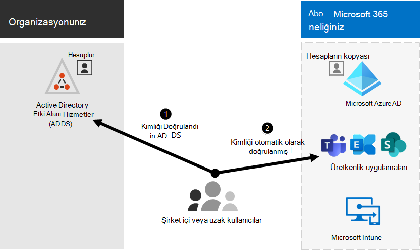

# Şirket içi ortamlarla Microsoft 365 tümleştirmesi

*Bu makale hem Microsoft 365 Kurumsal hem de Office 365 Kurumsal için geçerlidir.*

Microsoft 365'i mevcut şirket içi Active Directory Etki Alanı Hizmetleri (AD DS) ile ve Exchange Server, Skype Kurumsal Sunucu 2015 veya SharePoint Server'ın şirket içi yüklemeleriyle tümleştirebilirsiniz.
  
 - AD DS'yi tümleştirdiğinizde, her iki ortam için de kullanıcı hesaplarını eşitleyebilir ve yönetebilirsiniz. Ayrıca, kullanıcıların şirket içi kimlik bilgileriyle her iki ortamda da oturum açabilmesi için parola karması eşitlemesi (PHS) veya çoklu oturum açma (SSO) ekleyebilirsiniz.
 - Şirket içi sunucu ürünleriyle tümleştirdiğinizde karma bir ortam oluşturursunuz. Karma ortam, kullanıcıları veya bilgileri Microsoft 365'e geçirirken yardımcı olabilir ya da şirket içinde bazı kullanıcılara veya bazı bilgilere ve bazıları bulutta yer almaya devam edebilirsiniz. Hibrit ortamlar hakkında daha fazla bilgi için bkz. [hibrit bulut](../solutions/cloud-architecture-models.md#hybrid).

Microsoft 365 yönetim merkezi özelleştirilmiş kurulum kılavuzu için Azure Active Directory (Azure AD) danışmanlarını da kullanabilirsiniz (Microsoft 365'te oturum açmanız gerekir):

- [kurulum kılavuzunu Azure AD](https://aka.ms/aadpguidance)
- [Kullanıcıları kuruluşunuzun dizininden eşitleme](https://aka.ms/aadconnectpwsync)
- [Active Directory Federasyon Hizmetleri (AD FS) (AD FS) dağıtım danışmanı](https://aka.ms/adfsguidance)
   
## Başlamadan önce

Microsoft 365'i ve şirket içi ortamı tümleştirmeden önce [ağ planlaması ve performans ayarlaması](network-planning-and-performance.md) da yapmanız gerekir. Kullanılabilir [kimlik modellerini](deploy-identity-solution-identity-model.md) de anlamak istersiniz. 

[Microsoft 365 kullanıcı hesaplarını yönetmek](manage-microsoft-365-accounts.md) için kullanabileceğiniz araçların listesi için bkz. Microsoft 365 hesaplarını yönetme. 
  
## Microsoft 365'i AD DS ile tümleştirme

AD DS'de mevcut kullanıcı hesaplarınız varsa, Bu hesapların tümünü Microsoft 365'te yeniden oluşturmak istemezsiniz ve ortamlar arasındaki farkları veya hataları ortaya çıkarma riskini göze alırsınız. Dizin eşitlemesi, bu hesapları şirket içi ve çevrimiçi ortamlarınız arasında yansıtmanıza yardımcı olur. Dizin eşitlemesi sayesinde, kullanıcılarınızın her ortam için yeni bilgileri hatırlaması gerekmez ve hesapları iki kez oluşturmanız veya güncelleştirmeniz gerekmez. [Şirket içi dizininizi](prepare-for-directory-synchronization.md) dizin eşitlemesi için hazırlamanız gerekir.
  

  
Kullanıcıların şirket içi kimlik bilgileriyle Microsoft 365'te oturum açabilmesini istiyorsanız, SSO'yı da yapılandırabilirsiniz. SSO ile Microsoft 365, kullanıcı kimlik doğrulaması için şirket içi ortama güvenecek şekilde yapılandırılır.
  

### Parola karması eşitlemesi veya doğrudan kimlik doğrulaması (PTA) ile veya parola karması olmadan dizin eşitlemesi

Kullanıcı, şirket içi ortamında kullanıcı hesabıyla (etki alanı\kullanıcıadı) oturum açar. Microsoft 365'e gittiği zaman iş veya okul hesaplarıyla (user@domain.com) yeniden oturum açmaları gerekir. Kullanıcı adı her iki ortamda da aynıdır. PHS veya PTA eklediğinizde, kullanıcı her iki ortam için de aynı parolaya sahiptir, ancak Microsoft 365'te oturum açarken bu kimlik bilgilerini yeniden sağlaması gerekir. PHS ile dizin eşitlemesi, en yaygın kullanılan dizin eşitlemesidir.

Dizin eşitlemesini ayarlamak için Azure AD Bağlan'ı kullanın. Yönergeler için bkz. [Microsoft 365 için dizin eşitlemesini ayarlama](set-up-directory-synchronization.md) ve [hızlı ayarlarla bağlanma Azure AD](/azure/active-directory/hybrid/how-to-connect-install-express).

[Microsoft 365'e dizin eşitlemesi için hazırlanma](prepare-for-directory-synchronization.md) hakkında daha fazla bilgi edinin.

### SSO ile dizin eşitlemesi

Kullanıcı, şirket içi ortamında kullanıcı hesabıyla oturum açar. Microsoft 365'e gittiği zaman otomatik olarak oturum açarlar veya şirket içi ortamları (etki alanı\kullanıcıadı) için kullandıkları kimlik bilgilerini kullanarak oturum açarlar.

SSO'yı ayarlamak için Azure AD Connect'i de kullanırsınız. Yönergeler için bkz. [Azure AD Connect'in özel yüklemesi](/azure/active-directory/hybrid/how-to-connect-install-custom).

Daha fazla bilgi için bkz. [çoklu oturum açma](/azure/active-directory/manage-apps/what-is-single-sign-on).

## Azure AD Connect

Azure AD Connect, DirSync ve Azure AD Eşitleme gibi kimlik tümleştirme araçlarının eski sürümlerinin yerini alır. Azure Active Directory Eşitleme'den Azure AD Connect'e güncelleştirmek istiyorsanız [yükseltme yönergelerine](/azure/active-directory/hybrid/how-to-dirsync-upgrade-get-started) bakın. 

## Ayrıca bkz.

[Microsoft 365 Kurumsal genel bakış](microsoft-365-overview.md)