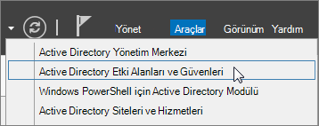

# <a name="prepare-a-non-routable-domain-for-directory-synchronization"></a>Yönlendirilebilir olmayan etki alanını dizin eşitlemesi için hazırlama

Şirket içi dizininizi Microsoft 365 eşitlemek için, Azure Active Directory (Azure AD) içinde doğrulanmış bir etki alanınız olmalıdır. Yalnızca şirket içi Active Directory Etki Alanı Hizmetleri (AD DS) etki alanıyla ilişkilendirilmiş Kullanıcı Asıl Adları (UPN)eşitlenir. Bununla birlikte, ".local" (örneğin: billa@contoso.local) gibi yönlendirilebilir olmayan bir etki alanı içeren tüm UPN'ler, .onmicrosoft.com etki alanıyla eşitlenir (örneğin: billa@contoso.onmicrosoft.com). 

Şu anda AD DS'de kullanıcı hesaplarınız için ".local" etki alanını kullanıyorsanız, etki alanınız ile düzgün eşitlenmesi için bunları billa@contoso.com gibi doğrulanmış bir etki alanı kullanmak üzere Microsoft 365 önerilir.
  
## <a name="what-if-i-only-have-a-local-on-premises-domain"></a>Yalnızca ".local" şirket içi etki alanım varsa ne olacak?

AD DS'nizi Bağlan kiracınizin Azure AD kiracısı ile eşitlemek için Azure AD Microsoft 365 kullanırsiniz. Daha fazla bilgi için bkz [. Şirket içi kimliklerinizi Azure AD ile tümleştirme](/azure/architecture/reference-architectures/identity/azure-ad).
  
Azure AD Bağlan, kullanıcılarınızı UPN ve parolalarını eşitler; böylelikle kullanıcılar şirket içinde kullanmakta olduğu kimlik bilgileriyle oturum açmalarını sağlar. Bununla birlikte, Azure AD Bağlan yalnızca etki alanları tarafından doğrulanan etki alanlarıyla Microsoft 365. Bu da, kimliklerinin Azure AD tarafından yönetil Microsoft 365 etki alanının Azure AD tarafından da doğrulanmış olduğu anlamına gelir. Başka bir deyişle, etki alanı geçerli bir İnternet etki alanı (.com, .org, .net, .us gibi) olmalıdır. İç AD DS'niz yalnızca yönlendirilebilir olmayan bir etki alanı kullanıyorsa (örneğin, ".local"), bu durum kullanıcı kiracınız için sahip olduğunuz doğrulanmış etki alanıyla Microsoft 365 olabilir. Bu sorunu, şirket içi AD DS'nizin birincil etki alanını değiştirerek veya bir veya birden çok UPN soneki ekleyerek düzeltebilirsiniz.
  
### <a name="change-your-primary-domain"></a>Birincil etki alanınızı değiştirme

Birincil etki alanınızı doğrulanmış bir etki alanıyla (örneğin, Microsoft 365 bir etki contoso.com. Contoso.local etki alanına sahip olan her kullanıcı bu etki alanıyla contoso.com. Bununla birlikte bu, söz konusu bir işlemdir ve aşağıdaki bölümde daha kolay bir çözüm açıklanmıştır.
  
### <a name="add-upn-suffixes-and-update-your-users-to-them"></a>UPN sonekleri ekleme ve kullanıcılarınızı bu soneklere güncelleştirme

".local" sorununu çözmek için AD DS'de doğrulanmış etki alanıyla (veya etki alanlarıyla) eşleşmesi için yeni UPN soneki veya sonekleri Microsoft 365. Yeni soneki kaydettikten sonra, kullanıcı UPN'lerini, ".local" yerine yeni etki alanı adını alacak şekilde (örneğin, bir kullanıcı hesabının son kullanıcı adı gibi) değiştir billa@contoso.com.
  
UPN'leri doğrulanmış etki alanını kullanmak üzere güncelleştirildikten sonra, şirket içi AD DS'nizi doğrulanmış etki alanıyla eşitlemeye Microsoft 365.
  
#### <a name="step-1-add-the-new-upn-suffix"></a>1. Adım: Yeni UPN soneki** ekleme
  
1. AD DS etki alanı denetleyicisinde, Sunucu Yöneticisi'nde Araçlar Active Directory Etki **Alanları** \> **ve Güvenleri'ni seçin**.
    
    **Ayrıca, e-Windows Server 2012**
    
    Çalıştır **Windows + R tuşlarına** basın, Domain.msc yazın ve Tamam'ı **seçin**.
    
    
  
2. **Active Directory Etki Alanları ve Güvenleri penceresinde Active** **Directory** Etki Alanları ve Güvenleri'ne sağ tıklayın ve Özellikler'i **seçin**.
    
    
  
3. **UPN Sonekleri** sekmesindeki Alternatif **UPN Sonekleri kutusuna yeni UPN** soneki veya soneklerinizi yazın ve ardından Uygula **Ekle'yi** \> **seçin**.
    
    
  
    **Sonek** eklemeyi bitirerek Tamam'ı seçin. 
    
 #### <a name="step-2-change-the-upn-suffix-for-existing-users"></a>2. Adım: Var olan kullanıcıların UPN soneki'ne değiştirme
  
1. AD DS etki alanı denetleyicisinde, Sunucu Yöneticisi'nde Araçlar Active Directory **Kullanıcıları** \> **ve Bilgisayarları'ı seçin**.
    
    **Ayrıca, e-Windows Server 2012**
    
    Çalıştır **Windows + R tuşlarına** basın, ardından Dsa.msc yazın ve Tamam'a **tıklayın**.
    
2. Bir kullanıcı seçin, sağ tıklayın ve özellikler'i **seçin**.
    
3. Hesap **sekmesindeki** UPN soneki açılan listesinde, yeni UPN soneki'ne ve sonra Tamam'a **tıklayın**.
    
    
  
4. Her kullanıcı için bu adımları tamamlayın.
    
   
### <a name="use-powershell-to-change-the-upn-suffix-for-all-of-your-users"></a>Tüm kullanıcılarınızı UPN soneki değiştirmek için PowerShell kullanma

Güncelleştirilen çok sayıda kullanıcı hesabınız varsa, PowerShell kullanmak daha kolaydır. Aşağıdaki örnekte, [get-ADUser](/previous-versions/windows/it-pro/windows-server-2008-R2-and-2008/ee617241(v=technet.10)) ve [Set-ADUser](/previous-versions/windows/it-pro/windows-server-2008-R2-and-2008/ee617215(v=technet.10)) cmdlet'leri tüm contoso.local soneklerini AD DS'de contoso.com olarak değiştirir. 

Örneğin, tüm contoso.local soneklerini güncelleştirin ve aşağıdaki PowerShell komutlarını çalıştırarak tüm contoso.com:
    
  ```powershell
  $LocalUsers = Get-ADUser -Filter "UserPrincipalName -like '*contoso.local'" -Properties userPrincipalName -ResultSetSize $null
  $LocalUsers | foreach {$newUpn = $_.UserPrincipalName.Replace("@contoso.local","@contoso.com"); $_ | Set-ADUser -UserPrincipalName $newUpn}
  ```

AD DS [Windows PowerShell de dizin](/previous-versions/windows/it-pro/windows-server-2008-R2-and-2008/ee617195(v=technet.10)) kullanma hakkında daha fazla bilgi için Windows PowerShell Active Directory Posta Modülü'ne bakın.