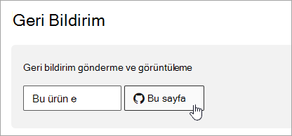

# Microsoft 365 belgeleri gezinti kılavuzu

Bu konuda, Microsoft 365 teknik belge alanında gezinmek için bazı ipuçları ve püf noktaları sağlanır.  

## Hub sayfası

Microsoft 365 hub sayfası adresinde bulunabilir [https://aka.ms/microsoft365docs](./index.yml) ve ilgili Microsoft 365 içeriğini bulmak için giriş noktasıdır.

Microsoft **365** teknik belge kümesindeki her sayfanın üst kısmındaki üst bilgiden Microsoft 365'i seçerek istediğiniz zaman bu sayfaya geri dönebilirsiniz:

## İçindekiler tablosu araması

Microsoft Learn'de, en üstteki filtre arama kutusunu kullanarak içindekiler tablosundaki içeriği arayabilirsiniz:

## Sürüm filtresi

Microsoft 365 teknik belgeleri, Office 365 Almanya ve 21 Vianet (Çin) tarafından sağlanan Office 365 dahil olmak üzere ek ürünler için içerik sağlar. Özellikler bu sürümler arasında farklılık gösterebilir ve bu nedenle bazen içeriğin kendisi farklılık gösterebilir.

Microsoft 365'in uygun sürümü için içerik gördüğünüzden emin olmak için sürüm filtresini kullanabilirsiniz:

## Kırıntı -ları

İçerik haritaları üst bilginin altında ve içindekiler tablosunun üstünde bulunabilir ve geçerli makalenin içindekiler tablosunda nerede bulunduğunu gösterir.  Bu, bağlamı okuduğun içerik türüne ayarlamaya yardımcı olmakla kalmaz, aynı zamanda içindekiler ağacına geri dönmenize de olanak tanır:

## Makale bölümü gezintisi

Sağ gezinti bölmesi, bir makalenin içindeki bölümlere hızla gitmenize ve makalenin içindeki konumunuzu belirlemenize olanak tanır.  

## Geri bildirim gönderme

Bir makalenin içinde yanlış bir şey bulursanız, sayfanın en altına gidip İçerik geri bildirimi'ni seçerek bu makale için SQL İçerik ekibine **geri bildirim** gönderebilirsiniz.

## Microsoft 365 belgelerine katkıda bulunma

Microsoft Learn'de içeriği kendiniz düzenleyebileceğinizi biliyor muydunuz? Bunu yaparsanız, belgelerimizi geliştirmekle kalmaz, aynı zamanda sayfaya katkıda bulunan olarak da kabul edilirsiniz. Başlamak için bkz.

- [Microsoft Docs katkıda bulunan kılavuzu](/contribute/)

## Sonraki adımlar

- [Microsoft 365 teknik belgelerini](index.yml) kullanmaya başlayın.
