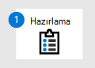

# Uç Nokta için Microsoft Defender dağıtımı hazırlama

[!INCLUDE [Microsoft 365 Defender rebranding](../../includes/microsoft-defender.md)]

**Şunlar için geçerlidir:**
- [Uç Nokta için Microsoft Defender Planı 2](https://go.microsoft.com/fwlink/p/?linkid=2154037)
- [Microsoft 365 Defender](https://go.microsoft.com/fwlink/?linkid=2118804)

> Uç Nokta için Microsoft Defender'ı deneyimlemek ister misiniz? [Ücretsiz deneme için kaydolun.](https://signup.microsoft.com/create-account/signup?products=7f379fee-c4f9-4278-b0a1-e4c8c2fcdf7e&ru=https://aka.ms/MDEp2OpenTrial?ocid=docs-wdatp-exposedapis-abovefoldlink)

Uç Nokta için Defender'ın dağıtılması üç aşamalı bir işlemdir:

| Aşama 1: Hazırlık| [Aşama 2: Kurulum](production-deployment.md)| [Aşama 3: Katılım](onboarding.md)|
|---|---|---|
|*Buradasınız!*|||

Şu anda hazırlık aşamasındasınız.

Hazırlık, başarılı dağıtımlar için önemlidir. Bu makalede, Uç Nokta için Defender'ı dağıtmaya hazırlanırken göz önünde bulundurmanız gereken noktalar konusunda size yol gösterecektir.

## Paydaşlar ve onay

Aşağıdaki bölüm, projede yer alan ve onaylaması, gözden geçirmesi veya bilgi sahibi olması gereken tüm paydaşları belirlemeye hizmet eder.

Aşağıdaki tabloya kuruluşunuz için uygun olan paydaşları ekleyin.

- SO = Projeyi onayla
- R = Bu projeyi gözden geçirin ve giriş sağlayın
- I = Bu proje hakkında bilgilendirildi

 

****

|Name|Rol|Eylem|
|---|---|---|
|Ad ve e-posta girin|**Bilgi Güvenliği Başkanı (CISO)** *Yeni teknoloji dağıtımı için kuruluşun içinde sponsor olarak görev yapan bir yönetici temsilcisi.*|SO|
|Ad ve e-posta girin|**Siber Savunma Operasyon Merkezi (CDOC) Başkanı** *Bu değişikliğin müşteri güvenlik operasyonları ekibindeki süreçlerle nasıl uyumlu olduğunu tanımlamaktan sorumlu CDOC ekibinden bir temsilci.*|SO|
|Ad ve e-posta girin|**Güvenlik Mimarı** *Bu değişikliğin kuruluştaki temel Güvenlik mimarisiyle nasıl uyumlu olduğunu tanımlamaktan sorumlu Güvenlik ekibinden bir temsilci.*|R|
|Ad ve e-posta girin|**Çalışma Alanı Mimarı** *Bu değişikliğin kuruluştaki temel çalışma alanı mimarisiyle nasıl uyumlu olduğunu tanımlamaktan sorumlu BT ekibinden bir temsilci.*|R|
|Ad ve e-posta girin|**Güvenlik Analisti** *Güvenlik operasyonları açısından algılama özellikleri, kullanıcı deneyimi ve bu değişikliğin genel kullanışlılığı hakkında giriş sağlayabilen CDOC ekibinden bir temsilci.*|I|
||||

## Ortam

Bu bölüm, ortamınızın proje katılımcıları tarafından derin bir şekilde anlaşılmasını sağlamak için kullanılır ve bu da teknolojilerde veya işlemlerde gerekli olan olası bağımlılıkları ve/veya değişiklikleri tanımlamaya yardımcı olur.

 

****

|Ne|Açıklama|
|---|---|
|Uç nokta sayısı|İşletim sistemine göre toplam uç nokta sayısı.|
|Sunucu sayısı|İşletim sistemi sürümüne göre Sunucuların toplam sayısı.|
|Yönetim altyapısı|Yönetim altyapısı adı ve sürümü (örneğin, System Center Configuration Manager Geçerli Dal 1803).|
|CDOC dağıtımı|Üst düzey CDOC yapısı (örneğin, Contoso'ya yönelik Katman 1, Avrupa ve Asya'ya dağıtılmış Katman 2 ve Katman 3 şirket içi).|
|Güvenlik bilgileri ve olay (SIEM)|Kullanımda olan SIEM teknolojisi.|
|||

## Rol tabanlı erişim denetimi

Microsoft, en az ayrıcalık kavramını kullanmanızı önerir. Uç Nokta için Defender, Azure Active Directory'deki yerleşik rollerden yararlanıyor. Microsoft [, kullanılabilir farklı rolleri gözden geçirmenizi](/azure/active-directory/roles/permissions-reference) ve bu uygulama için her kişilik için gereksinimlerinizi çözmek için doğru rolü seçmenizi önerir. Dağıtım tamamlandıktan sonra bazı rollerin geçici olarak uygulanması ve kaldırılması gerekebilir.

 

****

|Personas|Rolleri|Azure AD Rolü (gerekirse)|Ata|
|---|---|---|---|
|Güvenlik Yöneticisi||||
|Güvenlik Analisti||||
|Uç Nokta Yöneticisi||||
|Altyapı Yöneticisi||||
|İş Sahibi/Paydaş||||
|

Microsoft, dizin izinlerine sahip kullanıcılar için ek denetim, denetim ve erişim gözden geçirmesi sağlamak üzere rollerinizi yönetmek üzere [Privileged Identity Management](/azure/active-directory/active-directory-privileged-identity-management-configure) kullanılmasını önerir.

Uç Nokta için Defender izinleri yönetmek için iki yolu destekler:

- **Temel izin yönetimi**: İzinleri tam erişim veya salt okunur olarak ayarlayın. Azure Active Directory'de Genel Yönetici veya Güvenlik Yöneticisi rollerine sahip kullanıcılar tam erişime sahiptir. Güvenlik okuyucusu rolü salt okunur erişime sahiptir ve makineleri/cihaz envanterini görüntüleme erişimi vermez.

- **Rol tabanlı erişim denetimi (RBAC)**: Rolleri tanımlayarak, rollere Azure AD kullanıcı grupları atayarak ve kullanıcı gruplarına cihaz gruplarına erişim vererek ayrıntılı izinleri ayarlayın. Daha fazla bilgi için. Bkz. [Rol tabanlı erişim denetimini kullanarak portal erişimini yönetme](rbac.md).

Microsoft, yalnızca iş gerekçesi olan kullanıcıların Uç Nokta için Defender'a erişebildiğinden emin olmak için RBAC'nin kullanılması önerilir.

İzin yönergeleriyle ilgili ayrıntıları burada bulabilirsiniz: [Rol oluşturma ve rolü bir Azure Active Directory grubuna atama](/microsoft-365/security/defender-endpoint/user-roles#create-roles-and-assign-the-role-to-an-azure-active-directory-group).

Aşağıdaki örnek tablo, ortamınızda ortamınız için gereken RBAC yapısını belirlemenize yardımcı olacak Siber Savunma Operasyon Merkezi yapısını belirlemeye hizmet eder.

 

****

|Katmanı|Açıklama|İzin Gerekli|
|---|---|---|
|Katman 1|**Yerel güvenlik operasyonları ekibi / BT ekibi** 
 Bu ekip genellikle coğrafi konum içinde yer alan uyarıları önceliklendirmek ve araştırmakta ve etkin bir düzeltmenin gerekli olduğu durumlarda Katman 2'ye yükseltmektedir.||
|Katman 2|**Bölgesel güvenlik operasyonları ekibi** 
 Bu ekip, bölgelerinin tüm cihazlarını görebilir ve düzeltme eylemleri gerçekleştirebilir.|Verileri görüntüleme|
|Katman 3|**Küresel güvenlik operasyonları ekibi** 
 Bu ekip güvenlik uzmanlarından oluşur ve portaldan tüm eylemleri görme ve gerçekleştirme yetkisine sahip.|Verileri görüntüleme 
 Uyarı araştırması Etkin düzeltme eylemleri 
 Uyarı araştırması Etkin düzeltme eylemleri 
 Portal sistem ayarlarını yönetme 
 Güvenlik ayarlarını yönetme|
||||

## Benimseme Sırası

Çoğu durumda kuruluşlarda mevcut uç nokta güvenlik ürünleri bulunur. Her kuruluşun en düşük düzeyde bir virüsten koruma çözümü olması gerekir. Ancak bazı durumlarda, bir kuruluş zaten bir EDR çözümü yerleştirmiş olabilir.

Geçmişte, uygulama katmanına ve altyapı bağımlılıklarına sıkı kancalar nedeniyle zaman açısından yoğun olan ve ulaşılması zor olan herhangi bir güvenlik çözümünün değiştirilmesi. Ancak, Uç Nokta için Defender işletim sisteminde yerleşik olduğundan, üçüncü taraf çözümleri değiştirmek artık kolay bir işlemdir.

Kullanılacak Uç Nokta için Defender bileşenini seçin ve uygulanmayanları kaldırın. Aşağıdaki tabloda, Microsoft'un uç nokta güvenlik paketinin nasıl etkinleştirilmesi gerektiği için önerdiği sıra gösterilir.

 

****

|Bileşen|Açıklama|Benimseme Sırası Sırası|
|---|---|---|
|Uç Nokta Algılama & Yanıtı (EDR)|Uç nokta için Defender uç nokta algılama ve yanıt özellikleri, neredeyse gerçek zamanlı ve eyleme dönüştürülebilir gelişmiş saldırı algılamaları sağlar. Güvenlik analistleri uyarıların önceliklerini etkili bir şekilde belirleyebilir, ihlal kapsamının tamamını görebilir ve tehditleri düzeltmek için yanıt eylemleri gerçekleştirebilir. 
 [Daha fazla bilgi edinin.](/windows/security/threat-protection/windows-defender-atp/overview-endpoint-detection-response)|1|
|Microsoft Defender Güvenlik Açığı Yönetimi (MDVM)|Defender Güvenlik Açığı Yönetimi, Uç Nokta için Microsoft Defender bir bileşenidir ve hem güvenlik yöneticilerine hem de güvenlik operasyonları ekiplerine aşağıdakiler gibi benzersiz bir değer sağlar: <ul><li>Uç nokta güvenlik açıklarıyla ilişkili gerçek zamanlı uç nokta algılama ve yanıt (EDR) içgörüleri</li><li>Olay incelemeleri sırasında çok değerli cihaz güvenlik açığı bağlamı</li><li>Microsoft Intune ve Microsoft System Center Configuration Manager aracılığıyla yerleşik düzeltme işlemleri</li></ul> 
 [Daha fazla bilgi edinin](https://techcommunity.microsoft.com/t5/Windows-Defender-ATP/Introducing-a-risk-based-approach-to-threat-and-vulnerability/ba-p/377845).|2|
|Yeni nesil koruma (NGP)|Microsoft Defender Virüsten Koruma, masaüstü bilgisayarlar, taşınabilir bilgisayarlar ve sunucular için yeni nesil koruma sağlayan yerleşik bir kötü amaçlı yazılımdan koruma çözümüdür. Microsoft Defender Virüsten Koruma şunları içerir: <ul><li>Yeni ve yeni tehditlerin neredeyse anında algılanması ve engellenmesi için bulut tabanlı koruma. Bulut tabanlı koruma, makine öğrenmesi ve Akıllı Güvenlik Grafı ile birlikte Microsoft Defender Virüsten Koruma'yı destekleyen yeni nesil teknolojilerin bir parçasıdır.</li><li>Gelişmiş dosya ve işlem davranışı izleme ve diğer buluşsal yöntemler kullanılarak her zaman açık tarama ("gerçek zamanlı koruma" olarak da bilinir).</li><li>Makine öğrenmesi, insan ve otomatik büyük veri analizi ve ayrıntılı tehdit direnci araştırmalarına dayalı ayrılmış koruma güncelleştirmeleri.</li></ul> 
 [Daha fazla bilgi edinin](/windows/security/threat-protection/microsoft-defender-antivirus/microsoft-defender-antivirus-in-windows-10).|3|
|Saldırı Yüzeyini Azaltma (ASR)|Uç Nokta için Microsoft Defender'daki saldırı yüzeyi azaltma özellikleri, kuruluştaki cihazların ve uygulamaların yeni ve yeni tehditlere karşı korunmasına yardımcı olur.   [Daha fazla bilgi edinin.](/windows/security/threat-protection/windows-defender-atp/overview-attack-surface-reduction)|4|
|Otomatik Araştırma & Düzeltme (AIR)|Uç Nokta için Microsoft Defender, tek tek araştırılması gereken uyarı hacmini önemli ölçüde azaltmak için Otomatik araştırma kullanır. Otomatik araştırma özelliği, uyarıları incelemek ve ihlalleri çözmek için anında düzeltme eylemi uygulamak için analistler tarafından kullanılan çeşitli inceleme algoritmalarından ve işlemlerden (playbook'lar gibi) yararlanır. Bu, uyarı hacmini önemli ölçüde azaltarak güvenlik operasyonları uzmanlarının daha karmaşık tehditlere ve diğer yüksek değerli girişimlere odaklanmasına olanak sağlar. 
 [Daha fazla bilgi edinin.](/windows/security/threat-protection/windows-defender-atp/automated-investigations-windows-defender-advanced-threat-protection)|Geçerli değil|
|Microsoft Tehdit Uzmanları (MTE)|Microsoft Tehdit Uzmanları, güvenlik operasyon merkezlerine (SOC) benzersiz ortamlarındaki kritik tehditlerin kaçırılmamasını sağlamaya yardımcı olmak için uzman düzeyinde izleme ve analiz sağlayan yönetilen bir avcılık hizmetidir. 
 [Daha fazla bilgi edinin.](/windows/security/threat-protection/windows-defender-atp/microsoft-threat-experts)|Geçerli değil|

## Sonraki adım

   [Aşama 2: Kurulum](production-deployment.md)

Uç Nokta için Microsoft Defender dağıtımı ayarlayın.
