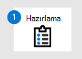

# Office 365 için Microsoft Defender Geçiş - 1. Aşama: Hazırlama

**Uygulandığı öğe**
- [Office 365 için Microsoft Defender plan 1 ve plan 2](defender-for-office-365.md)

 

|   Aşama 1: Hazırlık|   [Aşama 2: Kurulum](migrate-to-defender-for-office-365-setup.md)|   [Aşama 3: Katılım](migrate-to-defender-for-office-365-onboard.md)|
|---|---|---|
|*Buradasınız!*|||

**1. Aşama:** **[Office 365 için Microsoft Defender geçişinizi hazırlamaya](migrate-to-defender-for-office-365.md#the-migration-process)** hoş geldiniz! Bu geçiş aşaması aşağıdaki adımları içerir. Herhangi bir değişiklik yapmadan önce mevcut koruma hizmetinizdeki ayarların envanterini çıkarmalısınız. Aksi takdirde, kalan adımları istediğiniz sırayla gerçekleştirebilirsiniz:

1. [Mevcut koruma hizmetinizdeki ayarların envanterini oluşturun](#inventory-the-settings-at-your-existing-protection-service)
2. [Microsoft 365'te mevcut koruma yapılandırmanızı denetleme](#check-your-existing-protection-configuration-in-microsoft-365)
3. [Posta yönlendirme yapılandırmanızı denetleme](#check-your-mail-routing-configuration)
4. [İletileri değiştiren özellikleri Microsoft 365'e taşıma](#move-features-that-modify-messages-into-microsoft-365)
5. [İstenmeyen posta ve toplu kullanıcı deneyimlerini tanımlama](#define-spam-and-bulk-user-experiences)
6. [Öncelik hesaplarını belirleme ve belirleme](#identify-and-designate-priority-accounts)

## Mevcut koruma hizmetinizdeki ayarların envanterini oluşturun

Mevcut koruma hizmetinizdeki ayarların, kuralların, özel durumların vb. tam envanteri iyi bir fikirdir çünkü aboneliğinizi iptal ettikten sonra bilgilere erişemezsiniz.

**Ancak, Office 365 için Defender'da tüm mevcut özelleştirmelerinizi otomatik olarak veya rastgele yeniden oluşturmamanız çok önemlidir.** En iyi durumda artık gerekli, ilgili veya işlevsel olmayan ayarlar ekleyebilirsiniz. Daha da kötüsü, önceki özelleştirmelerinizden bazıları Office 365 için Defender'da güvenlik sorunları oluşturabilir.

Office 365 için Defender yerel özelliklerini ve davranışını test etmeniz ve gözlemlediğiniz sonuç, ihtiyacınız olan geçersiz kılmaları ve ayarları belirler. Mevcut koruma hizmetinizdeki ayarları aşağıdaki kategorilere ayırmanız yararlı olabilir:

- **Bağlantı veya içerik filtreleme**: Büyük olasılıkla Office 365 için Defender'da bu özelleştirmelerin çoğuna ihtiyacınız olmadığını fark edersiniz.
- **İş yönlendirmesi**: Yeniden oluşturmanız gereken özelleştirmelerin çoğu büyük olasılıkla bu kategoriye girer. Örneğin, bu ayarları Microsoft 365'te Exchange posta akışı kuralları (aktarım kuralları olarak da bilinir), bağlayıcılar ve kimlik sahtekarlığına yönelik özel durumlar olarak yeniden oluşturabilirsiniz.

Eski ayarları körü körüne Microsoft 365'e taşımak yerine, sürekli artan kullanıcı üyeliğiyle pilot aşamayı ve kurumsal iş gereksinimleriyle güvenlikle ilgili dikkat edilmesi gerekenleri dengelemeye dayalı gözlem tabanlı ayarlamayı içeren bir şelale yaklaşımı öneririz.

## Microsoft 365'te mevcut koruma yapılandırmanızı denetleme

Daha önce de belirttiğimiz gibi, üçüncü taraf koruma hizmeti kullandığınızda bile Microsoft 365'e teslim edilen postalar için tüm koruma özelliklerini tamamen kapatmak mümkün değildir. Bu nedenle, bir Microsoft 365 kuruluşunun en azından bazı e-posta koruma özelliklerinin yapılandırılması olağan dışı bir durum değildir. Örneğin:

- Geçmişte Microsoft 365 ile üçüncü taraf koruma hizmetini kullanmıyordunuz. Microsoft 365'te şu anda yoksayılmakta olan bazı koruma özelliklerini kullanmış ve yapılandırmış olabilirsiniz. Ancak bu ayarlar, Microsoft 365'teki koruma özelliklerini etkinleştirmek için "çevirme" özelliğini kullandığınızda etkili olabilir.
- Microsoft 365 korumasında, mevcut koruma hizmetiniz aracılığıyla yapılan hatalı pozitifler (kötü olarak işaretlenmiş iyi postalar) veya hatalı negatifler (hatalı postalara izin verilir) için konaklamanız olabilir.

Microsoft 365'teki mevcut koruma özelliklerinizi gözden geçirin ve artık gerekli olmayan ayarları kaldırmayı veya basitleştirmeyi göz önünde bulundurun. Yıllar önce gerekli olan bir kural veya ilke ayarı, kuruluşu riske atabilir ve korumada istenmeyen boşluklar oluşturabilir.

## Posta yönlendirme yapılandırmanızı denetleme

- Herhangi bir karmaşık yönlendirme (örneğin [Merkezi Posta Taşıma](/exchange/transport-options)) kullanıyorsanız, yönlendirmenizi basitleştirmeyi ve kapsamlı bir şekilde belgelemeyi göz önünde bulundurmanız gerekir. Özellikle Microsoft 365 iletiyi aldıktan sonra dış atlamalar yapılandırmayı ve sorun gidermeyi karmaşıklaştırabilir.

- Giden ve geçiş posta akışı bu makalenin kapsamı dışındadır. Ancak, aşağıdaki adımlardan birini veya daha fazlasını yapmanız gerekebileceğini unutmayın:
  - E-posta göndermek için kullandığınız tüm etki alanlarının uygun SPF kayıtlarına sahip olduğunu doğrulayın. Daha fazla bilgi için bkz. Kimlik [sahtekarlıklarını önlemeye yardımcı olmak için SPF'yi ayarlama](set-up-spf-in-office-365-to-help-prevent-spoofing.md).
  - Microsoft 365'te DKIM imzalamayı ayarlamanızı kesinlikle öneririz. Daha fazla bilgi için bkz. [Giden e-postayı doğrulamak için DKIM kullanma](use-dkim-to-validate-outbound-email.md).
  - Postaları doğrudan Microsoft 365'ten yönlendirmiyorsanız, giden bağlayıcıyı kaldırarak veya değiştirerek bu yönlendirmeyi değiştirmeniz gerekir.

- Şirket içi e-posta sunucularınızdan e-posta aktarmak için Microsoft 365 kullanmak kendi içinde karmaşık bir proje olabilir. Basit bir örnek, iletilerinin çoğunu iç alıcılara gönderen ve toplu postalar için kullanılmayan az sayıda uygulama veya cihazdır. Ayrıntılar için [bu kılavuza](/exchange/mail-flow-best-practices/how-to-set-up-a-multifunction-device-or-application-to-send-email-using-microsoft-365-or-office-365) bakın. Daha kapsamlı ortamların daha düşünceli olması gerekir. Pazarlama e-postası ve alıcılar tarafından istenmeyen posta olarak görülebilecek iletilere izin verilmez.

- Office 365 için Defender DMARC raporlarını toplama özelliğine sahip değildir. Microsoft 365 için DMARC raporlaması sunan üçüncü taraf satıcıları görüntülemek için Microsoft [Akıllı Güvenlik Birliği (MISA) kataloğunu](https://www.microsoft.com/misapartnercatalog) ziyaret edin.

## İletileri değiştiren özellikleri Microsoft 365'e taşıma

İletileri herhangi bir şekilde değiştiren özelleştirmeleri veya özellikleri Microsoft 365'e aktarmanız gerekir. Örneğin, mevcut koruma hizmetiniz dış gönderenlerden gelen iletilerin konusuna veya ileti gövdesine **bir Dış** etiket ekler. Herhangi bir bağlantı sarmalama özelliği de bazı iletilerde sorunlara neden olur. Bugün böyle bir özellik kullanıyorsanız, sorunları en aza indirmek için alternatif olarak Güvenli Bağlantılar dağıtımına öncelik vermelisiniz.

Mevcut koruma hizmetinizdeki ileti değişikliği özelliklerini kapatmıyorsanız, Microsoft 365'te aşağıdaki olumsuz sonuçları bekleyebilirsiniz:

- DKIM bozulacak. Tüm gönderenler DKIM'a güvenmez, ancak kimlik doğrulaması başarısız olur.
- Bu kılavuzun devamında yer alan kimlik [sahtekarlık bilgileri](anti-spoofing-protection.md) ve ayarlama adımı düzgün çalışmayacaktır.
- Büyük olasılıkla çok sayıda hatalı pozitif sonuç alırsınız (iyi posta kötü olarak işaretlenir).

Microsoft 365'te dış gönderen kimliğini yeniden oluşturmak için aşağıdaki seçeneklere sahipsiniz:

- [Outlook dış gönderen çağrı özelliği](https://techcommunity.microsoft.com/t5/exchange-team-blog/native-external-sender-callouts-on-email-in-outlook/ba-p/2250098) ve [ilk kişi güvenliği ipuçları](set-up-anti-phishing-policies.md#first-contact-safety-tip).
- Posta akışı kuralları (taşıma kuralları olarak da bilinir). Daha fazla bilgi için bkz[. Exchange Online'da kuruluş genelinde ileti bildirimleri, imzalar, alt bilgiler veya üst bilgiler](/exchange/security-and-compliance/mail-flow-rules/disclaimers-signatures-footers-or-headers).

Microsoft, yakın gelecekte Kimliği Doğrulanmış Alınan Zincir (ARC) standardını desteklemek için sektörle birlikte çalışmaktadır. Geçerli posta ağ geçidi sağlayıcınızda ileti değişikliği özelliklerini etkin bırakmak istiyorsanız, bu standardı destekleme planları hakkında onlarla iletişime geçmenizi öneririz.

## Etkin kimlik avı simülasyonları için hesap oluşturma

Etkin üçüncü taraf kimlik avı simülasyonlarınız varsa iletilerin, bağlantıların ve eklerin Office 365 için Defender tarafından kimlik avı olarak tanımlanmasını engellemeniz gerekir. Daha fazla bilgi için bkz. [Gelişmiş teslim ilkesinde üçüncü taraf kimlik avı simülasyonlarını yapılandırma](configure-advanced-delivery.md#use-the-microsoft-365-defender-portal-to-configure-third-party-phishing-simulations-in-the-advanced-delivery-policy).

## İstenmeyen posta ve toplu kullanıcı deneyimlerini tanımlama

- **Karantinaya al ve Gereksiz Email klasörüne teslim** et: Kötü amaçlı ve kesinlikle riskli iletiler için doğal ve önerilen yanıt, iletileri karantinaya almaktır. Ancak, kullanıcılarınızın istenmeyen posta ve toplu posta ( *gri posta* olarak da bilinir) gibi daha az zararlı iletileri nasıl işlemesini istiyorsunuz? Bu tür iletiler kullanıcıya Gereksiz Email klasörlerine teslim edilmeli mi?

  Standart güvenlik ayarlarımızla genellikle bu daha az riskli ileti türlerini Gereksiz Email klasörüne teslim ederiz. Bu davranış, kullanıcıların Gereksiz Email klasörlerinde eksik iletiler olup olmadığını denetleyebileceği ve bu iletileri kendileri kurtarabilecekleri birçok tüketici e-posta teklifine benzer. Ya da kullanıcı bilerek bir bültene veya pazarlama postasına kaydolmuşsa, kendi posta kutusu için gönderenin aboneliğini kaldırmayı veya engellemeyi seçebilir.

  Ancak, birçok kurumsal kullanıcı Gereksiz Email klasöründe çok az posta (varsa) için kullanılır. Bunun yerine, bu kurumsal kullanıcılar eksik iletileri için karantinayı denetlemek için kullanılır. Karantina, karantina bildirimleri, bildirim sıklığı ve iletileri görüntülemek ve serbest bırakmak için gereken izinlerle ilgili sorunları ortaya çıkarmaktadır.

  - Etki Alanı Anahtarları Tanımlanan Posta (DKIM) bozulacak.
  - [Sahtekarlık zekası](anti-spoofing-protection.md) düzgün çalışmaz.
  - Büyük olasılıkla çok sayıda hatalı pozitif sonuç alırsınız (iyi posta kötü olarak işaretlenir).

  Sonuç olarak, e-postanın karantinaya alınması yerine Gereksiz Email klasörüne teslim edilmesini engellemek istiyorsanız, bu sizin kararınızdır. Ancak kesin olan bir şey vardır: Office 365 için Defender deneyimi kullanıcılarınızın alışkın olduğundan farklıysa, bunları bilgilendirmeniz ve temel eğitim sağlamanız gerekir. Pilottan edinmiş olduğunuz öğrenmeleri birleştirin ve kullanıcıların e-posta teslimi için herhangi bir yeni davranışa hazır olduğundan emin olun.

- **İstenilen toplu posta ve istenmeyen toplu posta**: Birçok koruma sistemi kullanıcıların toplu e-postaya kendileri için izin vermesine veya engellemesine izin verir. Bu ayarlar Kolayca Microsoft 365'e geçirilmez, bu nedenle VIP'ler ve personeliyle birlikte çalışarak Microsoft 365'teki mevcut yapılandırmalarını yeniden oluşturmayı düşünmelisiniz.

  Bugün, Microsoft 365 bazı toplu postaları (örneğin bültenleri) ileti kaynağına göre güvenli olarak kabul eder. Bu "güvenli" kaynaklardan gelen postalar şu anda toplu olarak işaretlenmemiştir (toplu şikayet düzeyi veya BCL 0 veya 1'dir), bu nedenle bu kaynaklardan gelen postaları genel olarak engellemek zordur. Çoğu kullanıcı için çözüm, bu toplu iletilerin aboneliğini tek tek kaldırmalarını veya göndereni engellemek için Outlook'u kullanmalarını istemektir. Ancak, bazı kullanıcılar toplu iletileri engellemeyi veya abonelikten kaldırmayı sevmez.

  VIP kullanıcıları bunu kendileri yönetmek istemediğinde toplu e-postayı filtreleyen posta akışı kuralları yararlı olabilir. Daha fazla bilgi için bkz. [Toplu e-postayı filtrelemek için posta akışı kurallarını kullanma](/exchange/security-and-compliance/mail-flow-rules/use-rules-to-filter-bulk-mail).

## Öncelik hesaplarını belirleme ve belirleme

Özellik sizin kullanımınıza açıksa, **öncelik hesapları** ve **kullanıcı etiketleri** önemli Microsoft 365 kullanıcılarınızın raporlarda öne çıkmaları için tanımlanmasına yardımcı olabilir. Daha fazla bilgi için bkz. [Office 365 için Microsoft Defender kullanıcı etiketleri](user-tags.md) ve [Öncelik hesaplarını yönetme ve izleme](/microsoft-365/admin/setup/priority-accounts).

## Sonraki adım

**Tebrikler**! [Office 365 için Microsoft Defender'a geçişinizin Hazırlama aşamasını](migrate-to-defender-for-office-365.md#the-migration-process) tamamladınız!

- 2. [Aşama: Kurulum'a](migrate-to-defender-for-office-365-setup.md) geçin.
