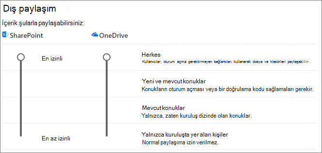

# Sitedeki konuklarla işbirliği yapma

Konuklarla belgeler, veriler ve listeler arasında işbirliği yapmanız gerekiyorsa, SharePoint sitesini kullanabilirsiniz. Modern SharePoint siteleri Microsoft 365 Grupları bağlanır ve site üyeliğini yönetebilir ve paylaşılan posta kutusu ve takvim gibi ek işbirliği araçları sağlayabilir.

Bu makalede, konuklarla işbirliği için bir SharePoint sitesi ayarlamak için gereken Microsoft 365 yapılandırma adımlarını inceleyeceğiz.

## Video tanıtımı

Bu videoda, bu belgede açıklanan yapılandırma adımları gösterilmektedir. 

> [!VIDEO https://www.microsoft.com/videoplayer/embed/RE44Llg?autoplay=false]

## Azure dış işbirliği ayarları

Microsoft 365'te paylaşım, [Azure Active Directory'deki B2B dış işbirliği ayarları](/azure/active-directory/external-identities/delegate-invitations) tarafından en üst düzeyde yönetilir. Konuk paylaşımı Azure AD devre dışı bırakıldıysa veya kısıtlandıysa, bu ayar Microsoft 365'te yapılandırdığınız paylaşım ayarlarını geçersiz kılar.

Konuklarla paylaşımın engellenmediğinden emin olmak için B2B dış işbirliği ayarlarını denetleyin.

Dış işbirliği ayarlarını ayarlamak için

1. adresinden Azure Active Directory'de [https://aad.portal.azure.com](https://aad.portal.azure.com)oturum açın.
2. Sol gezinti bölmesinde **Azure Active Directory'ye** tıklayın.
3. **Dış kimlikler'e** tıklayın.
4. **Başlarken** ekranında, sol gezinti bölmesinde **Dış işbirliği ayarları'na** tıklayın.
5. **Üye kullanıcıların ve belirli yönetici rollerine atanan kullanıcıların, üye izinlerine sahip konuklar dahil konuk kullanıcıları davet etmelerini** sağlayın veya **Kuruluştaki herkes konuk kullanıcıları davet edebilir(konuklar ve yönetici olmayanlar dahil)** seçilidir.
6. Değişiklik yaptıysanız **Kaydet'e** tıklayın.

**İşbirliği kısıtlamaları** bölümündeki ayarları not edin. İşbirliği yapmak istediğiniz konukların etki alanlarının engellenmediğinden emin olun.

Birden çok kuruluşun konuklarıyla çalışıyorsanız, dizin verilerine erişimlerini kısıtlamak isteyebilirsiniz. Bu, dizinde başka kimlerin konuk olduğunu görmelerini engeller. Bunu yapmak için **Konuk kullanıcı erişim kısıtlamaları'nın** altında **Konuk kullanıcılar dizin nesneleri ayarlarının özelliklerine ve üyeliğine sınırlı erişime sahip** veya **Konuk kullanıcı erişimi kendi dizin nesnelerinin özellikleri ve üyelikleriyle sınırlıdır'ı** seçin.

## Konuk ayarlarını Microsoft 365 Grupları

Modern SharePoint siteleri, site erişimini denetlemek için Microsoft 365 Grupları kullanır. SharePoint sitelerindeki konuk erişiminin çalışması için Microsoft 365 Grupları konuk ayarlarının açık olması gerekir.

Microsoft 365 Grupları konuk ayarlarını ayarlamak için

1. Microsoft 365 yönetim merkezi, sol gezinti bölmesinde **Ayarlar'ı** genişletin.
2. **Kuruluş ayarları'na** tıklayın.
3. Listede **Microsoft 365 Grupları'e** tıklayın.
4. **Grup sahiplerinin Microsoft 365 Grupları için kuruluşunuz dışındaki kişileri konuk olarak eklemesine izin ver** ve **Konuk grup üyelerinin grup içeriğine erişmesine izin ver** onay kutularının da işaretli olduğundan emin olun.
5. Değişiklik yaptıysanız Değişiklikleri **kaydet'e** tıklayın.

## SharePoint kuruluş düzeyinde paylaşım ayarları

Konukların SharePoint sitelerine erişebilmesi için SharePoint kuruluş düzeyinde paylaşım ayarlarının konuklarla paylaşıma izin vermesi gerekir.

Kuruluş düzeyindeki ayarlar, tek tek siteler için kullanılabilecek ayarları belirler. Site ayarları, kuruluş düzeyindeki ayarlardan daha izinli olamaz.

Kimliği doğrulanmamış dosya ve klasör paylaşımına izin vermek istiyorsanız **Herkes'i** seçin. Kuruluşunuz dışındaki tüm kişilerin kimlik doğrulaması yapmak zorunda olduğundan emin olmak istiyorsanız **Yeni ve mevcut konuklar'ı** seçin. Kuruluşunuzdaki herhangi bir sitenin ihtiyaç duyduğu en izin veren ayarı seçin.

SharePoint kuruluş düzeyinde paylaşım ayarlarını ayarlamak için

1. Microsoft 365 yönetim merkezi sol gezinti bölmesindeki **Yönetici merkezlerinin** altında **SharePoint'i** seçin.
2. SharePoint yönetim merkezinde, sol gezinti bölmesindeki **İlkeler'in** altında <a href="https://go.microsoft.com/fwlink/?linkid=2185222" target="_blank">**Paylaşım'ı**</a> seçin.
3. SharePoint için dış paylaşımın **Herkes** veya **Yeni ve mevcut konuklar olarak ayarlandığından** emin olun.
4. Değişiklik yaptıysanız **Kaydet'i** seçin.

## Site oluşturma

Sonraki adım, konuklarla işbirliği yapmak için kullanmayı planladığınız siteyi oluşturmaktır.

Site oluşturmak için
1. SharePoint yönetim merkezindeki **Siteler'in** altında <a href="https://go.microsoft.com/fwlink/?linkid=2185220" target="_blank">**Etkin siteler'i**</a> seçin.
2. **Oluştur**’u seçin.
3. **Ekip sitesi'ne** tıklayın.
4. Bir site adı yazın ve Grup sahibi (site sahibi) için bir ad girin.
5. **Gelişmiş ayarlar'ın** altında, bu sitenin genel mi yoksa özel mi olmasını istediğinizi seçin.
6. **İleri**'yi seçin.
7. **Bitir'i** seçin.

Kullanıcıları daha sonra davet edeceğiz. Ardından, bu sitenin site düzeyinde paylaşım ayarlarını denetlemek önemlidir.

## SharePoint site düzeyinde paylaşım ayarları

Bu site için istediğiniz erişim türüne izin verdiklerinden emin olmak için site düzeyinde paylaşım ayarlarını denetleyin. Örneğin, kuruluş düzeyi ayarlarını **Herkes** olarak ayarladıysanız ancak tüm konukların bu site için kimlik doğrulaması yapmasını istiyorsanız, site düzeyinde paylaşım ayarlarının **Yeni ve mevcut konuklar** olarak ayarlandığından emin olun.

Sitenin kimliği doğrulanmamış kişilerle paylaşılamayacağını (**Herkes** ayarı) ancak tek tek dosya ve klasörlerin paylaşabileceğini unutmayın.

[SharePoint sitelerinin dış paylaşım ayarlarını denetlemek için duyarlılık etiketlerini](../compliance/sensitivity-labels-teams-groups-sites.md) de kullanabilirsiniz.

Site düzeyinde paylaşım ayarlarını ayarlamak için
1. SharePoint yönetim merkezinde, sol gezinti bölmesinde **Siteler'i** genişletin ve <a href="https://go.microsoft.com/fwlink/?linkid=2185220" target="_blank">**Etkin siteler'i**</a> seçin.
2. Paylaşmak istediğiniz siteyi seçin.
3. ... öğesini ve **ardından Paylaşım'ı** seçin.
4. Paylaşımın **Herkes** veya **Yeni ve mevcut konuklar olarak ayarlandığından** emin olun.
5. Değişiklik yaptıysanız **Kaydet'i** seçin.

## Kullanıcıları davet etme

Artık konuk paylaşım ayarları yapılandırıldığından, sitenize dahili kullanıcılar ve konuklar eklemeye başlayabilirsiniz. Site erişimi ilişkili Microsoft 365 grubu üzerinden denetleneceğinden, oraya kullanıcı ekleyeceğiz.

Bir gruba iç kullanıcıları davet etmek için

1. Kullanıcıları eklemek istediğiniz siteye gidin.
2. Sağ üstteki üye sayısını gösteren **Üyeler** bağlantısını seçin.
3. **Üye ekle'yi** seçin.
4. Siteye davet etmek istediğiniz kullanıcıların adlarını veya e-posta adreslerini yazın ve **kaydet'i** seçin.

Konuklar siteden Microsoft 365 grubuna eklenemez. Gruba konuk ekleme hakkında bilgi için bkz. [Microsoft 365 Grupları konuk ekleme](https://support.microsoft.com/office/bfc7a840-868f-4fd6-a390-f347bf51aff6).

## Ayrıca bkz.

[Kimliği doğrulanmamış kullanıcılarla dosya ve klasör paylaşmaya yönelik en iyi yöntemler](best-practices-anonymous-sharing.md)

[Konuklarla paylaşırken dosyaların yanlışlıkla açığa alınmasını sınırlayın](share-limit-accidental-exposure.md)

[Güvenli bir konuk paylaşım ortamı oluşturma](create-secure-guest-sharing-environment.md)

[Yönetilen konuklarla B2B extranet oluşturma](b2b-extranet.md)

[Azure Active Directory B2B ile SharePoint ve OneDrive tümleştirmesi](/sharepoint/sharepoint-azureb2b-integration-preview)
