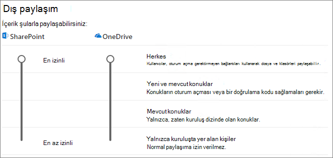

# Belge üzerinde konuklarla işbirliği yapma

SharePoint veya OneDrive'daki belgeler üzerinde kuruluşunuzun dışındaki kişilerle işbirliği yapmanız gerekiyorsa, bu kişilere belgeye bir paylaşım bağlantısı gönderebilirsiniz. Bu makalede, kuruluşunuzun gereksinimlerine yönelik SharePoint ve OneDrive için paylaşım bağlantılarını ayarlamak için gereken Microsoft 365 yapılandırma adımlarını inceleyeceğiz.

## Video tanıtımı

Bu videoda, bu belgede açıklanan yapılandırma adımları gösterilmektedir. 

> [!VIDEO https://www.microsoft.com/videoplayer/embed/RE450Vt?autoplay=false]

## Azure dış işbirliği ayarları

Microsoft 365'te paylaşım, [Azure Active Directory'deki B2B dış işbirliği ayarları](/azure/active-directory/external-identities/delegate-invitations) tarafından en üst düzeyde yönetilir. Konuk paylaşımı Azure AD devre dışı bırakıldıysa veya kısıtlandıysa, bu ayar Microsoft 365'te yapılandırdığınız paylaşım ayarlarını geçersiz kılar.

Konuklarla paylaşımın engellenmediğinden emin olmak için B2B dış işbirliği ayarlarını denetleyin.

Dış işbirliği ayarlarını ayarlamak için

1. adresinden Azure Active Directory'de [https://aad.portal.azure.com](https://aad.portal.azure.com)oturum açın.
2. Sol gezinti bölmesinde **Azure Active Directory'ye** tıklayın.
3. **Dış kimlikler'e** tıklayın.
4. **Başlarken** ekranında, sol gezinti bölmesinde **Dış işbirliği ayarları'na** tıklayın.
5. **Üye kullanıcıların ve belirli yönetici rollerine atanan kullanıcıların, üye izinlerine sahip konuklar dahil konuk kullanıcıları davet etmelerini** sağlayın veya **Kuruluştaki herkes konuk kullanıcıları davet edebilir(konuklar ve yönetici olmayanlar dahil)** seçilidir.
6. Değişiklik yaptıysanız **Kaydet'e** tıklayın.

**İşbirliği kısıtlamaları** bölümündeki ayarları not edin. İşbirliği yapmak istediğiniz konukların etki alanlarının engellenmediğinden emin olun.

Birden çok kuruluşun konuklarıyla çalışıyorsanız, dizin verilerine erişimlerini kısıtlamak isteyebilirsiniz. Bu, dizinde başka kimlerin konuk olduğunu görmelerini engeller. Bunu yapmak için **Konuk kullanıcı erişim kısıtlamaları'nın** altında **Konuk kullanıcılar dizin nesneleri ayarlarının özelliklerine ve üyeliğine sınırlı erişime sahip** veya **Konuk kullanıcı erişimi kendi dizin nesnelerinin özellikleri ve üyelikleriyle sınırlıdır'ı** seçin.

## SharePoint kuruluş düzeyinde paylaşım ayarları

Kuruluşunuz dışındaki kişilerin SharePoint veya OneDrive'daki bir belgeye erişebilmesi için, SharePoint ve OneDrive kuruluş düzeyinde paylaşım ayarlarının kuruluşunuz dışındaki kişilerle paylaşıma izin vermesi gerekir.

SharePoint'in kuruluş düzeyi ayarları, tek tek SharePoint siteleri için kullanılabilecek ayarları belirler. Site ayarları, kuruluş düzeyindeki ayarlardan daha izinli olamaz. OneDrive için kuruluş düzeyi ayarı, kullanıcıların OneDrive kitaplıklarında kullanılabilir olacak paylaşım düzeyini belirler.

SharePoint ve OneDrive için, kimliği doğrulanmamış dosya ve klasör paylaşımına izin vermek istiyorsanız **Herkes'i** seçin. Kuruluşunuzun dışındaki kişilerin kimlik doğrulaması yapmak zorunda olduğundan emin olmak istiyorsanız **Yeni ve mevcut konuklar'ı** seçin. *Herkesin* bağlantıları paylaşmanın en kolay yoludur: Kuruluşunuzun dışındaki kişiler bağlantıyı kimlik doğrulaması olmadan açabilir ve başkalarına iletmekte özgürdür.

SharePoint için, kuruluşunuzdaki herhangi bir sitenin ihtiyaç duyduğu en izin veren ayarı seçin.

SharePoint kuruluş düzeyinde paylaşım ayarlarını ayarlamak için

1. Microsoft 365 yönetim merkezi sol gezinti bölmesindeki **Yönetici merkezlerinin** altında **SharePoint'e** tıklayın.
2. SharePoint yönetim merkezinde, sol gezinti bölmesindeki **İlkeler'in** altında <a href="https://go.microsoft.com/fwlink/?linkid=2185222" target="_blank">**Paylaşım'ı**</a> seçin.
3. SharePoint veya OneDrive için dış paylaşımın **Herkes** veya **Yeni ve mevcut konuklar** olarak ayarlandığından emin olun. (OneDrive ayarının SharePoint ayarından daha izinli olamayacağını unutmayın.)
4. Değişiklik yaptıysanız **Kaydet'i** seçin.

## SharePoint kuruluş düzeyinde varsayılan bağlantı ayarları

Varsayılan dosya ve klasör bağlantısı ayarları, kullanıcılara bir dosya veya klasör paylaştıklarında varsayılan olarak gösterilecek bağlantı seçeneğini belirler. Kullanıcılar, isterseniz bağlantı türünü paylaşmadan önce diğer seçeneklerden biriyle değiştirebilir.

Bu ayarın kuruluşunuzdaki SharePoint sitelerini ve OneDrive'ı etkilediğini unutmayın.

Kullanıcılar dosya ve klasörleri paylaştığında varsayılan olarak seçili olan aşağıdaki türlerden herhangi birinden bir bağlantı seçin:

- **Bağlantısı olan herkes** - Çok fazla kimliği doğrulanmamış dosya ve klasör paylaşımı yapmayı bekliyorsanız bu seçeneği belirtin. *Herkes* bağlantılarına izin vermek istiyorsanız ancak yanlışlıkla kimliği doğrulanmamış paylaşımla ilgileniyorsanız, diğer seçeneklerden birini varsayılan olarak göz önünde bulundurun. Bu bağlantı türü yalnızca **Herkes** paylaşımını etkinleştirdiyseniz kullanılabilir.
- **Yalnızca kuruluşunuzdaki kişiler** - Çoğu dosya ve klasör paylaşımının kuruluşunuzdaki kişilerle olmasını bekliyorsanız bu seçeneği belirleyin.
- **Belirli kişiler** - Konuklarla çok fazla dosya ve klasör paylaşımı yapmayı bekliyorsanız bu seçeneği göz önünde bulundurun. Bu bağlantı türü konuklarla birlikte çalışır ve kimlik doğrulaması yapılmasını gerektirir.
 

SharePoint ve OneDrive kuruluş düzeyinde varsayılan bağlantı ayarlarını ayarlamak için

1. SharePoint yönetim merkezinde <a href="https://go.microsoft.com/fwlink/?linkid=2185222" target="_blank">**Paylaşım'a**</a> gidin.
2. **Dosya ve klasör bağlantıları'nın** altında, kullanmak istediğiniz varsayılan paylaşım bağlantısını seçin.
3. Değişiklik yaptıysanız **Kaydet'e** tıklayın.

Paylaşım bağlantısının iznini ayarlamak için, **Paylaşım bağlantıları için varsayılan olarak seçilen izni seçin altında.**

1. Kimliği doğrulanmamış kullanıcıların dosya ve klasörlerde değişiklik yapmasını istemiyorsanız **Görünüm'ü** seçin.
2. Kimliği doğrulanmamış kullanıcıların dosya ve klasörlerde değişiklik yapmasına izin vermek istiyorsanız **Düzenle'yi** seçin.

Yukarıdaki iki ön kullanım seçeneğinin yalnızca konuklar/dış kullanıcılar için değil, aynı zamanda iç kullanıcılar için de uygulanabileceğini unutmayın. Seçtiğiniz izin seçeneği, kendi takdirine bağlı olarak belirlenir.

Herkesle paylaşıma izin veren bağlantıların izinlerini ayarlamak için

1. **Bu bağlantılar şu izinleri verebilir:** alt bölme altında, 
    1. **Dosyalar** açılan listesinden 
        - Kimliği doğrulanmamış kullanıcıların dosyalarda değişiklik yapmasına izin vermek istiyorsanız **Görüntüle ve düzenle'yi** seçin.
        - Kimliği doğrulanmamış kullanıcıların dosyalarda değişiklik yapmasını istemiyorsanız **Görüntüle'yi** seçin.
    2. **Klasörler** açılan listesinden
        - Kimliği doğrulanmamış kullanıcıların klasörlerde değişiklik yapmasına izin vermek istiyorsanız **Görüntüle, düzenle ve karşıya yükle'yi** seçin.
        - Kimliği doğrulanmamış kullanıcıların klasörlerde değişiklik yapmasını istemiyorsanız **Görünüm'ü** seçin.

## SharePoint site düzeyinde paylaşım ayarları

SharePoint sitesinde bulunan dosya ve klasörleri paylaşıyorsanız, bu sitenin site düzeyinde paylaşım ayarlarını da denetlemeniz gerekir.

Site düzeyinde paylaşım ayarlarını ayarlamak için

1. SharePoint yönetim merkezinde, sol gezinti bölmesinde **Siteler'i** genişletin ve <a href="https://go.microsoft.com/fwlink/?linkid=2185220" target="_blank">**Etkin siteler'i**</a> seçin.
2. Konuklarla dosya ve klasör paylaşmak istediğiniz siteyi seçin.
3. Satırın (seçili sitenin bulunduğu) sağa kaydırın ve **Dış paylaşım** sütununda herhangi bir yere tıklayın.
4. Açılan sayfada **İlkeler** sekmesine tıklayın.
5. **Dış paylaşım** bölmesinin altında **Düzenle'ye** tıklayın.
6. Paylaşımın **Herkes** veya **Yeni ve mevcut konuklar olarak ayarlandığından** emin olun.
7. Değişiklik yaptıysanız **Kaydet'e** tıklayın.

## Kullanıcıları davet etme

Konuk paylaşım ayarları artık yapılandırıldı; böylece kullanıcılar artık kuruluşunuzun dışındaki kişilerle dosya ve klasör paylaşabilir. Daha fazla bilgi için bkz [. OneDrive dosya ve klasörlerini paylaşma](https://support.office.com/article/9fcc2f7d-de0c-4cec-93b0-a82024800c07) ve [SharePoint dosyalarını veya klasörlerini paylaşma](https://support.office.com/article/1fe37332-0f9a-4719-970e-d2578da4941c) .

## Ayrıca bkz.

[Kimliği doğrulanmamış kullanıcılarla dosya ve klasör paylaşmaya yönelik en iyi yöntemler](best-practices-anonymous-sharing.md)

[Konuklarla paylaşırken dosyaların yanlışlıkla açığa alınmasını sınırlayın](share-limit-accidental-exposure.md)

[Azure Active Directory B2B ile SharePoint ve OneDrive tümleştirmesi](/sharepoint/sharepoint-azureb2b-integration-preview)
