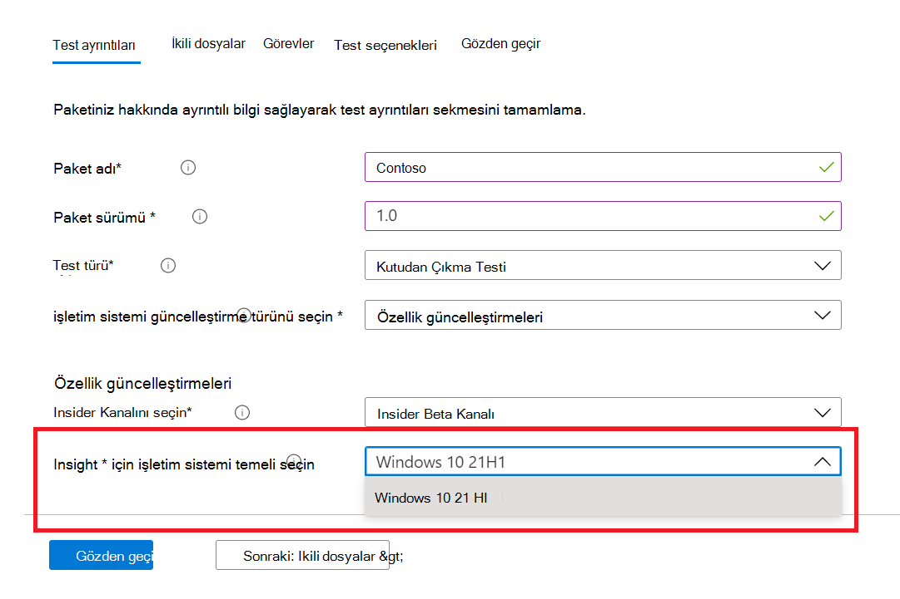

# <a name="windows-feature-update-validation"></a>Windows Özellik güncelleştirme doğrulaması

Yeni Windows özelliklerini doğrulamak için bir ortamı korumadan uygulamalarınızın bir sonraki Windows 10 veya Windows 11 sürümüyle nasıl performans göstereceği hakkında içgörülere mi ihtiyacınız var? 

Doğrulama testlerinizi Azure ortamımızda Windows Insider Programı derlemelerinde çalıştırmak istiyor musunuz?

M365 için Test Tabanı'nda **özellik güncelleştirme** doğrulaması, tüm bunları ve daha fazlasını başarmanıza yardımcı olabilir!

M365 hizmeti için Test Temeli'nde bu yeni özelliğe nasıl erişeceklerini öğrenmek için aşağıdaki adım adım ana hattı gözden geçirin.

M365 için Test Temeli'ni kullanmaya başlamak ```Feature update validation``` için self servis ekleme portalı aracılığıyla uygulamalarınızı (ve ilgili dosyaları) karşıya yükleyin. 

**Aşağıda, Test ayrıntılarını** doldururken izlenmeniz gereken adımlar vurgulanır:

1. İşletim sistemi güncelleştirme türünüz olarak **Özellik Güncelleştirmesi'ni** seçin:


2. Uygulamanızın doğrulanmasını istediğiniz Windows Insider Kanalı'nı seçin.  


3. Testinizin temeli olarak pazar içi bir Windows 10 veya Windows 11 sürümü seçin (ve elde edilen içgörüler!) ve paketinizi başarıyla eklemek için gereken diğer ayrıntıları sağlayın.



4. Uygulamanızın önceden yayımlanan Windows 10 özellik güncelleştirmelerine karşı doğrulamasının sonuçlarını görüntülemek için adresini ziyaret edin```Feature Updates Test Results```.


## <a name="next-steps"></a>Sonraki adımlar

Bellek regresyon analizini anlamaya başlamak için sonraki makaleye geçin.
> [!div class="nextstepaction"]
> [Sonraki adım](memory.md)

<!---
Add button for next page
-->
