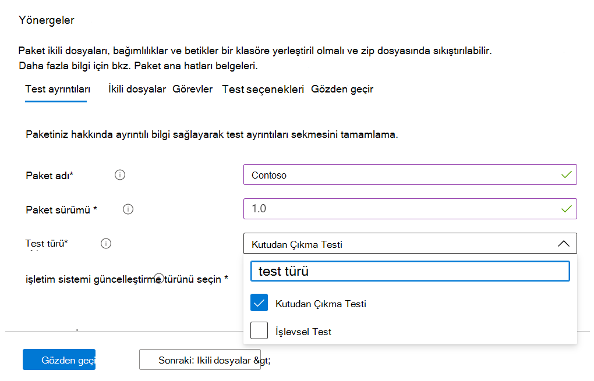

# <a name="functional-testing"></a>İşlevsel test

Bir yazılım yayımcısı olarak artık Microsoft 365 portalı için kendi kendine hizmet sunan Test Tabanı aracılığıyla tercih ettiğiniz test çerçevesini kullanarak özel işlevsel testler gerçekleştirebilirsiniz. 

Hizmeti ilk kez başlattığımızda, standartlaştırılmış betik ile yönlendirilen önceden tanımlanmış bir test kümesi olan hazır testler sunduk. Ancak bu, birçok Bağımsız Yazılım Satıcısı (ISV) için tam test kapsamı elde edemedi. 

Bu nedenle, geri bildirimlerinize yanıt olarak ISV'lerimize otomatik işlevsel testleri karşıya yükleme olanağı sağlıyoruz.

Bu özelliği kullanmak için aşağıdaki adımları izleyin:

1. Dosyalarınızı (ikili dosyalar, bağımlılıklar ve betikler) tek bir .zip paketi olarak karşıya yükleyin.
2. Çeşitli yürütme noktalarında test Sanal Makineler (VM) yeniden başlatmak isteyip istemediğinizi seçin.
3. Betikleriniz için kullanılabilir seçenekleri yönetin.
4. Yürütme sırasında VM'ye Windows güncelleştirmesinin ne zaman uygulanacağını seçin.

Yukarıdaki adımların ayrıntılı açıklamaları aşağıda vurgulanır:

**İşlevsel test paketini karşıya yükleme**

Başlamak için Karşıya Yükle sayfasına gidin, Azure'da M365 için Test Tabanı portalının sol tarafındaki gezinti menüsünde Uygulama kataloğu altında Yeni uygulamayı karşıya yükle'yi seçin. Buradan:

Sekme 1 - Temel bilgileri girin. Uygulamanızın adını ve sürümünü belirtin. Test türü seçeneğinde öğesini seçin ```Functional tests```. 

*İlk Çalıştırma (OOB) seçeneği varsayılan olarak gereklidir.*




Sekme 2 - Tüm testinizin bulunduğu bir zip dosyasını (ikili dosyalar, bağımlılıklar, betikler vb.) karşıya yükleyerek paketinizin bileşenlerini karşıya yükleyin. 

Ayrıntılar için bkz. aka.ms/usl-package-outline. (Not: Hem kullanıma açık test betikleri hem de İşlevsel test içeriği aynı zip dosyasına yerleştirilmelidir). Şu anda dosya boyutu 2 GB ile sınırlıdır.

Sekme 3 - İlk Çalıştırma ve İşlevsel test görevlerini yapılandırın. Burada, uygulamanızı yükleyecek, başlatacak, kapatacak ve kaldıracak PowerShell betiklerinin yollarını (İlk Çalıştırma için) ve işlevsel testinizi gerçekleştirmek için tüm özel betiklerinizin yollarını seçin. **(Not: Uygulamanızı kaldırma betiği isteğe bağlıdır).**

Şu anda işlevsel testleriniz için 1 ile 8 arası betik yükleyebilirsiniz. (Daha fazla betik gerekiyorsa lütfen bu gönderiye yorum yapın!)


(İsteğe bağlı) Yüklemeden sonra yeniden başlatma yapılandırabilirsiniz. Bazı uygulamalar yüklemeden sonra yeniden başlatma gerektirir. 

```Reboot After Execution``` Bu betiğin yürütülmesinden sonra yeniden başlatmanın yürütülmesini istiyorsanız Görevler sekmesinde belirli bir Betik seçin.

Sekme 4 - Windows güncelleştirmesinin ne zaman yükleneceğini seçin: Windows Update düzeltme ekinin uygulaması istediğiniz herhangi bir betikten önce yapılır. Gerçek uygulama kullanım senaryolarınızı yakından taklit etmek için uygulama yüklendikten sonra bir Windows güncelleştirmesi yüklemeniz önerilir.


Sekme 5 - Paketi gözden geçirin ve oluşturun. Yukarıda listelenen adımları tamamladıktan sonra karşıya yükleme işlemini tamamlamak için öğesini seçin ```Create``` .

Paketiniz oluşturulduktan sonra paketinizin doğrulama durumunu de kontrol edebilirsiniz.

Uygulamanızı yüklemek, başlatmak, kapatmak ve kaldırmak için bir ilk test çalıştırıyoruz. Paketinizin hizmetimize hatasız olarak yüklenebildiğini doğrulamamıza olanak tanır.

Doğrulama işlemi 24 saat kadar sürebilir. Doğrulama tamamlandıktan sonra menüdeki ```Manage packages``` durumu görebilirsiniz ve bu iki girdiden biri olur:

1. Doğrulama başarılı olur: Paket, seçtiğiniz işletim sistemi derlemeleri için yayın öncesi Windows güncelleştirmelerinde otomatik olarak test edilecek.
veya
2. Doğrulama başarısız oluyor: Hatanın nedenlerini araştırmanız, sorunu düzeltmeniz ve paketinizi yeniden yüklemeniz gerekir.

Ayrıca, Azure portal bildirim simgesi aracılığıyla her iki sonuç da size bildirilir.
